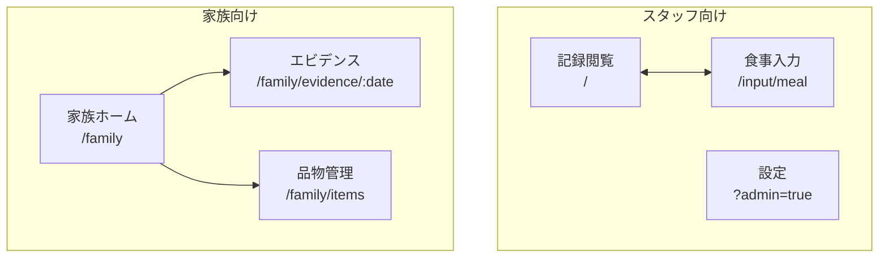

# 施設ケア入力フォーム

介護施設向けコミュニケーションアプリのプロトタイプ - スタッフの食事記録入力と家族への情報共有を実現

## デモ・リンク

| リンク | 説明 |
|--------|------|
| [デモサイト](https://facility-care-input-form.web.app) | PWAアプリ |
| [デモショーケース](https://facility-care-input-form.web.app/demo) | ガイド付きデモ（本番データに影響なし） |
| [管理者モード](https://facility-care-input-form.web.app/input/meal?admin=true) | 設定変更画面 |
| [プロジェクト紹介](https://yasushihonda-acg.github.io/facility-care-input-form/) | GitHub Pages（Mermaid図付き） |
| [ドキュメント目次](docs/INDEX.md) | 設計・仕様書の一覧 |

---

## 概要

### 目的

既存の業務フロー（スプレッドシート・FAX）を維持しつつ、以下の機能をモバイルアプリで提供:

- **記録閲覧**: スプレッドシートから自動同期されたケア記録の参照
- **食事入力**: スタッフによる食事記録入力（写真・Google Chat通知付き）
- **家族ビュー**: ご家族向けのタイムライン表示・品物管理

### 技術スタック

| カテゴリ | 技術 |
|----------|------|
| Frontend | React + Vite + TypeScript + TailwindCSS |
| Backend | Cloud Functions (2nd gen) |
| Database | Cloud Firestore |
| Hosting | Firebase Hosting |
| External | Google Sheets API, Google Drive API, Google Chat Webhook |
| CI/CD | GitHub Actions |

---

## システム構成

### 全体アーキテクチャ


### データフロー


---

## 主要機能

| 機能 | 説明 | 状態 |
|------|------|------|
| 記録閲覧 | スプレッドシートからの自動同期・検索・ソート | ✅ 完了 |
| 食事入力フォーム | 摂取量・間食・写真・特記事項の入力 | ✅ 完了 |
| Google Chat通知 | 入力時にWebhookで自動通知 | ✅ 完了 |
| 写真アップロード | Google Driveへの画像保存 | ✅ 完了 |
| 管理者設定 | 初期値・Webhook URL・フォルダID設定 | ✅ 完了 |
| 家族ビュー | タイムライン形式・エビデンス確認 | ✅ 完了 |
| 品物管理 | 家族からの差し入れ品物の登録・追跡 | ✅ 完了 |
| タスク管理 | 賞味期限警告・リマインダー等のタスク管理 | ✅ 完了 |
| 統計ダッシュボード | 品物状況・摂食傾向・アラートの可視化 | ✅ 完了 |
| AI提案 | Gemini APIによる賞味期限・提供方法の自動提案 | ✅ 完了 |
| プリセット管理 | 「いつもの指示」のCRUD管理・AI自動ストック | ✅ 完了 |
| 消費記録連携 | 提供・摂食記録API、タイムライン表示 | ✅ 完了 |
| 禁止ルール機能 | 提供禁止品目の設定・警告表示 | ✅ 完了 |
| デモショーケース | デモ専用ページ・シードデータ（本番影響なし） | ✅ 完了 |

---

## 画面構成



---

## 開発進捗

```
Phase 1-4: 基盤〜デモ版        ████████████████████ 100%
Phase 5.x: 食事入力・設定機能   ████████████████████ 100%
Phase 6.0: フッターナビ        ████████████████████ 100%
Phase 7.x: 家族ビュー・予実管理  ████████████████████ 100%
Phase 8.x: 品物・タスク・統計    ████████████████████ 100%
Phase 9.x: 在庫追跡・禁止ルール  ████████████████████ 100%
デモショーケース               ████████████████████ 100%
```

---

## クイックスタート

### 開発再開

```bash
# 1. 現在のステータス確認
cat docs/CURRENT_STATUS.md

# 2. アカウント切替
gh auth switch --user yasushihonda-acg
gcloud config set account yasushi.honda@aozora-cg.com
gcloud config set project facility-care-input-form
firebase use facility-care-input-form

# 3. 依存関係インストール
cd frontend && npm install
cd ../functions && npm install

# 4. 開発サーバー起動
cd ../frontend && npm run dev
```

### ビルド・デプロイ

```bash
# フロントエンドビルド
cd frontend && npm run build

# デプロイ
firebase deploy
```

---

## ドキュメント

### 必読（再開時）

| ドキュメント | 説明 |
|-------------|------|
| [CURRENT_STATUS.md](./docs/CURRENT_STATUS.md) | **現在の進捗・次のタスク** |
| [HANDOVER.md](./docs/HANDOVER.md) | **引き継ぎドキュメント** |
| [CLAUDE.md](./CLAUDE.md) | Claude Code設定・アカウント情報 |

### 設計・仕様

| ドキュメント | 説明 |
|-------------|------|
| [ROADMAP.md](./docs/ROADMAP.md) | 開発ロードマップ |
| [ARCHITECTURE.md](./docs/ARCHITECTURE.md) | システム設計 |
| [API_SPEC.md](./docs/API_SPEC.md) | API仕様書 |
| [FAMILY_UX_DESIGN.md](./docs/FAMILY_UX_DESIGN.md) | 家族向けUX設計 |

### 機能別

| ドキュメント | 説明 |
|-------------|------|
| [MEAL_INPUT_FORM_SPEC.md](./docs/MEAL_INPUT_FORM_SPEC.md) | 食事入力フォーム |
| [GOOGLE_CHAT_WEBHOOK_SPEC.md](./docs/GOOGLE_CHAT_WEBHOOK_SPEC.md) | Webhook連携 |
| [PHOTO_UPLOAD_SPEC.md](./docs/PHOTO_UPLOAD_SPEC.md) | 写真アップロード |
| [ADMIN_TEST_FEATURE_SPEC.md](./docs/ADMIN_TEST_FEATURE_SPEC.md) | 設定テスト機能 |

---

## ディレクトリ構成

```
facility-care-input-form/
├── CLAUDE.md              # Claude Code設定
├── README.md              # このファイル
├── frontend/              # React PWA
│   ├── src/
│   │   ├── pages/         # ページコンポーネント
│   │   │   ├── HomePage.tsx
│   │   │   ├── MealInputPage.tsx
│   │   │   └── family/    # 家族向けページ
│   │   ├── components/    # UIコンポーネント
│   │   ├── hooks/         # カスタムフック
│   │   └── types/         # 型定義
│   └── package.json
├── functions/             # Cloud Functions
│   ├── src/
│   │   ├── index.ts       # エントリポイント
│   │   ├── functions/     # API関数
│   │   └── services/      # サービス層
│   └── package.json
├── docs/                  # ドキュメント
├── gh-pages/              # プロジェクト紹介ページ
└── keys/                  # サービスアカウントキー（Git管理外）
```

---

## API一覧

| メソッド | パス | 説明 | 状態 |
|---------|------|------|------|
| GET | `/healthCheck` | ヘルスチェック | ✅ |
| POST | `/syncPlanData` | データ同期 | ✅ |
| GET | `/getPlanData` | データ取得 | ✅ |
| POST | `/submitMealRecord` | 食事記録入力 | ✅ |
| GET | `/getMealFormSettings` | 設定取得 | ✅ |
| POST | `/updateMealFormSettings` | 設定更新 | ✅ |
| POST | `/uploadCareImage` | 画像アップロード | ✅ |
| POST | `/testWebhook` | Webhookテスト | ✅ |
| POST | `/testDriveAccess` | Driveテスト | ✅ |
| GET/POST | `/careItems/*` | 品物CRUD | ✅ |
| GET/POST | `/tasks/*` | タスクCRUD | ✅ |
| GET | `/getStats` | 統計データ取得 | ✅ |
| POST | `/aiSuggest` | AI品物入力補助 | ✅ |
| GET/POST | `/presets/*` | プリセットCRUD | ✅ |
| GET/POST | `/prohibitions/*` | 禁止ルールCRUD | ✅ |

---

## 環境情報

| 項目 | 値 |
|------|-----|
| GCPプロジェクト | `facility-care-input-form` |
| リージョン | `asia-northeast1` (東京) |
| サービスアカウント | `facility-care-sa@...` |
| Sheet A (読み取り) | `1Gf8QTbGyKB7rn5QQa5cYOg1NNYWMV8lzqySdbDkfG-w` |
| Sheet B (書き込み) | `1OrpUVoDfUECXCTrKOGKLwN_4OQ9dlg7cUTCPGLDGHV0` |

---

## 開発モード (Dev Mode)

| 項目 | 設定 |
|------|------|
| 認証 | なし (`--allow-unauthenticated`) |
| Firestore Rules | `allow read, write: if true;` |

> **注意**: 本番環境では必ず認証を実装してください

---

## ライセンス

Private - All rights reserved

---

**最終更新**: 2025年12月17日
