# 施設ケア入力フォーム

介護施設向けコミュニケーションアプリのプロトタイプ - スタッフの食事記録入力と家族への情報共有を実現

## デモ・リンク

| リンク | 説明 |
|--------|------|
| [デモサイト](https://facility-care-input-form.web.app) | PWAアプリ |
| [管理者モード](https://facility-care-input-form.web.app/input/meal?admin=true) | 設定変更画面 |
| [プロジェクト紹介](https://yasushihonda-acg.github.io/facility-care-input-form/) | GitHub Pages（Mermaid図付き） |

---

## 概要

### 目的

既存の業務フロー（スプレッドシート・FAX）を維持しつつ、以下の機能をモバイルアプリで提供:

- **記録閲覧**: スプレッドシートから自動同期されたケア記録の参照
- **食事入力**: スタッフによる食事記録入力（写真・Google Chat通知付き）
- **家族ビュー**: ご家族向けのタイムライン表示・ケア指示作成

### 技術スタック

| カテゴリ | 技術 |
|----------|------|
| Frontend | React + Vite + TypeScript + TailwindCSS |
| Backend | Cloud Functions (2nd gen) |
| Database | Cloud Firestore |
| Hosting | Firebase Hosting |
| External | Google Sheets API, Google Drive API, Google Chat Webhook |
| CI/CD | GitHub Actions |

---

## システム構成

### 全体アーキテクチャ

```mermaid
flowchart TB
    subgraph Users["ユーザー"]
        Staff["スタッフ"]
        Family["ご家族"]
        Admin["管理者"]
    end

    subgraph Frontend["フロントエンド"]
        PWA["React PWA<br/>Firebase Hosting"]
    end

    subgraph Backend["バックエンド"]
        Functions["Cloud Functions"]
        Scheduler["Cloud Scheduler<br/>15分毎同期"]
    end

    subgraph Storage["ストレージ"]
        Firestore["Firestore"]
        Drive["Google Drive"]
    end

    subgraph External["外部連携"]
        SheetA["Sheet A<br/>読み取り専用"]
        SheetB["Sheet B<br/>書き込み専用"]
        Chat["Google Chat"]
    end

    Staff --> PWA
    Family --> PWA
    Admin --> PWA

    PWA <--> Functions
    Functions <--> Firestore
    Functions --> Drive
    Functions --> Chat
    Functions <--> SheetA
    Functions --> SheetB

    Scheduler --> Functions
```



### データフロー

```mermaid
flowchart LR
    subgraph FlowA["Flow A: データ同期"]
        A1["Sheet A"] -->|15分毎| A2["syncPlanData"]
        A2 --> A3["Firestore<br/>plan_data/"]
        A3 --> A4["getPlanData"]
        A4 --> A5["記録閲覧画面"]
    end

    subgraph FlowB["Flow B: 食事入力"]
        B1["食事入力フォーム"] --> B2["submitMealRecord"]
        B2 --> B3["Sheet B"]
        B2 --> B4["Google Chat通知"]
    end

    subgraph FlowC["Flow C: 家族ビュー"]
        C1["家族ホーム"] --> C2["useFamilyMealRecords"]
        C2 --> C3["getPlanData"]
        C3 --> C4["タイムライン表示"]
    end
```



---

## 主要機能

| 機能 | 説明 | 状態 |
|------|------|------|
| 記録閲覧 | スプレッドシートからの自動同期・検索・ソート | ✅ 完了 |
| 食事入力フォーム | 摂取量・間食・写真・特記事項の入力 | ✅ 完了 |
| Google Chat通知 | 入力時にWebhookで自動通知 | ✅ 完了 |
| 写真アップロード | Google Driveへの画像保存 | ✅ 完了 |
| 管理者設定 | 初期値・Webhook URL・フォルダID設定 | ✅ 完了 |
| 家族ホーム | タイムライン形式で食事状況確認 | ✅ 完了 |
| エビデンス・モニター | Plan vs Result対比表示 | ✅ 完了 |
| ケア指示作成 | プリセット＋条件付き指示 | ✅ 完了 |
| 設定テスト機能 | Webhook/Driveの事前テスト | 📋 計画中 |

---

## 画面構成

```mermaid
graph TB
    subgraph Staff["スタッフ向け"]
        Home["記録閲覧<br/>/"]
        Input["食事入力<br/>/input/meal"]
        Settings["設定<br/>?admin=true"]
    end

    subgraph Family["家族向け"]
        FamHome["家族ホーム<br/>/family"]
        Evidence["エビデンス<br/>/family/evidence/:date"]
        Request["ケア指示作成<br/>/family/request"]
    end

    Home <--> Input
    FamHome --> Evidence
    FamHome --> Request
```



---

## 開発進捗

```
Phase 1-4: 基盤〜デモ版      ████████████████████ 100%
Phase 5.0-5.7: 食事入力関連   ████████████████████ 100%
Phase 5.8: 設定テスト機能     ██████░░░░░░░░░░░░░░  30% (設計完了)
Phase 6.0: フッターナビ       ████████████████████ 100%
Phase 7.0-7.1: 家族ビュー     ████████████████████ 100%
```

---

## クイックスタート

### 開発再開

```bash
# 1. 現在のステータス確認
cat docs/CURRENT_STATUS.md

# 2. アカウント切替
gh auth switch --user yasushihonda-acg
gcloud config set account yasushi.honda@aozora-cg.com
gcloud config set project facility-care-input-form
firebase use facility-care-input-form

# 3. 依存関係インストール
cd frontend && npm install
cd ../functions && npm install

# 4. 開発サーバー起動
cd ../frontend && npm run dev
```

### ビルド・デプロイ

```bash
# フロントエンドビルド
cd frontend && npm run build

# デプロイ
firebase deploy
```

---

## ドキュメント

### 必読（再開時）

| ドキュメント | 説明 |
|-------------|------|
| [CURRENT_STATUS.md](./docs/CURRENT_STATUS.md) | **現在の進捗・次のタスク** |
| [HANDOVER.md](./docs/HANDOVER.md) | **引き継ぎドキュメント** |
| [CLAUDE.md](./CLAUDE.md) | Claude Code設定・アカウント情報 |

### 設計・仕様

| ドキュメント | 説明 |
|-------------|------|
| [ROADMAP.md](./docs/ROADMAP.md) | 開発ロードマップ |
| [ARCHITECTURE.md](./docs/ARCHITECTURE.md) | システム設計 |
| [API_SPEC.md](./docs/API_SPEC.md) | API仕様書 |
| [FAMILY_UX_DESIGN.md](./docs/FAMILY_UX_DESIGN.md) | 家族向けUX設計 |

### 機能別

| ドキュメント | 説明 |
|-------------|------|
| [MEAL_INPUT_FORM_SPEC.md](./docs/MEAL_INPUT_FORM_SPEC.md) | 食事入力フォーム |
| [GOOGLE_CHAT_WEBHOOK_SPEC.md](./docs/GOOGLE_CHAT_WEBHOOK_SPEC.md) | Webhook連携 |
| [PHOTO_UPLOAD_SPEC.md](./docs/PHOTO_UPLOAD_SPEC.md) | 写真アップロード |
| [ADMIN_TEST_FEATURE_SPEC.md](./docs/ADMIN_TEST_FEATURE_SPEC.md) | 設定テスト機能 |

---

## ディレクトリ構成

```
facility-care-input-form/
├── CLAUDE.md              # Claude Code設定
├── README.md              # このファイル
├── frontend/              # React PWA
│   ├── src/
│   │   ├── pages/         # ページコンポーネント
│   │   │   ├── HomePage.tsx
│   │   │   ├── MealInputPage.tsx
│   │   │   └── family/    # 家族向けページ
│   │   ├── components/    # UIコンポーネント
│   │   ├── hooks/         # カスタムフック
│   │   └── types/         # 型定義
│   └── package.json
├── functions/             # Cloud Functions
│   ├── src/
│   │   ├── index.ts       # エントリポイント
│   │   ├── functions/     # API関数
│   │   └── services/      # サービス層
│   └── package.json
├── docs/                  # ドキュメント
├── gh-pages/              # プロジェクト紹介ページ
└── keys/                  # サービスアカウントキー（Git管理外）
```

---

## API一覧

| メソッド | パス | 説明 | 状態 |
|---------|------|------|------|
| GET | `/healthCheck` | ヘルスチェック | ✅ |
| POST | `/syncPlanData` | データ同期 | ✅ |
| GET | `/getPlanData` | データ取得 | ✅ |
| POST | `/submitMealRecord` | 食事記録入力 | ✅ |
| GET | `/getMealFormSettings` | 設定取得 | ✅ |
| POST | `/updateMealFormSettings` | 設定更新 | ✅ |
| POST | `/uploadCareImage` | 画像アップロード | ✅ |
| POST | `/testWebhook` | Webhookテスト | 📋 |
| POST | `/testDriveAccess` | Driveテスト | 📋 |

---

## 環境情報

| 項目 | 値 |
|------|-----|
| GCPプロジェクト | `facility-care-input-form` |
| リージョン | `asia-northeast1` (東京) |
| サービスアカウント | `facility-care-sa@...` |
| Sheet A (読み取り) | `1Gf8QTbGyKB7rn5QQa5cYOg1NNYWMV8lzqySdbDkfG-w` |
| Sheet B (書き込み) | `1OrpUVoDfUECXCTrKOGKLwN_4OQ9dlg7cUTCPGLDGHV0` |

---

## 開発モード (Dev Mode)

| 項目 | 設定 |
|------|------|
| 認証 | なし (`--allow-unauthenticated`) |
| Firestore Rules | `allow read, write: if true;` |

> **注意**: 本番環境では必ず認証を実装してください

---

## ライセンス

Private - All rights reserved

---

**最終更新**: 2025年12月15日
