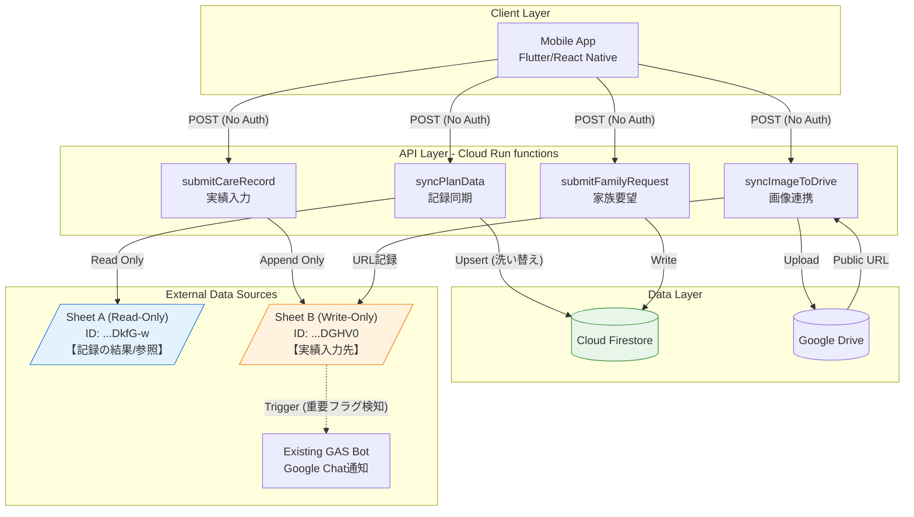

# システムアーキテクチャ設計書

## 1. プロジェクト概要

**プロジェクト名**: 蒲池様プロジェクト（入居者様ご家族向けコミュニケーションアプリ）

**目的**: 介護施設における既存の業務フロー（スプレッドシート・FAX）を維持しつつ、モバイルアプリで以下の機能を提供する：
- 記録の閲覧（ケアプラン・指示内容）
- 実績の入力（食事介助記録など）
- 要望の送信（ご家族からの詳細なケア要望）

**フェーズ**: プロトタイプ / 機能検証（Dev Mode）

---

## 2. 開発モード (Dev Mode) 方針

> **重要**: 本フェーズでは機能検証を優先し、認証機能は実装しません。

| 項目 | 設定 |
|------|------|
| Firebase Authentication | 未実装 |
| Cloud Run functions | `--allow-unauthenticated` |
| Firestore Security Rules | `allow read, write: if true;` |
| ユーザー識別 | リクエストボディで `userId` / `staffId` を受け取る |

**リスク認識**: 本設定は検証環境専用です。本番環境への移行時には必ず認証・認可を実装すること。

---

## 3. インフラストラクチャ構成

### 使用サービス

| サービス | 用途 |
|----------|------|
| Cloud Run functions (2nd gen) | APIエンドポイント |
| Cloud Firestore | 家族要望データ、同期データの保存 |
| Google Sheets API | スプレッドシートの読み取り・書き込み |
| Google Drive API | 画像ファイルの転送・公開URL生成 |

---

## 4. データフロー定義（3つのフロー）

本システムは3つの独立したデータフローで構成されます。それぞれの役割を厳密に区別してください。

### Flow A: 記録参照フロー (Read-Only Sync)

**概要**: 施設側が管理する「指示・計画マスタ」を読み取り専用で同期

| 属性 | 値 |
|------|-----|
| **Role** | Read-Only Source (Source of Truth) |
| **Sheet ID** | `1Gf8QTbGyKB7rn5QQa5cYOg1NNYWMV8lzqySdbDkfG-w` |
| **Sheet URL** | https://docs.google.com/spreadsheets/d/1Gf8QTbGyKB7rn5QQa5cYOg1NNYWMV8lzqySdbDkfG-w/edit |
| **操作** | 読み取りのみ（書き込み禁止） |
| **同期方式** | 洗い替え（全シートスキャン → Firestoreへミラーリング） |

**データ内容例**:
- 食事制限・禁止食材
- 調理方法の詳細指示（例：キウイの切り方）
- 条件付き禁止事項

### Flow B: 実績入力フロー (Write-Only Log)

**概要**: スタッフがアプリから入力したケア実績を記録

| 属性 | 値 |
|------|-----|
| **Role** | Write-Only Destination |
| **Sheet ID** | `1OrpUVoDfUECXCTrKOGKLwN_4OQ9dlg7cUTCPGLDGHV0` |
| **Sheet URL** | https://docs.google.com/spreadsheets/d/1OrpUVoDfUECXCTrKOGKLwN_4OQ9dlg7cUTCPGLDGHV0/edit |
| **操作** | 追記のみ（読み取り・更新禁止） |
| **特殊仕様** | Bot連携ハック（詳細は BUSINESS_RULES.md 参照） |

**データ内容例**:
- 食事介助記録
- 間食記録（特殊処理あり）
- 水分摂取記録

### Flow C: 家族要望フロー (Firestore Database)

**概要**: ご家族からの詳細なケア要望・指示を管理

| 属性 | 値 |
|------|-----|
| **Role** | アプリ内完結データ |
| **Storage** | Cloud Firestore (`family_requests` collection) |
| **操作** | 読み書き可能 |

**データ内容例**:
- ケア方法への要望
- 特別な配慮事項
- 優先度・カテゴリ分類

---

## 5. システム構成図



---

## 6. データモデル

### Firestore Collections

#### `plan_data` (Flow A 同期先)
```typescript
interface PlanData {
  residentId: string;          // 入居者ID
  residentName: string;        // 入居者名
  sheetName: string;           // 元シート名
  mealRestrictions: string[];  // 食事制限
  instructions: string;        // 詳細指示（非定型テキスト）
  conditionalBan: string;      // 条件付き禁止（非定型テキスト）
  syncedAt: Timestamp;         // 同期日時
  rawData: Record<string, any>; // 元データ全体
}
```

#### `family_requests` (Flow C)
```typescript
interface FamilyRequest {
  id: string;                  // ドキュメントID
  userId: string;              // ご家族ユーザーID
  residentId: string;          // 対象入居者ID
  category: string;            // カテゴリ（食事/生活/医療など）
  content: string;             // 要望内容
  priority: 'low' | 'medium' | 'high';
  status: 'pending' | 'reviewed' | 'implemented';
  createdAt: Timestamp;
  updatedAt: Timestamp;
}
```

---

## 7. 実装予定ファイル構成

```
src/
├── config/
│   └── sheets.ts              # スプレッドシートID・URL定数
├── functions/
│   ├── syncPlanData.ts        # Flow A: 記録同期
│   ├── submitCareRecord.ts    # Flow B: 実績入力
│   ├── submitFamilyRequest.ts # Flow C: 家族要望
│   └── syncImageToDrive.ts    # 画像連携
├── services/
│   ├── sheetsService.ts       # Sheets API ラッパー
│   ├── firestoreService.ts    # Firestore ラッパー
│   └── driveService.ts        # Drive API ラッパー
└── types/
    └── index.ts               # 型定義

firestore.rules                 # セキュリティルール（Dev Mode: 全開放）
```

---

## 8. セキュリティルール (Dev Mode)

```javascript
// firestore.rules
rules_version = '2';
service cloud.firestore {
  match /databases/{database}/documents {
    // WARNING: Dev Mode - 本番環境では必ず認証を実装すること
    match /{document=**} {
      allow read, write: if true;
    }
  }
}
```

---

## 9. 次のステップ

1. ✅ ドキュメント作成（本ファイル）
2. ✅ BUSINESS_RULES.md 作成
3. ✅ API_SPEC.md 作成
4. ⬜ 実装開始（src/配下）
5. ⬜ デプロイ・検証
