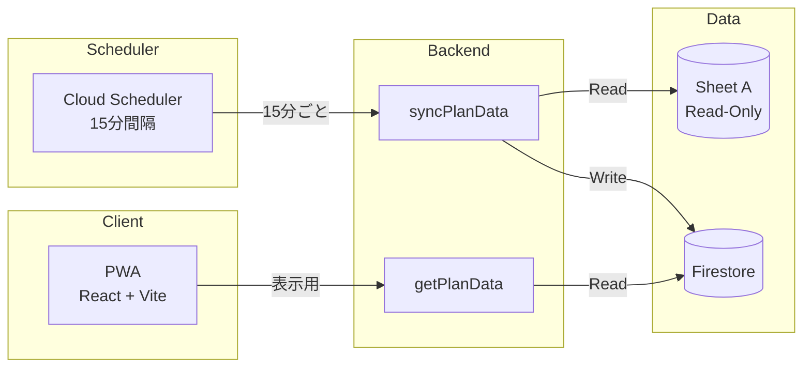

# システムアーキテクチャ設計書

## 1. プロジェクト概要

**プロジェクト名**: 蒲地様プロジェクト（入居者様ご家族向けコミュニケーションアプリ）

**目的**: 介護施設における既存の業務フロー（スプレッドシート・FAX）を維持しつつ、モバイルアプリで以下の機能を提供する：
- 記録の閲覧（ケアプラン・指示内容）
- 実績の入力（食事介助記録など）
- 要望の送信（ご家族からの詳細なケア要望）

**フェーズ**: プロトタイプ / 機能検証（Dev Mode）

---

## 2. 開発モード (Dev Mode) 方針

> **重要**: 本フェーズでは機能検証を優先し、認証機能は実装しません。

| 項目 | 設定 |
|------|------|
| Firebase Authentication | 未実装 |
| Cloud Run functions | `--allow-unauthenticated` |
| Firestore Security Rules | `allow read, write: if true;` |
| ユーザー識別 | リクエストボディで `userId` / `staffId` を受け取る |

**リスク認識**: 本設定は検証環境専用です。本番環境への移行時には必ず認証・認可を実装すること。

---

## 3. インフラストラクチャ構成

### 使用サービス

| サービス | 用途 |
|----------|------|
| Cloud Run functions (2nd gen) | APIエンドポイント |
| Cloud Firestore | 家族要望データ、同期データ、写真メタデータの保存 |
| Firebase Storage | 写真ファイルの保存・公開URL生成（Phase 17） |
| Google Sheets API | スプレッドシートの読み取り・書き込み |

---

## 4. データフロー定義（3つのフロー）

本システムは3つの独立したデータフローで構成されます。それぞれの役割を厳密に区別してください。

### Flow A: 記録参照フロー (Read-Only Sync)

**概要**: 施設側が管理する「指示・計画マスタ」を読み取り専用で同期

| 属性 | 値 |
|------|-----|
| **Role** | Read-Only Source (Source of Truth) |
| **Sheet ID** | `1Gf8QTbGyKB7rn5QQa5cYOg1NNYWMV8lzqySdbDkfG-w` |
| **Sheet URL** | https://docs.google.com/spreadsheets/d/1Gf8QTbGyKB7rn5QQa5cYOg1NNYWMV8lzqySdbDkfG-w/edit |
| **操作** | 読み取りのみ（書き込み禁止） |
| **同期方式** | 洗い替え（全シートスキャン → Firestoreへミラーリング） |

**データ内容例**:
- 食事制限・禁止食材
- 調理方法の詳細指示（例：キウイの切り方）
- 条件付き禁止事項

### Flow B: 実績入力フロー (Write-Only Log)

**概要**: スタッフがアプリから入力したケア実績を記録

| 属性 | 値 |
|------|-----|
| **Role** | Write-Only Destination |
| **Sheet ID** | `1OrpUVoDfUECXCTrKOGKLwN_4OQ9dlg7cUTCPGLDGHV0` |
| **Sheet URL** | https://docs.google.com/spreadsheets/d/1OrpUVoDfUECXCTrKOGKLwN_4OQ9dlg7cUTCPGLDGHV0/edit |
| **操作** | 追記のみ（読み取り・更新禁止） |
| **特殊仕様** | Bot連携ハック（詳細は BUSINESS_RULES.md 参照） |

**データ内容例**:
- 食事介助記録
- 間食記録（特殊処理あり）
- 水分摂取記録

### Flow C: 家族要望フロー (Firestore Database)

**概要**: ご家族からの詳細なケア要望・指示を管理

| 属性 | 値 |
|------|-----|
| **Role** | アプリ内完結データ |
| **Storage** | Cloud Firestore (`family_requests`, `care_instructions` collection) |
| **操作** | 読み書き可能 |

**データ内容例**:
- ケア方法への要望（自由記述）
- 構造化されたケア指示（メニュー・調理方法・条件付きロジック）
- 特別な配慮事項
- 優先度・カテゴリ分類

#### Flow C 詳細: 家族向け機能（『遠隔ケア・コックピット』）

> **詳細設計**: [FAMILY_UX_DESIGN.md](./FAMILY_UX_DESIGN.md) を参照

**解決する課題**:
| 課題 | 現状（FAX） | 解決策（アプリ） |
|------|------------|------------------|
| 指示の不透明さ | FAXを送っても実施確認できない | 写真付きエビデンスで実施確認 |
| 手書きの手間 | 詳細な指示を毎回手書き | プリセット＋構造化入力で効率化 |
| 条件付き指示 | 「残食があれば...」が伝わりにくい | If-Then形式のUI |

**3つのビュー**:
| ビュー | パス | 説明 |
|--------|------|------|
| 家族ホーム | `/family` | タイムライン形式で1日の食事状況を確認 |
| エビデンス・モニター | `/family/evidence/:date` | Plan（指示）とResult（実績）を対比表示 |
| ケア仕様ビルダー | `/family/request` | 構造化されたケア指示を作成 |

**データ結合ロジック**:
```
Plan（Flow A/C）─┬─ targetDate    ─┐
                 ├─ mealTime      ─┼─→ JOIN → エビデンス対比表示
Result（Flow B）─┴─ menuName(opt) ─┘
```

---

## 5. システム構成図


---

## 6. データモデル

### Firestore Collections

#### `plan_data` (Flow A 同期先) - 汎用データモデル

> **注意**: 各シートのカラム構造が異なるため、固定スキーマではなく汎用データモデルを採用しています。

```typescript
interface PlanDataRecord {
  id: string;                    // ドキュメントID（sheetName_rowIndex形式）
  sheetName: string;             // 元シート名
  timestamp: string;             // 日時列（各シートの1列目）
  staffName: string;             // スタッフ名（検出された場合）
  residentName: string;          // 入居者名（検出された場合）
  data: Record<string, string>;  // 列名→値のマッピング（汎用データ）
  rawRow: string[];              // 元データ行（配列形式）
  syncedAt: Timestamp;           // 同期日時
}
```

**汎用データモデルの特徴**:
- `data` フィールドに各シートのヘッダー行を解析し、列名をキーとしたマップで保存
- シートごとに異なるカラム構造を柔軟に扱える
- フロントエンドでシート別にカラムを動的表示可能

**同期時のパース処理**:
1. 各シートの1行目をヘッダーとして取得
2. 2行目以降をデータ行として処理
3. ヘッダー名と値を `data` マップにマッピング
4. 共通フィールド (`timestamp`, `staffName`, `residentName`) を個別に抽出

#### `family_requests` (Flow C - 汎用要望)
```typescript
interface FamilyRequest {
  id: string;                  // ドキュメントID
  userId: string;              // ご家族ユーザーID
  residentId: string;          // 対象入居者ID
  category: string;            // カテゴリ（食事/生活/医療など）
  content: string;             // 要望内容（自由記述）
  priority: 'low' | 'medium' | 'high';
  status: 'pending' | 'reviewed' | 'implemented';
  attachments?: string[];      // 添付ファイルURL
  createdAt: Timestamp;
  updatedAt: Timestamp;
}
```

#### `care_instructions` (Flow C - 構造化ケア指示)

> **詳細**: [FAMILY_UX_DESIGN.md](./FAMILY_UX_DESIGN.md) を参照

```typescript
interface CareInstruction {
  id: string;                  // ドキュメントID
  userId: string;              // ご家族ユーザーID
  residentId: string;          // 対象入居者ID

  // 対象指定
  targetDate: string;          // "2025-12-14"
  mealTime: 'breakfast' | 'lunch' | 'dinner' | 'snack';

  // メニュー・指示内容
  menuName: string;            // "キウイ"
  processingDetail: string;    // 詳細指示（必須・長文OK）

  // 条件付きロジック（オプション）
  conditions?: {
    trigger: 'leftover' | 'poor_condition' | 'no_appetite' | 'after_rehab';
    action: 'reserve_snack' | 'reduce_amount' | 'cancel' | 'alternative';
  }[];

  // 優先度
  priority: 'normal' | 'critical';  // critical = 絶対厳守

  // ステータス
  status: 'pending' | 'acknowledged' | 'completed';

  // メタ情報
  createdAt: Timestamp;
  updatedAt: Timestamp;
}
```

**Firestoreコレクション構成**:
```
firestore/
├── family_requests/           # 汎用的な要望（自由記述）
│   └── {requestId}
├── care_instructions/         # 構造化されたケア指示
│   └── {instructionId}
├── plan_data/                 # 同期済み記録データ（Flow A）
│   └── {recordId}
└── settings/                  # アプリ設定
    └── mealFormDefaults
```

---

## 7. 実装予定ファイル構成

```
src/
├── config/
│   └── sheets.ts              # スプレッドシートID・URL定数
├── functions/
│   ├── syncPlanData.ts        # Flow A: 記録同期
│   ├── submitCareRecord.ts    # Flow B: 実績入力
│   ├── submitFamilyRequest.ts # Flow C: 家族要望
│   ├── uploadCareImage.ts     # 画像アップロード
│   └── getCarePhotos.ts       # 写真取得（Phase 17）
├── services/
│   ├── sheetsService.ts       # Sheets API ラッパー
│   ├── firestoreService.ts    # Firestore ラッパー
│   └── storageService.ts      # Firebase Storage ラッパー（Phase 17）
└── types/
    └── index.ts               # 型定義

firestore.rules                 # セキュリティルール（Dev Mode: 全開放）
```

---

## 8. セキュリティルール (Dev Mode)

```javascript
// firestore.rules
rules_version = '2';
service cloud.firestore {
  match /databases/{database}/documents {
    // WARNING: Dev Mode - 本番環境では必ず認証を実装すること
    match /{document=**} {
      allow read, write: if true;
    }
  }
}
```

---

## 9. 関連ドキュメント

| ドキュメント | 内容 |
|--------------|------|
| [CURRENT_STATUS.md](./CURRENT_STATUS.md) | **現在の進捗状況**（再開時に最初に読む） |
| [ROADMAP.md](./ROADMAP.md) | 開発ロードマップ（Phase 1〜6） |
| [SETUP.md](./SETUP.md) | 環境セットアップガイド（CLI版） |
| [BUSINESS_RULES.md](./BUSINESS_RULES.md) | 業務ルール・Bot連携ハック |
| [API_SPEC.md](./API_SPEC.md) | API仕様書（Dev Mode） |
| [SYNC_CONCURRENCY.md](./archive/SYNC_CONCURRENCY.md) | 同期処理の競合防止設計 |
| [TABLE_VIEW_COLUMNS.md](./TABLE_VIEW_COLUMNS.md) | テーブルビュー表示カラム設計 |
| [GOOGLE_CHAT_WEBHOOK_SPEC.md](./GOOGLE_CHAT_WEBHOOK_SPEC.md) | Google Chat Webhook仕様 |
| [PHOTO_UPLOAD_SPEC.md](./PHOTO_UPLOAD_SPEC.md) | 写真アップロード仕様 |
| [SETTINGS_MODAL_UI_SPEC.md](./SETTINGS_MODAL_UI_SPEC.md) | 設定モーダルUI仕様 |
| [MEAL_INPUT_FORM_SPEC.md](./MEAL_INPUT_FORM_SPEC.md) | 食事入力フォーム設計 |
| [SHEET_B_STRUCTURE.md](./archive/SHEET_B_STRUCTURE.md) | Sheet B（書き込み先）構造 |
| [FAMILY_UX_DESIGN.md](./FAMILY_UX_DESIGN.md) | **家族向けUX設計（Flow C詳細）** |

---

## 10. デモ版PWA仕様

### 10.1 概要

デモ版では**読み取り専用**のPWAを提供し、Sheet A（記録の結果）の全シートデータをモバイルで閲覧可能にする。

### 10.2 機能スコープ

| 機能 | デモ版 | 将来版 |
|------|--------|--------|
| シート閲覧（全11シート） | ✅ | ✅ |
| 15分ごと自動同期 | ✅ | ✅ |
| 手動同期 | ✅ | ✅ |
| 実績入力（Sheet B書き込み） | ❌ | ✅ |
| 画像アップロード | ❌ | ✅ |
| 家族要望送信 | ❌ | ✅ |

### 10.3 同期仕様

| 項目 | 仕様 |
|------|------|
| 差分同期 | 15分ごと（Cloud Scheduler）- 新規レコードのみ追加 |
| 完全同期 | 日次 午前3時（Cloud Scheduler）- 洗い替え |
| 手動更新 | Firestoreキャッシュ再取得のみ（**同期は行わない**） |
| 同期対象 | Sheet A 全11シート（13,603件） |
| 同期トリガー | **Cloud Schedulerのみ**（競合防止） |
| 重複防止 | **決定論的ドキュメントID**により原理的に排除 |

> **重要**: 同期処理の競合防止のため、`syncPlanData`はCloud Schedulerからのみ呼び出されます。
> - **差分同期**（15分）: 新規レコードのみ追加、削除なし
> - **完全同期**（日次）: 洗い替えでデータ整合性担保
> - **コスト削減**: 月$144 → $5-15（90%以上削減）
> 詳細は [SYNC_CONCURRENCY.md](./archive/SYNC_CONCURRENCY.md) を参照。

### 10.4 システム構成（デモ版）



> **注**: PWAからsyncPlanDataへの直接呼び出しは廃止。Cloud Schedulerが唯一の同期トリガー。

詳細は [DEMO_PWA_SPEC.md](./archive/DEMO_PWA_SPEC.md) を参照。

---

## 11. 次のステップ

詳細は [ROADMAP.md](./ROADMAP.md) を参照してください。

### 完了済みPhase

| Phase | 内容 | 状態 |
|-------|------|------|
| Phase 1 | 基盤構築（GCP/Firebase） | ✅ 完了 |
| Phase 2 | バックエンド実装 | ✅ 完了 |
| Phase 3 | デプロイ・検証 | ✅ 完了 |
| Phase 4 | デモ版PWA開発 | ✅ 完了 |
| Phase 4.1〜4.9 | UI改善・同期最適化 | ✅ 完了 |
| Phase 5.0〜5.2 | 食事入力フォーム | ✅ 完了 |
| Phase 5.3〜5.4 | 管理者初期値設定 | ✅ 完了 |
| Phase 5.5 | Google Chat Webhook連携 | ✅ 完了 |
| Phase 5.6〜5.10 | 写真・設定モーダル・テスト機能 | ✅ 完了 |
| Phase 6.0 | フッターナビゲーション | ✅ 完了 |
| Phase 7.0 | 家族向け機能（Flow C拡張） | ✅ 完了 |
| Phase 7.1 | 予実管理 | ✅ 完了 |
| Phase 8.x | 品物・タスク・統計・AI連携 | ✅ 完了 |
| Phase 9.x | 消費追跡・禁止ルール・統計拡張 | ✅ 完了 |
| Phase 10-12 | 間食記録連携・FoodMaster・FIFO | ✅ 完了 |
| Phase 13 | 品物起点の間食記録・スケジュール拡張 | ✅ 完了 |
| Phase 14 | スタッフ用デモページ | ✅ 完了 |
| Phase 15 | スタッフ記録入力フォーム統一 | ✅ 完了 |
| Phase 16 | 写真エビデンス表示 | ✅ 完了 |
| Phase 17 | Firebase Storage 写真連携 | ✅ 完了 |

### 将来の機能

| 機能 | 内容 | 状態 |
|------|------|------|
| 週次レポート | Gemini AI による週次サマリー自動生成 | 📋 計画中 |
| ケア指示永続化 | モックデータ → Firestore永続化 | 📋 計画中 |
| CSVエクスポート | 表示データのダウンロード | 📋 計画中 |

> **詳細**: [FAMILY_UX_DESIGN.md](./FAMILY_UX_DESIGN.md)、[HANDOVER.md](./HANDOVER.md) を参照

**実装済みビュー**:
| ビュー | 説明 | 状態 |
|--------|------|------|
| 家族ホーム（タイムライン） | 1日の食事状況を時系列表示 | ✅ 完了 |
| エビデンス・モニター | Plan/Result対比＋写真エビデンス | ✅ 完了 |
| ケア仕様ビルダー | 構造化されたケア指示作成 | ✅ 完了 |
| 品物管理 | 差し入れ品物の登録・追跡・FIFO | ✅ 完了 |
| 統計ダッシュボード | 在庫・摂食傾向・アラート | ✅ 完了 |

### その他オプション機能

| 機能 | 説明 | 優先度 |
|------|------|--------|
| 他入力フォーム | 水分・排泄・バイタル等 | 中 |
| CSVエクスポート | 表示中のデータをダウンロード | 低 |
| オフラインキャッシュ強化 | ServiceWorker改善 | 低 |
