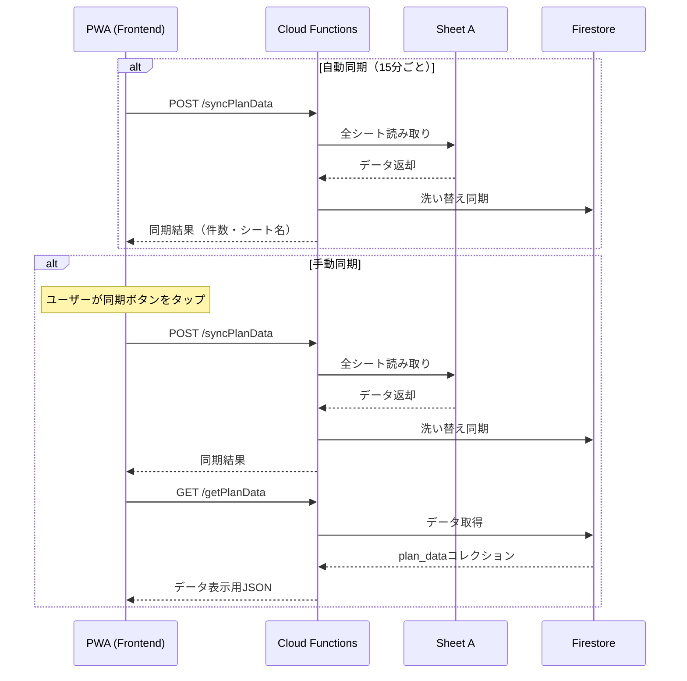

# デモ版PWA仕様書

## 1. 概要

**目的**: 介護施設スタッフ向けに、Sheet A（記録の結果）の全シートデータをモバイルで閲覧可能にする

**種別**: Progressive Web App (PWA)

**フェーズ**: デモ版（読み取り専用）

---

## 2. 機能一覧

### 2.1 コア機能

| 機能 | 説明 | 優先度 |
|------|------|--------|
| シート一覧表示 | 全11シートをリスト表示 | 必須 |
| シートデータ閲覧 | 選択したシートのデータをテーブル表示 | 必須 |
| 自動同期 | 15分ごとにバックグラウンドでデータ更新 | 必須 |
| 手動同期 | ユーザー操作でデータを即座に更新 | 必須 |
| 同期状態表示 | 最終同期日時・同期中インジケータ | 必須 |

### 2.2 将来拡張（デモ版対象外）

| 機能 | 説明 | 備考 |
|------|------|------|
| 実績入力 | Sheet Bへの書き込み | Sheet B共有後に対応 |
| 画像アップロード | ケア記録への画像添付 | Phase 2 |
| 家族要望送信 | Firestoreへの要望登録 | Phase 2 |
| プッシュ通知 | 更新通知 | Phase 3 |

---

## 3. データ同期仕様

### 3.1 同期タイミング

| トリガー | 間隔 | 処理 |
|----------|------|------|
| 自動同期 | 15分ごと | バックグラウンドで`syncPlanData` API呼び出し |
| 手動同期 | ユーザー操作時 | 画面上のボタンタップで即座に同期実行 |
| アプリ起動時 | 初回起動 | 前回同期から5分以上経過していれば自動同期 |

### 3.2 同期フロー



### 3.3 同期対象シート

Sheet A（記録の結果）の全11シート：

| シート名 | 概要 |
|----------|------|
| 食事 | 食事に関する指示・制限 |
| 水分摂取量 | 水分摂取の記録 |
| 排便・排尿 | 排泄に関する記録 |
| バイタル | バイタルサイン記録 |
| 口腔ケア | 口腔ケアに関する記録 |
| 内服 | 服薬に関する記録 |
| 特記事項 | 特記すべき事項 |
| 血糖値インスリン投与 | 血糖値・インスリン記録 |
| 往診録 | 往診に関する記録 |
| 体重 | 体重測定記録 |
| カンファレンス録 | カンファレンス記録 |

---

## 4. 画面設計

### 4.1 画面一覧

| 画面ID | 画面名 | 概要 |
|--------|--------|------|
| HOME | ホーム | シート一覧・同期ステータス表示 |
| SHEET_DETAIL | シート詳細 | 選択シートのデータテーブル表示 |

### 4.2 HOME画面

```
+------------------------------------------+
|  介護記録ビューア            [手動同期]   |
+------------------------------------------+
|  最終同期: 2025-12-13 16:45              |
|  [同期中...] または [✓ 同期済み]          |
+------------------------------------------+
|                                          |
|  +------------------------------------+  |
|  | 食事                        13件 > |  |
|  +------------------------------------+  |
|  | 水分摂取量                  1,245件 >|  |
|  +------------------------------------+  |
|  | 排便・排尿                   892件 > |  |
|  +------------------------------------+  |
|  | バイタル                   2,341件 > |  |
|  +------------------------------------+  |
|  | ...                                |  |
|  +------------------------------------+  |
|                                          |
+------------------------------------------+
|  次回自動同期: 14分後                     |
+------------------------------------------+
```

### 4.3 SHEET_DETAIL画面

```
+------------------------------------------+
|  < 戻る      食事                        |
+------------------------------------------+
|  13件 | 最終同期: 16:45                  |
+------------------------------------------+
|                                          |
|  +------------------------------------+  |
|  | 入居者ID: R001                     |  |
|  | 氏名: 山田太郎                     |  |
|  | 食事制限: 小麦, 卵                 |  |
|  | 指示: キウイは1/8カットで...      |  |
|  +------------------------------------+  |
|                                          |
|  +------------------------------------+  |
|  | 入居者ID: R002                     |  |
|  | 氏名: 佐藤花子                     |  |
|  | 食事制限: なし                     |  |
|  | 指示: 軟菜食で提供                 |  |
|  +------------------------------------+  |
|                                          |
+------------------------------------------+
```

---

## 5. 使用API

### 5.1 バックエンドAPI

| メソッド | エンドポイント | 用途 | 備考 |
|----------|---------------|------|------|
| POST | `/syncPlanData` | Sheet A → Firestore同期 | 自動・手動同期で使用 |
| GET | `/getPlanData` | Firestore → PWA取得 | 画面表示用 |
| GET | `/healthCheck` | ヘルスチェック | 接続確認用 |

### 5.2 API呼び出し例

```javascript
// 手動同期
async function syncData() {
  // Step 1: Sheet A → Firestore 同期
  const syncRes = await fetch(
    'https://asia-northeast1-facility-care-input-form.cloudfunctions.net/syncPlanData',
    {
      method: 'POST',
      headers: { 'Content-Type': 'application/json' },
      body: JSON.stringify({ triggeredBy: 'manual' })
    }
  );

  // Step 2: Firestore → PWA データ取得
  const dataRes = await fetch(
    'https://asia-northeast1-facility-care-input-form.cloudfunctions.net/getPlanData'
  );
  return dataRes.json();
}
```

---

## 6. 技術スタック

### 6.1 フロントエンド

| 項目 | 技術 | 理由 |
|------|------|------|
| フレームワーク | React + Vite | 高速ビルド、PWA対応容易 |
| UI | Tailwind CSS または MUI | モバイルファースト |
| 状態管理 | React Query (TanStack Query) | キャッシュ・自動再取得 |
| PWA | Vite PWA Plugin | Service Worker自動生成 |

### 6.2 PWA要件

| 項目 | 対応 |
|------|------|
| HTTPS | Firebase Hosting で自動対応 |
| Service Worker | オフラインキャッシュ（読み取りデータ） |
| Web App Manifest | ホーム画面追加対応 |
| レスポンシブ | モバイルファースト設計 |

---

## 7. デプロイ

### 7.1 ホスティング

| 項目 | 値 |
|------|-----|
| サービス | Firebase Hosting |
| ドメイン | `facility-care-input-form.web.app` |
| リージョン | 自動（CDN） |

### 7.2 デプロイコマンド

```bash
# フロントエンドビルド
cd frontend
npm run build

# Firebase Hosting へデプロイ
firebase deploy --only hosting
```

---

## 8. 開発フェーズ

### Phase 4-1: PWA基盤構築

- [ ] Vite + React プロジェクト作成
- [ ] PWA設定（manifest.json, Service Worker）
- [ ] Firebase Hosting 初期設定

### Phase 4-2: 画面実装

- [ ] HOME画面（シート一覧）
- [ ] SHEET_DETAIL画面（データ表示）
- [ ] 同期ステータス表示

### Phase 4-3: 同期機能実装

- [ ] 手動同期ボタン
- [ ] 15分ごと自動同期（setInterval / Background Sync API）
- [ ] 同期インジケータ

### Phase 4-4: デプロイ・検証

- [ ] Firebase Hosting デプロイ
- [ ] モバイル実機テスト
- [ ] デモ実施

---

## 9. 制約事項

### デモ版の制約

| 項目 | 制約 | 理由 |
|------|------|------|
| 認証 | なし | Dev Mode |
| 書き込み | 不可 | 読み取り専用デモ |
| オフライン | 限定的 | 最後の同期データのみ |
| 通知 | なし | Phase 2以降 |

### パフォーマンス考慮

| 項目 | 対策 |
|------|------|
| 大量データ | ページネーション（1シート100件ずつ） |
| 同期時間 | ローディングインジケータ表示 |
| バッテリー | 15分間隔で負荷軽減 |

---

## 10. 関連ドキュメント

| ドキュメント | 内容 |
|--------------|------|
| [ARCHITECTURE.md](./ARCHITECTURE.md) | システム全体設計 |
| [API_SPEC.md](./API_SPEC.md) | API仕様詳細 |
| [ROADMAP.md](./ROADMAP.md) | 開発ロードマップ |
| [CURRENT_STATUS.md](./CURRENT_STATUS.md) | 現在の進捗 |
