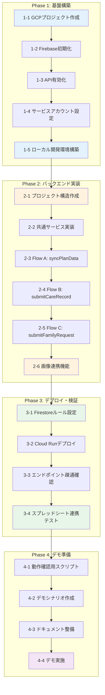

# 開発ロードマップ

## 目標

**デモ版公開**: 介護施設向けコミュニケーションアプリのプロトタイプを動作可能な状態でデプロイし、関係者にデモンストレーションできる状態にする。

---

## 全体フロー図



---

## Phase 1: 基盤構築

GCP/Firebaseの環境をCLIで構築する。

### 1-1. GCPプロジェクト作成

```bash
# 新規プロジェクト作成
gcloud projects create facility-care-demo --name="Facility Care Demo"

# プロジェクトを選択
gcloud config set project facility-care-demo

# 請求先アカウントのリンク（必要に応じて）
gcloud billing accounts list
gcloud billing projects link facility-care-demo --billing-account=BILLING_ACCOUNT_ID
```

**成果物**: GCPプロジェクト `facility-care-demo`

### 1-2. Firebase初期化

```bash
# Firebase CLIでプロジェクトに追加
firebase projects:addfirebase facility-care-demo

# ローカルでFirebase初期化
firebase init
# 選択: Firestore, Functions, Emulators
```

**成果物**: `firebase.json`, `.firebaserc`

### 1-3. API有効化

```bash
# 必要なAPIを有効化
gcloud services enable \
  cloudfunctions.googleapis.com \
  run.googleapis.com \
  firestore.googleapis.com \
  sheets.googleapis.com \
  drive.googleapis.com \
  cloudbuild.googleapis.com
```

**成果物**: 5つのAPIが有効化された状態

### 1-4. サービスアカウント設定

```bash
# サービスアカウント作成
gcloud iam service-accounts create facility-care-sa \
  --display-name="Facility Care Service Account"

# 権限付与
gcloud projects add-iam-policy-binding facility-care-demo \
  --member="serviceAccount:facility-care-sa@facility-care-demo.iam.gserviceaccount.com" \
  --role="roles/datastore.user"

# Sheets/Drive用のキー生成（必要に応じて）
gcloud iam service-accounts keys create ./keys/sa-key.json \
  --iam-account=facility-care-sa@facility-care-demo.iam.gserviceaccount.com
```

**成果物**: サービスアカウント、認証キー

### 1-5. ローカル開発環境構築

```bash
# Functions用ディレクトリで依存関係インストール
cd functions
npm init -y
npm install firebase-functions firebase-admin googleapis

# TypeScript設定
npm install -D typescript @types/node
npx tsc --init
```

**成果物**: `functions/package.json`, `functions/tsconfig.json`

### Phase 1 完了条件

- [ ] `gcloud projects describe facility-care-demo` が成功
- [ ] `firebase projects:list` にプロジェクトが表示
- [ ] `gcloud services list --enabled` で5つのAPIが確認可能
- [ ] `firebase emulators:start` が起動可能

---

## Phase 2: バックエンド実装

Cloud Run functionsのコードを実装する。

### 2-1. プロジェクト構造作成

```
functions/
├── src/
│   ├── index.ts              # エントリポイント
│   ├── config/
│   │   └── sheets.ts         # スプレッドシートID定数
│   ├── functions/
│   │   ├── syncPlanData.ts
│   │   ├── submitCareRecord.ts
│   │   ├── submitFamilyRequest.ts
│   │   └── uploadCareImage.ts
│   ├── services/
│   │   ├── sheetsService.ts
│   │   ├── firestoreService.ts
│   │   └── driveService.ts
│   └── types/
│       └── index.ts
├── package.json
└── tsconfig.json
```

**成果物**: ディレクトリ構造、設定ファイル

### 2-2. 共通サービス実装

| ファイル | 内容 |
|----------|------|
| `sheetsService.ts` | Sheets API読み取り・追記 |
| `firestoreService.ts` | Firestore CRUD操作 |
| `driveService.ts` | Drive アップロード・URL生成 |

**成果物**: 3つのサービスモジュール

### 2-3. Flow A: syncPlanData

- Sheet A（記録の結果）からデータ取得
- Firestoreへ洗い替え同期
- 全シート動的スキャン対応

**成果物**: `syncPlanData.ts`、ローカルテスト完了

### 2-4. Flow B: submitCareRecord

- ケア実績をSheet Bに追記
- **Bot連携ハック実装**（間食→特記事項+重要度）
- 画像URL対応

**成果物**: `submitCareRecord.ts`、Bot連携動作確認

### 2-5. Flow C: submitFamilyRequest

- 家族要望をFirestoreに保存
- カテゴリ・優先度対応

**成果物**: `submitFamilyRequest.ts`

### 2-6. 画像連携機能

- 画像をDriveにアップロード
- 公開URL生成
- Sheet Bへの記録

**成果物**: `uploadCareImage.ts`

### Phase 2 完了条件

- [ ] `npm run build` がエラーなく完了
- [ ] Emulatorで全エンドポイントが応答
- [ ] ローカルでSheet A読み取りテスト成功
- [ ] ローカルでSheet B書き込みテスト成功

---

## Phase 3: デプロイ・検証

本番環境（Cloud Run）へデプロイし、動作確認を行う。

### 3-1. Firestoreルール設定

```bash
# Dev Mode用ルールをデプロイ
firebase deploy --only firestore:rules
```

```javascript
// firestore.rules (Dev Mode)
rules_version = '2';
service cloud.firestore {
  match /databases/{database}/documents {
    match /{document=**} {
      allow read, write: if true;
    }
  }
}
```

**成果物**: Firestoreルールがデプロイ済み

### 3-2. Cloud Runデプロイ

```bash
# 全Functionsをデプロイ
firebase deploy --only functions

# または個別デプロイ
firebase deploy --only functions:syncPlanData
firebase deploy --only functions:submitCareRecord
firebase deploy --only functions:submitFamilyRequest
firebase deploy --only functions:uploadCareImage
```

**成果物**: 4つのCloud Run functionsがデプロイ済み

### 3-3. エンドポイント疎通確認

```bash
# 各エンドポイントの疎通確認
curl -X POST https://[REGION]-[PROJECT].cloudfunctions.net/syncPlanData \
  -H "Content-Type: application/json" \
  -d '{"triggeredBy": "manual"}'

curl -X POST https://[REGION]-[PROJECT].cloudfunctions.net/submitFamilyRequest \
  -H "Content-Type: application/json" \
  -d '{"userId":"F001","residentId":"R001","category":"meal","content":"テスト","priority":"low"}'
```

**成果物**: 全エンドポイントが200レスポンスを返す

### 3-4. スプレッドシート連携テスト

| テスト項目 | 確認内容 |
|------------|----------|
| Sheet A 読み取り | Firestoreにデータが同期される |
| Sheet B 書き込み | 行が追加される |
| Bot連携ハック | 間食入力時に「重要」フラグがセットされる |
| 画像連携 | DriveにファイルがアップロードされURLが記録される |

**成果物**: 全テスト項目がパス

### Phase 3 完了条件

- [ ] `firebase deploy` が成功
- [ ] 本番URLで全APIが応答
- [ ] Sheet A → Firestore同期が動作
- [ ] Sheet B への追記が動作
- [ ] Bot連携（重要フラグ）が動作確認済み

---

## Phase 4: デモ版PWA開発

読み取り専用のPWAアプリケーションを開発し、モバイルでSheet Aデータを閲覧可能にする。

### 4-1. PWA基盤構築

```bash
# フロントエンドプロジェクト作成
npm create vite@latest frontend -- --template react-ts
cd frontend
npm install

# PWA関連パッケージ
npm install vite-plugin-pwa workbox-window

# UI・状態管理
npm install @tanstack/react-query tailwindcss
npx tailwindcss init -p
```

**成果物**: `frontend/` ディレクトリ、PWA設定完了

### 4-2. 画面実装

| 画面 | 機能 |
|------|------|
| HOME | シート一覧（11シート）、同期ステータス、手動同期ボタン |
| SHEET_DETAIL | 選択シートのデータテーブル表示 |

**成果物**: React コンポーネント群

### 4-3. 同期機能実装

| 機能 | 実装 |
|------|------|
| 自動同期 | 15分ごと（setInterval / React Query refetchInterval） |
| 手動同期 | ボタンクリックで即座にAPI呼び出し |
| 同期状態表示 | 最終同期日時、同期中インジケータ |

```typescript
// React Query による同期設定例
const { data, refetch, isFetching } = useQuery({
  queryKey: ['planData'],
  queryFn: fetchPlanData,
  refetchInterval: 15 * 60 * 1000, // 15分
  staleTime: 5 * 60 * 1000, // 5分間はキャッシュ使用
});
```

**成果物**: 同期ロジック、UI表示

### 4-4. Firebase Hosting デプロイ

```bash
# Firebase Hosting 初期化（既存プロジェクト）
firebase init hosting
# public: frontend/dist
# SPA: Yes

# ビルド＆デプロイ
cd frontend
npm run build
cd ..
firebase deploy --only hosting
```

**成果物**: `https://facility-care-input-form.web.app` でPWA公開

### 4-5. モバイル実機テスト

| テスト項目 | 確認内容 |
|------------|----------|
| ホーム画面追加 | PWAとしてインストール可能 |
| シート一覧表示 | 全11シートが表示される |
| データ閲覧 | 各シートのデータが正しく表示 |
| 手動同期 | ボタンタップで同期実行 |
| 自動同期 | 15分後にデータ更新 |
| オフライン | 最終取得データが表示 |

**成果物**: テスト結果レポート

### Phase 4 完了条件

- [ ] PWAがFirebase Hostingにデプロイ済み
- [ ] 全11シートのデータが閲覧可能
- [ ] 15分ごと自動同期が動作
- [ ] 手動同期ボタンが動作
- [ ] モバイルでホーム画面に追加可能
- [ ] 関係者へURL共有・デモ実施完了

### Phase 4 デモシナリオ

| # | シナリオ | 操作 | 期待結果 |
|---|----------|------|----------|
| 1 | アプリ起動 | PWA URLにアクセス | シート一覧が表示 |
| 2 | シート選択 | 「食事」をタップ | 食事データ一覧表示 |
| 3 | 手動同期 | 同期ボタンをタップ | 最新データに更新 |
| 4 | 自動同期確認 | 15分待機 | 自動的にデータ更新 |
| 5 | ホーム画面追加 | ブラウザメニュー | アプリとしてインストール |

---

## Phase 4.1: タブUI・汎用データモデル ✅ 完了

スプレッドシートの列構造を動的に扱うための汎用データモデルを実装。

### 4.1-1. 汎用データモデル対応

| 項目 | 内容 |
|------|------|
| 課題 | 各シートの列構造が異なり、固定スキーマでは対応不可 |
| 解決策 | 列名をキーとしたマップ (`data: Record<string, string>`) で保存 |
| 成果物 | `functions/src/types/index.ts`、`frontend/src/types/index.ts` |

### 4.1-2. タブ形式シート切り替え

- 横スクロール可能なタブバー
- シート名 + レコード数バッジ表示
- タブタップでシート切り替え

**成果物**: `frontend/src/pages/HomePage.tsx`

### 4.1-3. 同期UX改善

- 同期成功時トースト通知（「〇シート △件を同期しました」）
- 同期エラー時エラートースト
- 同期中アニメーション

**成果物**: `frontend/src/components/Header.tsx`

### 4.1-4. Firestoreインデックス

```json
{
  "collectionGroup": "plan_data",
  "fields": [
    { "fieldPath": "sheetName", "order": "ASCENDING" },
    { "fieldPath": "timestamp", "order": "DESCENDING" }
  ]
}
```

**成果物**: `firestore.indexes.json`

### Phase 4.1 完了条件 ✅

- [x] 汎用データモデルがBackend/Frontendで実装
- [x] タブUIでシート切り替え可能
- [x] 同期トースト通知が動作
- [x] Firestoreインデックスが作成済み

---

## Phase 4.2: テーブルビュー・検索・ソート ✅ 完了

カードビューからテーブルビューへ変更し、検索・ソート機能を追加。

### 4.2-1. テーブルビュー実装

| 項目 | 仕様 |
|------|------|
| ヘッダー | シートのカラム名を動的表示 |
| ボディ | 各レコードを行として表示 |
| 横スクロール | カラム数が多い場合対応 |

### 4.2-2. 検索フィルタ

- 入居者名、スタッフ名での部分一致検索
- リアルタイムフィルタ適用

### 4.2-3. ソート機能

- 日時、入居者名、スタッフ名でソート
- 昇順/降順切り替え

### 4.2-4. ページネーション

- 1ページあたり50件表示
- 前へ/次へボタン
- 現在ページ/総ページ数表示

### 4.2-5. 詳細モーダル

行クリック/タップで全カラムの詳細情報をポップアップ表示。

| 項目 | 仕様 |
|------|------|
| トリガー | テーブル行をクリック/タップ |
| 表示内容 | 選択レコードの全カラムをラベル:値形式で表示 |
| レイアウト | **画面中央**に配置（フェードイン） |
| サイズ | 幅: 90%（max 600px）、高さ: 最大80vh |
| 閉じる | 背景タップ or ×ボタン or ESCキー |
| 利点 | 横スクロール不要で全情報を一覧可能、視認性が高い |

**設計の理由**:
- カラム数が多いデータは中央配置の方が視認性が高い
- ボトムシート形式は情報量が少ない場合に適しているが、今回のデータには不向き
- モバイル・デスクトップ両方で適切なサイズに対応

```
+----------------------------------------------------------+
|                                                          |
|    +------------------------------------------------+    |
|    |  [×]                                           |    |
|    |  血糖値インスリン投与 詳細                       |    |
|    |  2025/12/12 19:34:17                           |    |
|    +------------------------------------------------+    |
|    |                                                |    |
|    |  日時              2025/12/12 19:34:17         |    |
|    |  スタッフ名        リー                         |    |
|    |  入居者名          215_蒲地 キヌヱ様(ID7282)   |    |
|    |  特記事項          【ケアに関すること】         |    |
|    |  ...                                           |    |
|    |                                                |    |
|    |  ─────────────────────────────────────────    |    |
|    |  同期日時: 2025/12/13 17:57:08                 |    |
|    +------------------------------------------------+    |
|                                                          |
+----------------------------------------------------------+
```

### Phase 4.2 完了条件 ✅

- [x] テーブルビューがカードビューを置き換え
- [x] 検索フィルタが動作
- [x] ソート機能が動作
- [x] ページネーションが動作
- [x] 詳細モーダルが動作
- [x] Firebase Hostingへ再デプロイ

---

## Phase 4.3: 全シート同期 + 年月フィルタ ✅ 完了

**目的**: Firestoreバッチ制限を解消し、全11シートを同期可能にする。年・月フィルタUIで大量データを効率的に閲覧可能にする。

### 4.3-1. バックエンド修正（バッチ分割）

**問題**: Firestoreのバッチ書き込みは500件/バッチまでの制限があり、大量データ（食事1,482件など）でエラーが発生している。

**解決策**: 400件ずつバッチを分割して書き込み

```typescript
// firestoreService.ts
const BATCH_SIZE = 400;

async function syncSheetData(sheetName: string, records: PlanDataRecord[]): Promise<number> {
  const db = getFirestore();
  const collectionRef = db.collection('plan_data');

  // 1. 既存データ削除（シート単位）
  const existing = await collectionRef.where('sheetName', '==', sheetName).get();
  const deleteChunks = chunkArray(existing.docs, BATCH_SIZE);
  for (const chunk of deleteChunks) {
    const batch = db.batch();
    chunk.forEach(doc => batch.delete(doc.ref));
    await batch.commit();
  }

  // 2. 新規データ追加（バッチ分割）
  const insertChunks = chunkArray(records, BATCH_SIZE);
  for (const chunk of insertChunks) {
    const batch = db.batch();
    chunk.forEach(record => {
      const docRef = collectionRef.doc();
      batch.set(docRef, record);
    });
    await batch.commit();
  }

  return records.length;
}

function chunkArray<T>(array: T[], size: number): T[][] {
  const chunks: T[][] = [];
  for (let i = 0; i < array.length; i += size) {
    chunks.push(array.slice(i, i + size));
  }
  return chunks;
}
```

**影響範囲**:
- `functions/src/services/firestoreService.ts` - `syncPlanData`関数の修正

### 4.3-2. フロントエンド修正（年・月フィルタUI）

**新規コンポーネント**:

| コンポーネント | 役割 |
|----------------|------|
| `YearPaginator.tsx` | 年切り替え（◀ 2025年 ▶） |
| `MonthFilter.tsx` | 月フィルタタブ（全月/1月〜12月） |
| `MonthGroupHeader.tsx` | 月グループセパレーター |

**状態管理**:

```typescript
// HomePage.tsx
const [selectedYear, setSelectedYear] = useState<number>(new Date().getFullYear());
const [selectedMonth, setSelectedMonth] = useState<number | null>(null); // null = 全月

// フィルタ適用
const filteredRecords = useMemo(() => {
  return records.filter(record => {
    const date = new Date(record.timestamp);
    if (date.getFullYear() !== selectedYear) return false;
    if (selectedMonth !== null && date.getMonth() + 1 !== selectedMonth) return false;
    return true;
  });
}, [records, selectedYear, selectedMonth]);
```

**画面レイアウト（DEMO_PWA_SPEC.md参照）**:

```
+--------------------------------------------------+
|  介護記録ビューア                   [🔄 同期]    |
+--------------------------------------------------+
|  [◀] [2025年] [▶]                               |  ← 年ページネーション
+--------------------------------------------------+
|  [全月] [1月] [2月] ... [12月]  →                |  ← 月フィルタ
+--------------------------------------------------+
|  [食事] [水分] [排便] [バイタル] [...]  →        |  ← シートタブ
+--------------------------------------------------+
```

### 4.3-3. データ確認

現在のシート別・年別データ量（実測値）:

| シート | 2024年 | 2025年 | 合計 | バッチ数 |
|--------|--------|--------|------|----------|
| 排便・排尿 | 675 | 1,985 | 2,660 | 7 |
| 水分摂取量 | 441 | 1,626 | 2,067 | 6 |
| 特記事項 | 389 | 1,533 | 1,922 | 5 |
| 口腔ケア | 409 | 1,094 | 1,503 | 4 |
| 内服 | 393 | 1,097 | 1,490 | 4 |
| 食事 | 392 | 1,090 | 1,482 | 4 |
| 血糖値インスリン投与 | 379 | 1,077 | 1,456 | 4 |
| バイタル | 139 | 450 | 589 | 2 |
| 体重 | 58 | 339 | 397 | 1 |
| 往診録 | 14 | 33 | 47 | 1 |
| カンファレンス録 | - | 1 | 1 | 1 |
| **合計** | **3,289** | **10,325** | **13,614** | **39** |

### Phase 4.3 完了条件 ✅

- [x] バッチ分割実装でエラーなく全シート同期
- [x] 全11シートがフロントエンドで閲覧可能
- [x] 年ページネーションが動作
- [x] 月フィルタが動作
- [x] Firebase Hostingへ再デプロイ

---

## Phase 4.4: シート表示順序修正 ✅ 完了

**目的**: APIレスポンスのシート順序をスプレッドシートのタブ順序に一致させる。

### 4.4-1. 問題

- APIレスポンスのシート順序がスプレッドシートの元のタブ順序と異なっていた
- 原因: `getPlanData.ts` で `Map.entries()` から配列作成時、Firestoreクエリの返却順序に依存

### 4.4-2. 解決策

**SHEET_A_ORDER定数追加** (`functions/src/config/sheets.ts`):

```typescript
export const SHEET_A_ORDER: string[] = [
  "食事",
  "水分摂取量",
  "排便・排尿",
  "バイタル",
  "口腔ケア",
  "内服",
  "特記事項",
  "血糖値インスリン投与",
  "往診録",
  "体重",
  "カンファレンス録",
];
```

**ソート処理追加** (`functions/src/functions/getPlanData.ts`):

```typescript
const sheets: SheetSummary[] = Array.from(sheetMap.entries())
  .map(([name, info]) => ({ sheetName: name, ... }))
  .sort((a, b) => {
    const indexA = SHEET_A_ORDER.indexOf(a.sheetName);
    const indexB = SHEET_A_ORDER.indexOf(b.sheetName);
    return (indexA === -1 ? SHEET_A_ORDER.length : indexA) -
           (indexB === -1 ? SHEET_A_ORDER.length : indexB);
  });
```

### Phase 4.4 完了条件 ✅

- [x] SHEET_A_ORDER定数をsheets.tsに追加
- [x] getPlanDataでシート順序ソート処理追加
- [x] ドキュメント更新（SHEET_A_STRUCTURE.md）
- [x] Cloud Functionsデプロイ
- [x] curlで検証（スプレッドシート元順序と一致確認）

---

## Phase 4.5: デザイン改善 + 差分同期実装 (計画中)

**目的**:
1. プロWebデザイナーのアドバイスに基づき、UIの視覚的品質を向上させる
2. 差分同期を実装し、Firestoreコストを最適化する

> **詳細**: [DESIGN_GUIDELINES.md](./DESIGN_GUIDELINES.md) を参照

### 4.5-1. 現状の問題点

| 問題 | 詳細 |
|------|------|
| 視覚的階層の欠如 | 要素間の区別がつきにくい、視線誘導不足 |
| カラーパレット単調 | 青一色で単調、アクセントカラーなし |
| タイポグラフィ | 見出し・本文の区別が曖昧 |
| レイアウト | 余白不足、モバイル最適化不足 |

### 4.5-2. 改善計画

#### 高優先度（即時対応）
- [ ] カラーパレット適用（Tailwind設定更新）
- [ ] ヘッダーデザイン改善（グラデーション、影）
- [ ] 月フィルタ・シートタブのスタイル改善
- [ ] 検索バーのUI改善
- [ ] テーブルのゼブラストライプ・ホバー追加

#### 中優先度（次回対応）
- [ ] シート別アイコン追加
- [ ] モバイル向けボトムナビゲーション
- [ ] アニメーション・トランジション追加

#### 低優先度（将来対応）
- [ ] ダークモード対応

### 4.5-3. カラーシステム

```
Primary: #2563EB (Blue 600)
Secondary: #10B981 (Emerald 500)
Warning: #F59E0B (Amber 500)
Error: #EF4444 (Red 500)
Accent: #14B8A6 (Teal)
```

### 4.5-4. シート別アイコン

| シート名 | アイコン |
|----------|----------|
| 食事 | 🍽️ |
| 水分摂取量 | 💧 |
| 排便・排尿 | 🚻 |
| バイタル | ❤️ |
| 口腔ケア | 🦷 |
| 内服 | 💊 |
| 特記事項 | 📝 |
| 血糖値インスリン投与 | 💉 |
| 往診録 | 🩺 |
| 体重 | ⚖️ |
| カンファレンス録 | 👥 |

### 4.5-5. 差分同期実装（コスト最適化）

**現状の問題**:
- SYNC_STRATEGY.md では15分自動同期は「差分同期」と定義
- しかし現在の実装は自動・手動ともに「完全洗い替え」
- 月間コスト: 現状 ~$144/月 → 差分同期実装後 ~$5-15/月 (90%以上削減)

**実装計画**:

1. **バックエンド修正**
   - `syncPlanData` に `incremental: boolean` パラメータ追加
   - `incremental: true` の場合、最終同期時刻以降の新規レコードのみ取得・追加
   - 既存データは削除せず、新規追加のみ

2. **フロントエンド修正**
   - 自動同期（15分ごと）: `incremental: true` で呼び出し
   - 手動同期（ボタン）: `incremental: false` で完全洗い替え

3. **差分検出ロジック**
   ```typescript
   // Firestoreから最終同期時刻を取得
   const lastSync = await getLastSyncTimestamp(sheetName);

   // Sheets APIで最終同期以降のデータのみ取得
   const newRecords = rows.filter(row => {
     const timestamp = parseTimestamp(row[0]);
     return timestamp > lastSync;
   });
   ```

**影響ファイル**:
- `functions/src/functions/syncPlanData.ts`
- `functions/src/services/firestoreService.ts`
- `frontend/src/hooks/useSync.ts`
- `frontend/src/api/index.ts`

### Phase 4.5 完了条件

- [ ] DESIGN_GUIDELINES.md に基づくUI実装
- [ ] 高優先度項目の実装完了
- [ ] 差分同期実装（15分自動同期がincremental）
- [ ] Firebase Hostingへ再デプロイ
- [ ] モバイル実機での見た目確認

---

## Phase 4.8: 同期競合防止 + コスト最適化 ✅ 完了

**目的**:
1. 複数ユーザー・複数デバイスからの同時同期によるデータ重複を防止
2. Firestoreコストを90%以上削減

> **詳細**: [SYNC_CONCURRENCY.md](./SYNC_CONCURRENCY.md) を参照

### Phase 4.8 完了条件 ✅

- [x] バックエンド差分同期ロジック実装
- [x] 決定論的ドキュメントID実装
- [x] Cloud Scheduler ジョブ作成（差分/完全）
- [x] フロントエンドから`syncPlanData`呼び出しを削除
- [x] 「更新」ボタンがFirestoreキャッシュ再取得のみ実行
- [x] デプロイ・動作検証完了
- [x] ドキュメント更新完了

---

## Phase 5.3: グローバル初期値設定（コード定数版） ✅ 完了

**目的**: 食事入力フォームの初期値を全ユーザー共通で管理

> **注意**: Phase 5.4でFirestore + API方式に置き換えられました

### Phase 5.3 完了条件 ✅

- [x] 初期値をコード内定数として定義
- [x] フォームに初期値を適用

---

## Phase 5.4: 管理者初期値設定（Firestore + API） ✅ 完了

**目的**: 管理者がコード修正なしで初期値を変更可能にする

### 5.4-1. 実装内容

| 項目 | 内容 |
|------|------|
| バックエンドAPI | `getMealFormSettings` / `updateMealFormSettings` |
| データ保存先 | Firestore `settings/mealFormDefaults` |
| 管理者アクセス | `?admin=true` パラメータで設定UI表示 |

### 5.4-2. 設定項目

| 項目 | 説明 |
|------|------|
| defaultFacility | デフォルト施設名 |
| defaultResidentName | デフォルト利用者名 |
| defaultDayServiceName | デフォルトデイサービス名 |

### Phase 5.4 完了条件 ✅

- [x] Cloud Functions API実装
- [x] Firestoreデータ保存
- [x] フロントエンド設定モーダル作成
- [x] デプロイ・動作確認

---

## Phase 5.5: Google Chat Webhook連携 ✅ 完了

**目的**: 食事記録入力時にGoogle Chatスペースへ自動通知

> **詳細**: [GOOGLE_CHAT_WEBHOOK_SPEC.md](./GOOGLE_CHAT_WEBHOOK_SPEC.md) を参照

### 5.5-1. 通知フロー

```
[食事記録入力] → [Sheet B書き込み成功]
    ├─→ [通常Webhook] 全記録を通知
    └─→ [重要Webhook] isImportant="重要" のみ追加通知
```

### 5.5-2. 設定項目（追加）

| 項目 | 説明 |
|------|------|
| webhookUrl | 通常Webhook URL（全記録通知） |
| importantWebhookUrl | 重要Webhook URL（重要記録のみ追加通知） |

### Phase 5.5 完了条件 ✅

- [x] Webhook送信サービス作成 (`googleChatService.ts`)
- [x] 設定API拡張（Webhook URL保存）
- [x] submitMealRecord修正（Webhook送信追加）
- [x] フロントエンド設定UI拡張
- [x] デプロイ・動作確認

---

## Phase 5.6: 写真アップロードフォルダ設定 ✅ 完了

**目的**: 写真アップロード先のGoogle Driveフォルダを管理者が指定可能にする

> **詳細**: [PHOTO_UPLOAD_SPEC.md](./PHOTO_UPLOAD_SPEC.md) を参照

### 5.6-1. アップロードフロー

```
[写真選択] → [POST /uploadCareImage]
    ├─→ Firestore: driveUploadFolderId を取得
    ├─→ 設定済み: {指定フォルダ}/{YYYY}/{MM}/{filename}
    └─→ 未設定: CareRecordImages/{YYYY}/{MM}/{filename} (後方互換)
```

### 5.6-2. 設定項目（追加）

| 項目 | 説明 |
|------|------|
| driveUploadFolderId | 写真保存先Google DriveフォルダID |

### Phase 5.6 完了条件 ✅

- [x] 型定義拡張（backend + frontend）
- [x] driveService修正（フォルダID対応）
- [x] uploadCareImage修正（設定読み取り）
- [x] フロントエンド設定UI拡張
- [x] デプロイ・動作確認

---

## Phase 5.7: 設定モーダルUI改善 ✅ 完了

**目的**: 設定モーダルの誤操作防止とUX改善

> **詳細**: [SETTINGS_MODAL_UI_SPEC.md](./SETTINGS_MODAL_UI_SPEC.md) を参照

### 5.7-1. 変更内容

| 要素 | Before | After |
|------|--------|-------|
| フッター左ボタン | クリア | キャンセル |
| フッター右ボタン | 保存 | 保存（変更なし） |
| クリア機能 | フッターボタン | 本文下部の赤テキストリンク |
| クリア確認 | なし | 確認ダイアログ追加 |

### Phase 5.7 完了条件 ✅

- [x] フッターボタン配置変更
- [x] クリアリンクを本文下部に移動
- [x] 確認ダイアログ追加
- [x] デプロイ・動作確認

---

## Phase 5.8: 管理設定テスト機能 📋 計画中

**目的**: Webhook URLやDriveフォルダIDの設定を保存前にテストし、誤設定を防止する

> **詳細設計**: [ADMIN_TEST_FEATURE_SPEC.md](./ADMIN_TEST_FEATURE_SPEC.md) を参照

### 5.8-1. 機能概要

| 機能 | 説明 | テスト内容 |
|------|------|-----------|
| Webhookテスト送信 | 入力したURLにテストメッセージ送信 | Google Chatスペースにメッセージ到達を確認 |
| Driveフォルダ接続テスト | 入力したフォルダIDへのアクセス確認 | フォルダ存在・権限を検証、フォルダ名表示 |

### 5.8-2. 新規API

| API | メソッド | 説明 |
|-----|---------|------|
| `/testWebhook` | POST | Webhook URLにテストメッセージ送信 |
| `/testDriveAccess` | POST | DriveフォルダIDのアクセス権限確認 |

### 5.8-3. UI変更

```
┌─────────────────────────────────────────────────────────┐
│ Google Chat Webhook URL（通常通知）                       │
│ ┌─────────────────────────────────┐ ┌───────────────┐  │
│ │ https://chat.googleapis.com/... │ │ テスト送信    │  │
│ └─────────────────────────────────┘ └───────────────┘  │
│ ✅ テスト送信成功                                        │
├─────────────────────────────────────────────────────────┤
│ Google Drive フォルダID                                   │
│ ┌─────────────────────────────────┐ ┌───────────────┐  │
│ │ 1ABC...xyz                      │ │ 接続テスト    │  │
│ └─────────────────────────────────┘ └───────────────┘  │
│ ✅ フォルダにアクセス可能: ケア写真フォルダ               │
└─────────────────────────────────────────────────────────┘
```

### 5.8-4. 実装ステップ

| # | タスク | ファイル |
|---|--------|----------|
| 1 | testWebhook関数作成 | `functions/src/functions/testWebhook.ts` |
| 2 | testDriveAccess関数作成 | `functions/src/functions/testDriveAccess.ts` |
| 3 | index.tsにエクスポート追加 | `functions/src/index.ts` |
| 4 | フロントエンドテストサービス作成 | `frontend/src/services/adminTestService.ts` |
| 5 | 設定モーダルUI修正 | `frontend/src/components/MealSettingsModal.tsx` |
| 6 | ビルド・ローカルテスト | - |
| 7 | デプロイ | Firebase Deploy |
| 8 | ドキュメント更新 | API_SPEC.md等 |

### Phase 5.8 完了条件

- [ ] testWebhook API実装・動作確認
- [ ] testDriveAccess API実装・動作確認
- [ ] フロントエンドテストボタン実装
- [ ] テスト結果表示（成功/失敗）
- [ ] クールダウン実装（連打防止）
- [ ] デプロイ・動作確認
- [ ] API_SPEC.md更新

---

## マイルストーンサマリー

```
Phase 1: 基盤構築              ████████████████████ 100% (完了)
Phase 2: バックエンド実装       ████████████████████ 100% (完了)
Phase 3: デプロイ・検証         ████████████████████ 100% (完了)
Phase 4: デモ版PWA開発         ████████████████████ 100% (完了)
Phase 4.1: タブUI・汎用モデル    ████████████████████ 100% (完了)
Phase 4.2: テーブルビュー       ████████████████████ 100% (完了)
Phase 4.3: 全シート同期         ████████████████████ 100% (完了)
Phase 4.4: シート順序修正       ████████████████████ 100% (完了)
Phase 4.5: デザイン改善         ████████████████████ 100% (完了)
Phase 4.9: 同期競合防止         ████████████████████ 100% (完了)
Phase 5.0: 食事入力フォームUI   ████████████████████ 100% (完了)
Phase 5.1: Sheet B SA接続      ████████████████████ 100% (完了)
Phase 5.2: 食事入力フォームAPI  ████████████████████ 100% (完了)
Phase 5.3: グローバル初期値設定  ████████████████████ 100% (完了)
Phase 5.4: 管理者初期値設定     ████████████████████ 100% (完了)
Phase 5.5: Google Chat Webhook ████████████████████ 100% (完了)
Phase 5.6: 写真フォルダ設定     ████████████████████ 100% (完了)
Phase 5.7: 設定モーダルUI改善   ████████████████████ 100% (完了)
Phase 5.8: 管理設定テスト機能   ████████████████████ 100% (完了)
Phase 6.0: フッターナビゲーション ████████████████████ 100% (完了)
Phase 7.0: 家族向け機能        ████████████████████ 100% (完了)
Phase 7.1: 予実管理            ████████████████████ 100% (完了)
Phase 8.1: 品物管理基盤        ████████████████████ 100% (完了)
Phase 8.2: タスク管理          ████████████████████ 100% (完了)
Phase 8.2.1: タスク自動生成    ████████████████████ 100% (完了)
Phase 8.3: 統計ダッシュボード   ████████████████████ 100% (完了)
Phase 8.4: AI提案UI統合        ████████████████████ 100% (完了)
Phase 8.4.1: AI摂食傾向分析    ████████████████████ 100% (完了)
Phase 8.5: プリセット提案統合   ████████████████████ 100% (完了)
Phase 8.6: プリセット管理CRUD  ████████████████████ 100% (完了)
Phase 8.7: AI自動ストック      ████████████████████ 100% (完了)
Phase 9.0: ビュー構成設計      ████████████████████ 100% (完了)
Phase 9.1: ルーティング・ページ ████████████████████ 100% (完了)
Phase 9.2: 消費記録連携        ████████████████████ 100% (完了)
Phase 9.x: 禁止ルール機能      ████████████████████ 100% (完了)
Phase 9.3: 統計拡張            ████████████████████ 100% (完了)
デモショーケース実装           ████████████████████ 100% (完了)
家族向けデモ特化リデザイン      ████████████████████ 100% (完了)
Phase 10: 間食記録連携         ████████████████████ 100% (完了)
Phase 11: FoodMaster食品マスタ ████████████████████ 100% (完了)
Phase 11.1: FoodMaster自動蓄積 ████████████████████ 100% (完了)
Phase 12.0: FIFO対応           ████████████████████ 100% (完了)
Phase 12.1: 手動プリセット保存 ████████████████████ 100% (完了)
Phase 13.0: 品物から記録タブ   ████████████████████ 100% (完了)
Phase 13.1: スケジュール拡張   ████████████████████ 100% (完了)
Phase 13.2: スケジュール表示   ████████████████████ 100% (完了)
Phase 14: スタッフ用デモ       ████████████████████ 100% (完了)
Phase 15: 記録フォーム統一     ████████████████████ 100% (完了)
                               ─────────────────────
                               合計: 200+ tasks
```

| Phase | タスク数 | 主な成果物 | 状態 |
|-------|----------|------------|------|
| Phase 1 | 5 | GCP/Firebase環境、ローカル開発環境 | ✅ 完了 |
| Phase 2 | 6 | Cloud Functions（7エンドポイント） | ✅ 完了 |
| Phase 3 | 4 | 本番デプロイ、Sheet A読み取り確認 | ✅ 完了 |
| Phase 4 | 5 | デモ版PWA（読み取り専用） | ✅ 完了 |
| Phase 4.1 | 5 | タブUI、汎用データモデル、同期通知 | ✅ 完了 |
| Phase 4.2 | 6 | テーブルビュー、検索、ソート、詳細モーダル | ✅ 完了 |
| Phase 4.3 | 5 | 全シート同期（バッチ分割）、年月フィルタUI | ✅ 完了 |
| Phase 4.4 | 5 | シート表示順序修正（SHEET_A_ORDER） | ✅ 完了 |
| Phase 4.5 | 5 | デザイン改善（カラー、タイポ、アイコン） | ✅ 完了 |
| Phase 4.9 | 5 | 同期競合防止（Cloud Scheduler、決定論的ID） | ✅ 完了 |
| Phase 5.0 | 3 | 食事入力フォームUI | ✅ 完了 |
| Phase 5.1 | 2 | Sheet B サービスアカウント接続 | ✅ 完了 |
| Phase 5.2 | 5 | submitMealRecord API実装・動作確認 | ✅ 完了 |
| Phase 5.3 | 2 | グローバル初期値設定（コード定数版） | ✅ 完了 |
| Phase 5.4 | 4 | 管理者初期値設定（Firestore + API） | ✅ 完了 |
| Phase 5.5 | 4 | Google Chat Webhook連携 | ✅ 完了 |
| Phase 5.6 | 4 | 写真アップロードフォルダ設定 | ✅ 完了 |
| Phase 5.7 | 2 | 設定モーダルUI改善 | ✅ 完了 |
| Phase 5.8 | 8 | 管理設定テスト機能 | 📋 計画中 |
| Phase 6.0 | 4 | フッターナビゲーション基盤 | ✅ 完了 |
| Phase 6.1 | - | ビュー分離（閲覧/入力） | ✅ 完了（6.0に統合） |
| Phase 7.0 | 14 | 家族向け機能（Flow C拡張） | ✅ 完了 |
| Phase 7.1 | 8 | 予実管理（Plan/Result連携） | ✅ 完了 |
| Phase 8.1 | 12 | 品物管理基盤（CareItems） | ✅ 完了 |
| Phase 8.2 | 10 | タスク管理（Tasks） | ✅ 完了 |
| Phase 8.2.1 | 5 | タスク自動生成（Cloud Scheduler） | ✅ 完了 |
| Phase 8.3 | 8 | 統計ダッシュボード | ✅ 完了 |
| Phase 8.4 | 4 | AI提案UI統合（ItemForm） | ✅ 完了 |
| Phase 8.4.1 | 4 | AI摂食傾向分析（aiAnalyze API + StatsDashboard統合） | ✅ 完了 |
| Phase 8.5 | 6 | プリセット提案統合（getPresetSuggestions） | ✅ 完了 |
| Phase 8.6 | 6 | プリセット管理CRUD（presets.ts） | ✅ 完了 |
| Phase 8.7 | 5 | AI自動ストック（saveAISuggestionAsPreset） | ✅ 完了 |
| Phase 9.0 | 3 | ビュー構成設計（VIEW_ARCHITECTURE_SPEC.md） | ✅ 完了 |
| Phase 9.1 | 8 | ルーティング・ページ実装（スタッフ/家族ビュー） | ✅ 完了 |
| Phase 9.2 | 6 | 消費記録連携（ConsumptionLog API・UI） | ✅ 完了 |
| Phase 9.x | 5 | 禁止ルール機能（入居者設定・警告表示） | ✅ 完了 |
| Phase 9.3 | 4 | 統計ダッシュボード拡張（在庫サマリー・食品傾向） | ✅ 完了 |
| Demo | 4 | デモショーケース実装（シードデータ・専用ページ・フック対応） | ✅ 完了 |
| Demo | 4 | 家族向けデモ特化リデザイン（スタッフ分離・ストーリー追加） | ✅ 完了 |
| Phase 10 | 10 | 間食記録連携（スタッフ食事入力×家族品物管理） | ✅ 完了 |
| Phase 11 | 5 | FoodMaster食品マスタ（AI提案キャッシュ・正規化情報管理） | ✅ 完了 |
| Phase 11.1 | 3 | FoodMaster自動蓄積（本番モードでAI結果自動保存） | ✅ 完了 |
| Phase 12.0 | 5 | FIFO対応（期限順ソート・同一品物アラート・FIFOガイド） | ✅ 完了 |
| Phase 12.1 | 2 | 手動登録時プリセット保存提案（SaveManualPresetDialog） | ✅ 完了 |
| Phase 13.0 | 5 | 品物から記録タブ（スタッフ用・ソート優先度・記録モーダル） | ✅ 完了 |
| Phase 13.1 | 5 | スケジュール拡張（曜日指定・複数日・ServingSchedule型・E2E 7件） | ✅ 完了 |
| Phase 13.2 | 5 | スタッフ向けスケジュール表示（ScheduleDisplay・WeekdayBadges・E2E 7件） | ✅ 完了 |
| Phase 14.0 | 5 | スタッフ用デモページ（DemoStaffHome・DemoStaffShowcase・E2E 17件） | ✅ 完了 |
| Phase 15 | 4 | スタッフ記録入力フォーム統一（タブ削除・StaffRecordDialog・E2E 22件） | ✅ 完了 |
| Phase 15.6 | 2 | 摂食割合の数値入力（0-10）・残り対応フィールド（破棄/保存/その他） | ✅ 完了 |
| Phase 15.7 | 3 | 残り対応による在庫・統計の分離計算（破棄→全量減、保存→食べた分のみ減） | 📋 設計完了 |

---

## Phase 6.0: フッターナビゲーション基盤 ✅ 完了

**目的**: FABボタン方式からフッターナビゲーション方式に変更し、「読み取り専用ビュー」と「書き込み専用ビュー」を明確に分離する。

> **詳細設計**: [FOOTER_NAVIGATION_SPEC.md](./FOOTER_NAVIGATION_SPEC.md) を参照

### 6.0-1. 背景・課題

| 問題 | 詳細 |
|------|------|
| FABの発見性が低い | 右下のFABボタンは目立たず、初見ユーザーは入力方法がわからない |
| 操作性が悪い | 画面右下は片手操作時に親指が届きにくい |
| コンテキストが曖昧 | 「閲覧中」か「入力中」かが視覚的に不明確 |
| 拡張性が低い | 入力フォームが増えた場合、FABメニューが煩雑になる |

### 6.0-2. 設計概要

```
┌──────────────────────────────────────┐
│              [Header]                │
├──────────────────────────────────────┤
│                                      │
│         [メインコンテンツ]            │
│                                      │
├──────────────────────────────────────┤
│    📋 記録閲覧    │    ✏️ 記録入力    │  ← 2タブ構成
└──────────────────────────────────────┘
```

### 6.0-3. 実装タスク

| タスク | ファイル | 状態 |
|--------|----------|------|
| Layout.tsx 作成 | `frontend/src/components/Layout.tsx` | 📋 |
| FooterNav.tsx 作成 | `frontend/src/components/FooterNav.tsx` | 📋 |
| App.tsx ルーティング変更 | `frontend/src/App.tsx` | 📋 |
| Safe Area 対応 | `frontend/src/index.css` | 📋 |

### 6.0-4. ルーティング変更

| パス | 変更前 | 変更後 |
|------|--------|--------|
| `/` | HomePage | リダイレクト → `/view` |
| `/view` | - | ViewPage（記録閲覧） |
| `/input` | - | InputPage（入力メニュー） |
| `/input/meal` | MealInputPage | MealInputPage（変更なし） |

### Phase 6.0 完了条件

- [x] Layout.tsx 作成（Header + Main + FooterNav）
- [x] FooterNav.tsx 作成（2タブ構成、色反転で視認性向上）
- [x] App.tsx ルーティング変更
- [x] Safe Area 対応（iOS）
- [x] ビルド・Lint 確認
- [x] ローカル動作確認
- [x] 中間画面（InputPage）削除、直接食事入力へ遷移

---

## Phase 6.1: ビュー分離（閲覧/入力）📋 計画中

**目的**: 閲覧ビューと入力ビューを完全に分離し、入力メニュー画面を作成する。

### 6.1-1. 実装タスク

| タスク | ファイル | 状態 |
|--------|----------|------|
| HomePage → ViewPage リネーム | `frontend/src/pages/ViewPage.tsx` | 📋 |
| FABボタン削除 | - | 📋 |
| InputPage 作成（入力メニュー） | `frontend/src/pages/InputPage.tsx` | 📋 |
| InputCard 作成 | `frontend/src/components/InputCard.tsx` | 📋 |

### 6.1-2. 入力メニュー画面

```
┌──────────────────────────────────────┐
│          記録入力                    │
├──────────────────────────────────────┤
│  ┌────────────┐  ┌────────────┐      │
│  │ 🍽️ 食事    │  │ 💧 水分    │      │
│  │ 記録       │  │ 記録       │      │
│  └────────────┘  └────────────┘      │
│                                      │
│  ┌────────────┐  ┌────────────┐      │
│  │ 🚻 排泄    │  │ ❤️ バイタル │      │
│  │ 記録       │  │ 記録       │      │
│  └────────────┘  └────────────┘      │
│                                      │
│  ┌────────────┐                      │
│  │ 📝 特記事項 │                      │
│  └────────────┘                      │
├──────────────────────────────────────┤
│    📋 記録閲覧    │    ✏️ 記録入力    │
└──────────────────────────────────────┘
```

### 6.1-3. 入力種別

| 種別 | アイコン | パス | 状態 |
|------|----------|------|------|
| 食事記録 | 🍽️ | `/input/meal` | ✅ 実装済み |
| 水分記録 | 💧 | `/input/hydration` | 📋 将来実装 |
| 排泄記録 | 🚻 | `/input/excretion` | 📋 将来実装 |
| バイタル記録 | ❤️ | `/input/vital` | 📋 将来実装 |
| 特記事項 | 📝 | `/input/note` | 📋 将来実装 |

### Phase 6.1 完了条件

- [ ] ViewPage 作成（旧HomePage）
- [ ] FABボタン削除
- [ ] InputPage 作成
- [ ] InputCard 作成
- [ ] 食事記録カードから `/input/meal` へ遷移
- [ ] Firebase Hosting デプロイ
- [ ] モバイル実機確認

---

## Phase 7.0: 家族向け機能（Flow C拡張） ✅ 完了

**目的**: ご家族（蒲池様）向けの「遠隔ケア・コックピット」機能を実装。FAXの代替となる入力機能と、安心を提供する確認画面を提供。

> **詳細設計**: [FAMILY_UX_DESIGN.md](./FAMILY_UX_DESIGN.md) を参照

### 7.0-1. 背景・課題

| 課題 | 現状（FAX） | 解決策（アプリ） |
|------|------------|------------------|
| 指示の不透明さ | FAXを送っても実施確認できない | 写真付きエビデンスで実施確認 |
| 手書きの手間 | 詳細な指示を毎回手書き | プリセット＋構造化入力で効率化 |
| 条件付き指示 | 「残食があれば...」が伝わりにくい | If-Then形式のUI |
| リアルタイム性の欠如 | FAX送信後の状況がわからない | タイムラインで食事提供状況を確認 |

### 7.0-2. 3つのビュー

| ビュー | パス | 説明 | 優先度 |
|--------|------|------|--------|
| **View C: 家族ホーム** | `/family` | タイムライン形式で1日の食事状況を確認 | 高 |
| **View A: エビデンス・モニター** | `/family/evidence/:date` | Plan（指示）とResult（実績）を対比表示、写真エビデンス | 高 |
| **View B: ケア仕様ビルダー** | `/family/request` | 構造化されたケア指示を作成（プリセット＋If-Then） | 中 |

### 7.0-3. 画面構成

#### View C: 家族ホーム（タイムライン）

```
┌──────────────────────────────────────┐
│  家族ホーム               🔔 [⚙️]   │
│  蒲池 キヌヱ様                       │
├──────────────────────────────────────┤
│  📅 2025年12月14日（土）             │
│  [◀] [12] [13] [14●] [▶]            │
├──────────────────────────────────────┤
│  🌅 朝食 (7:30)  ✅ 完了             │
│  ├─ 主食: 8割 / 副食: 7割            │
│  └─ [📷 写真を見る]                  │
│                                      │
│  ☀️ 昼食 (12:00) ✅ 完了             │
│  ├─ キウイ（8等分カット）✓ 指示通り  │
│  └─ [📷 写真を見る] [📋 詳細]        │
│                                      │
│  🍪 間食 (15:00) ⚠️ 重要             │
│  ├─ プリン（ご本人希望）             │
│  └─ [📋 詳細を確認]                  │
│                                      │
│  🌙 夕食 (18:00) ⏳ 未提供           │
│  └─ 予定: らっきょう（冷）           │
├──────────────────────────────────────┤
│  📋 記録閲覧 │ ✏️ 記録入力 │ 👨‍👩‍👧 家族 │
└──────────────────────────────────────┘
```

#### View A: エビデンス・モニター

```
┌──────────────────────────────────────┐
│  [←] エビデンス・モニター 12/14 昼食 │
├──────────────────────────────────────┤
│  📋 PLAN（指示内容）                 │
│  ─────────────────────────────────   │
│  キウイ 1/2玉                        │
│                                      │
│  【詳細指示】                        │
│  輪切り4等分をさらに半分に切って     │
│  ください。皮は必ず剥いてください。  │
│  種が多い部分は避けてください。      │
│                                      │
│  ⚠️ 絶対厳守                        │
├──────────────────────────────────────┤
│               ↓ 対比 ↓               │
├──────────────────────────────────────┤
│  ✅ RESULT（実施結果）               │
│  ─────────────────────────────────   │
│  ┌────────────────────────────────┐  │
│  │   📷 提供直前の写真             │  │
│  │   [キウイ8等分カットの写真]     │  │
│  └────────────────────────────────┘  │
│                                      │
│  記録者: 田中花子                    │
│  記録日時: 2025/12/14 12:15          │
│  摂取量: 主食8割 / 副食7割           │
└──────────────────────────────────────┘
```

### 7.0-4. 実装タスク

| # | タスク | ファイル | 優先度 |
|---|--------|----------|--------|
| 1 | UX設計書作成 | `docs/FAMILY_UX_DESIGN.md` | ✅ 完了 |
| 2 | ARCHITECTURE.md更新 | `docs/ARCHITECTURE.md` | ✅ 完了 |
| 3 | デモ用モックデータ作成 | `frontend/src/data/demoFamilyData.ts` | 高 |
| 4 | 家族向け型定義 | `frontend/src/types/family.ts` | 高 |
| 5 | フッターナビ拡張（3タブ） | `frontend/src/components/FooterNav.tsx` | 高 |
| 6 | 家族ホーム実装 | `frontend/src/pages/family/FamilyDashboard.tsx` | 高 |
| 7 | タイムラインアイテム | `frontend/src/components/family/TimelineItem.tsx` | 高 |
| 8 | エビデンスカード | `frontend/src/components/family/EvidenceCard.tsx` | 高 |
| 9 | エビデンス・モニター実装 | `frontend/src/pages/family/EvidenceMonitor.tsx` | 高 |
| 10 | ケア仕様ビルダー実装 | `frontend/src/pages/family/RequestBuilder.tsx` | 中 |
| 11 | プリセットボタン | `frontend/src/components/family/PresetButton.tsx` | 中 |
| 12 | 条件ロジックビルダー | `frontend/src/components/family/ConditionBuilder.tsx` | 中 |
| 13 | ルーティング追加 | `frontend/src/App.tsx` | 高 |
| 14 | デプロイ・動作確認 | - | 高 |

### 7.0-5. データモデル

#### CareInstruction（構造化ケア指示）

```typescript
interface CareInstruction {
  id: string;
  userId: string;              // ご家族ID
  residentId: string;          // 入居者ID
  targetDate: string;          // "2025-12-14"
  mealTime: 'breakfast' | 'lunch' | 'dinner' | 'snack';
  menuName: string;            // "キウイ"
  processingDetail: string;    // 詳細指示（必須・長文OK）
  conditions?: {
    trigger: 'leftover' | 'poor_condition' | 'no_appetite' | 'after_rehab';
    action: 'reserve_snack' | 'reduce_amount' | 'cancel' | 'alternative';
  }[];
  priority: 'normal' | 'critical';
  status: 'pending' | 'acknowledged' | 'completed';
  createdAt: Timestamp;
  updatedAt: Timestamp;
}
```

### Phase 7.0 完了条件 ✅

- [x] `docs/FAMILY_UX_DESIGN.md` 作成
- [x] `docs/ARCHITECTURE.md` 更新（Flow C詳細）
- [x] デモ用モックデータ作成
- [x] フッターナビ3タブ化
- [x] View C: 家族ホーム（タイムライン）実装
- [x] View A: エビデンス・モニター実装
- [x] View B: ケア仕様ビルダー実装
- [x] ルーティング追加（`/family`配下）
- [x] Firebase Hosting デプロイ
- [x] 動作確認

---

## Phase 7.1: 予実管理（Plan/Result連携） ✅ 完了

**目的**: スタッフの食事入力データ（Result）を家族ビューに自動反映する予実管理機能を実装。

> **詳細設計**: [PLAN_RESULT_MANAGEMENT.md](./PLAN_RESULT_MANAGEMENT.md) を参照

### 7.1-1. 設計方針

**方針B「読み取り時JOIN」を採用**:
- バックエンド修正ゼロ（既存API `getPlanData` を活用）
- Firestoreトリガー不要 → コスト増なし
- 15分同期ラグ許容（安定運用優先）

### 7.1-2. 実装内容

| ファイル | 変更種別 | 内容 |
|---------|----------|------|
| `frontend/src/utils/mealTimeMapping.ts` | **新規** | 食事時間マッピングユーティリティ |
| `frontend/src/hooks/useFamilyMealRecords.ts` | **新規** | 食事シートからResult取得フック |
| `frontend/src/types/family.ts` | 修正 | MealResult型追加 |
| `frontend/src/pages/family/EvidenceMonitor.tsx` | 修正 | モック→実データ切替 |
| `frontend/src/pages/family/FamilyDashboard.tsx` | 修正 | タイムラインに実績反映 |
| `docs/PLAN_RESULT_MANAGEMENT.md` | **新規** | 設計ドキュメント |

### 7.1-3. データフロー

```
食事入力(スタッフ) → Sheet B → 同期(15分毎) → Firestore plan_data/
                                                    ↓
家族ビュー → useFamilyMealRecords → 日付+食事時間でフィルタ → 表示
                                                    ↑
家族連絡(Plan) → モックデータ (将来: Firestore care_instructions/)
```

### Phase 7.1 完了条件 ✅

- [x] 設計書作成（PLAN_RESULT_MANAGEMENT.md）
- [x] 食事時間マッピングユーティリティ作成
- [x] MealResult型定義追加
- [x] useFamilyMealRecordsフック作成
- [x] EvidenceMonitor修正（実データ取得）
- [x] FamilyDashboard修正（実データ反映）
- [x] ビルド確認
- [x] コミット・デプロイ

---

## Phase 8.1: 品物管理基盤（CareItems） ✅ 完了

**目的**: 家族が送付した品物（差し入れ）を管理し、スタッフが提供・摂食記録を入力できる機能を実装。

> **詳細設計**: [ITEM_MANAGEMENT_SPEC.md](./ITEM_MANAGEMENT_SPEC.md) を参照

### 8.1-1. 実装内容

| カテゴリ | ファイル | 内容 |
|----------|----------|------|
| バックエンド | `functions/src/functions/careItems.ts` | CRUD API（作成・取得・更新・削除） |
| バックエンド | `functions/src/types/careItem.ts` | CareItem型定義 |
| フロントエンド | `frontend/src/types/careItem.ts` | CareItem型定義（共通） |
| フロントエンド | `frontend/src/pages/family/ItemManagement.tsx` | 品物一覧ページ |
| フロントエンド | `frontend/src/pages/family/ItemForm.tsx` | 品物登録フォーム |
| フロントエンド | `frontend/src/components/family/ItemCard.tsx` | 品物カードコンポーネント |
| フロントエンド | `frontend/src/hooks/useCareItems.ts` | React Queryフック |

### 8.1-2. データモデル

```typescript
interface CareItem {
  id: string;
  residentId: string;
  userId: string;
  itemName: string;
  sentDate: string;
  expirationDate?: string;
  quantity: number;
  servingMethod: ServingMethod;
  plannedServeDate?: string;
  actualServeDate?: string;
  servedQuantity?: number;
  consumptionRate?: number;
  consumptionStatus?: ConsumptionStatus;
  noteToFamily?: string;
  noteToStaff?: string;
  status: ItemStatus;
  createdAt: Timestamp;
  updatedAt: Timestamp;
}
```

### 8.1-3. API

| エンドポイント | メソッド | 説明 |
|---------------|---------|------|
| `/createCareItem` | POST | 品物登録 |
| `/getCareItems` | GET | 品物一覧取得 |
| `/updateCareItem` | PUT | 品物更新 |
| `/deleteCareItem` | DELETE | 品物削除 |

### Phase 8.1 完了条件 ✅

- [x] バックエンドAPI実装（CRUD）
- [x] フロントエンド品物一覧ページ
- [x] フロントエンド品物登録フォーム
- [x] React Queryフック作成
- [x] ルーティング追加（`/family/items`）
- [x] FamilyDashboardにクイックリンク追加
- [x] ビルド・デプロイ

---

## Phase 8.2: タスク管理（Tasks） ✅ 完了

**目的**: 賞味期限警告・提供リマインダー等のタスクを管理し、スタッフが完了処理できる機能を実装。

> **詳細設計**: [TASK_MANAGEMENT_SPEC.md](./TASK_MANAGEMENT_SPEC.md) を参照

### 8.2-1. 実装内容

| カテゴリ | ファイル | 内容 |
|----------|----------|------|
| バックエンド | `functions/src/functions/tasks.ts` | CRUD API（作成・取得・更新・削除） |
| バックエンド | `functions/src/types/task.ts` | Task型定義 |
| フロントエンド | `frontend/src/types/task.ts` | Task型定義（共通） |
| フロントエンド | `frontend/src/pages/family/TaskList.tsx` | タスク一覧ページ |
| フロントエンド | `frontend/src/hooks/useTasks.ts` | React Queryフック |
| フロントエンド | `frontend/src/api/index.ts` | タスクAPIクライアント追加 |

### 8.2-2. データモデル

```typescript
interface Task {
  id: string;
  residentId: string;
  userId?: string;
  title: string;
  description?: string;
  taskType: TaskType;
  relatedItemId?: string;
  dueDate: string;
  dueTime?: string;
  status: TaskStatus;
  priority: TaskPriority;
  assignee?: string;
  completedBy?: string;
  completedAt?: Timestamp;
  completionNote?: string;
  notificationSent: boolean;
  createdAt: Timestamp;
  updatedAt: Timestamp;
}
```

### 8.2-3. API

| エンドポイント | メソッド | 説明 |
|---------------|---------|------|
| `/createTask` | POST | タスク作成 |
| `/getTasks` | GET | タスク一覧取得（フィルタ・ソート対応） |
| `/updateTask` | PUT | タスク更新（ステータス変更・完了処理） |
| `/deleteTask` | DELETE | タスク削除 |

### 8.2-4. UI機能

| 機能 | 説明 |
|------|------|
| フィルタタブ | 全て/未着手/対応中/完了 |
| 期限切れ表示 | 期限切れタスクは赤いハイライト |
| 完了モーダル | 完了メモ入力対応 |
| バッジ表示 | FamilyDashboardに未完了タスク数バッジ |

### Phase 8.2 完了条件 ✅

- [x] バックエンドAPI実装（CRUD）
- [x] フロントエンドタスク一覧ページ
- [x] フィルタ・ソート機能
- [x] 完了処理モーダル
- [x] React Queryフック作成
- [x] ルーティング追加（`/family/tasks`）
- [x] FamilyDashboardにタスクバッジ追加
- [x] ビルド・デプロイ

---

## Phase 9.0: ビュー構成設計 ✅ 完了

**目的**: スタッフ・家族間でデータが交差するビュー構成を設計し、両者が同じデータを異なる視点で閲覧・操作できる整合性のある設計を定義。

> **詳細設計**: [VIEW_ARCHITECTURE_SPEC.md](./VIEW_ARCHITECTURE_SPEC.md) を参照

### 9.0-1. 設計原則

| 原則 | 説明 |
|------|------|
| データ交差 | 家族が登録した品物をスタッフが閲覧・操作し、その結果を家族が確認 |
| 共有ビュー | 記録閲覧・統計など、同じデータを両者が見れるビュー |
| 専用ビュー | 入力・操作系はロール専用（誤操作防止） |
| リアルタイム同期 | 更新があれば即座に反映 |

### 9.0-2. ビュー構成

| パス | 名称 | ロール | 説明 |
|------|------|--------|------|
| `/view` | 記録閲覧 | 共有 | 食事記録・バイタル等の閲覧 |
| `/stats` | 統計 | 共有 | 品物状況・アラートの可視化 |
| `/items/:id/timeline` | タイムライン | 共有 | 品物の履歴（登録〜消費） |
| `/staff/family-messages` | 家族連絡 | スタッフ | 家族からの品物・指示一覧 |
| `/staff/family-messages/:id` | 消費記録 | スタッフ | 提供・摂食の記録入力 |
| `/family/items` | 品物管理 | 家族 | 品物の登録・一覧・編集 |
| `/family/items/:id` | 品物詳細 | 家族 | 品物の詳細・消費履歴 |

### Phase 9.0 完了条件 ✅

- [x] VIEW_ARCHITECTURE_SPEC.md 作成
- [x] ビュー構成図・データ交差フロー定義
- [x] ルーティング設計
- [x] データ層3階層モデル定義（FoodMaster→CareItem→ConsumptionLog）

---

## Phase 9.1: ルーティング・ページ実装 ✅ 完了

**目的**: Phase 9.0で設計したビュー構成を実装し、スタッフ・家族それぞれのビューを構築。

### 9.1-1. 実装ファイル

| ファイル | 説明 |
|----------|------|
| `App.tsx` | /staff/* ルート追加、リダイレクト設定 |
| `FooterNav.tsx` | 家族用フッターに「記録閲覧」タブ追加 |
| `pages/staff/StaffHome.tsx` | スタッフホーム（タスク・アラート表示） |
| `pages/staff/FamilyMessages.tsx` | 家族連絡一覧 |
| `pages/staff/FamilyMessageDetail.tsx` | 家族連絡詳細・消費記録入力 |
| `pages/shared/ItemTimeline.tsx` | 品物タイムライン（共有ビュー） |
| `pages/family/ItemDetail.tsx` | 品物詳細（家族用） |
| `types/careItem.ts` | getStorageLabel, getServingMethodLabel関数追加 |

### 9.1-2. バグ修正

| 問題 | 原因 | 修正 |
|------|------|------|
| 統計ビュー無限ループ | useStatsフックでinclude配列が毎回新参照 | useRefで初回値固定 + hasFetchedRefフラグ |

### Phase 9.1 完了条件 ✅

- [x] App.tsx ルーティング修正
- [x] FooterNav.tsx 修正（家族用タブ変更）
- [x] StaffHome.tsx 新規作成
- [x] FamilyMessages.tsx 新規作成
- [x] FamilyMessageDetail.tsx 新規作成
- [x] ItemTimeline.tsx 新規作成
- [x] ItemDetail.tsx 新規作成
- [x] careItem.ts 型定義拡張
- [x] useStats無限ループ修正
- [x] ビルド・デプロイ

---

## Phase 9.2: 消費記録連携 ✅ 完了

**完了日**: 2025-12-17

**目的**: 品物の提供・摂食記録をAPIで管理し、タイムライン形式で表示

**実装ファイル（バックエンド）**:
- `functions/src/functions/consumptionLogs.ts` - 消費ログCRUD API
- `functions/src/types/index.ts` - ConsumptionLog型追加

**実装ファイル（フロントエンド）**:
- `frontend/src/types/consumptionLog.ts` - 消費ログ型定義
- `frontend/src/hooks/useConsumptionLogs.ts` - 消費ログフック
- `frontend/src/components/staff/ConsumptionRecordModal.tsx` - 消費記録モーダル
- `frontend/src/components/shared/InventoryBar.tsx` - 在庫バー

---

## Phase 9.x: 禁止ルール機能 ✅ 完了

**完了日**: 2025-12-17

**目的**: 家族が設定した「提供禁止品目」をスタッフに警告表示

**設計書**: [ITEM_MANAGEMENT_SPEC.md セクション8](./ITEM_MANAGEMENT_SPEC.md#8-禁止ルール提供禁止品目)

**実装ファイル（バックエンド）**:
- `functions/src/functions/prohibitions.ts` - 禁止ルールCRUD API

**実装ファイル（フロントエンド）**:
- `frontend/src/hooks/useProhibitions.ts` - 禁止ルールフック
- `frontend/src/pages/family/ResidentSettings.tsx` - 入居者設定画面
- `frontend/src/components/staff/ProhibitionWarning.tsx` - 禁止警告
- `frontend/src/components/staff/ProhibitionBadge.tsx` - 禁止バッジ

---

## Phase 9.3: 統計ダッシュボード拡張 ✅ 完了

**完了日**: 2025-12-17

**目的**: 在庫サマリー・食品傾向分析API、摂食傾向タブの実装

**実装ファイル（バックエンド）**:
- `functions/src/functions/inventoryStats.ts` - 在庫サマリー・食品統計API

**実装ファイル（フロントエンド）**:
- `frontend/src/types/stats.ts` - 統計型定義追加
- `frontend/src/pages/shared/StatsDashboard.tsx` - 摂食傾向タブ追加

---

## デモショーケース実装 ✅ 完了

**設計書**: [DEMO_SHOWCASE_SPEC.md](./DEMO_SHOWCASE_SPEC.md)、[DEMO_FAMILY_REDESIGN.md](./DEMO_FAMILY_REDESIGN.md)

**目的**: 本番データに影響せず、デモ・プレゼン用の専用環境を提供

**URL**: https://facility-care-input-form.web.app/demo

**ターゲット**: 家族（入居者の家族）がメインターゲット
**テーマ**: 「離れて暮らす親御さんのケアを見守る」

**進捗**:
| Phase | 内容 | 状態 |
|-------|------|------|
| Phase 1 | 基盤構築（useDemoMode, ルーティング, DemoHome） | ✅ 完了 |
| Phase 2 | シードデータ作成（demoCareItems, demoStats等） | ✅ 完了 |
| Phase 3 | データフック対応（useCareItems等のデモモード対応） | ✅ 完了 |
| Phase 4 | ショーケース（DemoShowcase完成） | ✅ 完了 |
| Phase 5 | **家族向け特化リデザイン** | ✅ 完了 |

**家族視点6ステップツアー**:
1. 品物を登録する → `/demo/family/items/new`
2. 登録した品物を確認 → `/demo/family/items`
3. いつもの指示を設定 → `/demo/family/presets`
4. 入居者設定を確認 → `/demo/family/settings/resident`
5. 今日の様子を確認 → `/demo/family`
6. 傾向を分析する → `/demo/stats`

> **注**: `/demo/staff/*` ルートは無効化（将来 `/demo/staff-app` として復活予定）

**完成済みファイル**:
- `frontend/src/hooks/useDemoMode.ts` - デモモード判定フック
- `frontend/src/data/demo/` - シードデータ（12品物、18ログ、9タスク等）
- `frontend/src/pages/demo/DemoHome.tsx` - デモホームページ（家族向け特化）
- `frontend/src/pages/demo/DemoShowcase.tsx` - 家族視点ガイド付きツアー
- `frontend/src/hooks/useCareItems.ts` - デモモード対応済み
- `frontend/src/hooks/useStats.ts` - デモモード対応済み
- `frontend/src/hooks/useTasks.ts` - デモモード対応済み
- `frontend/src/hooks/useConsumptionLogs.ts` - デモモード対応済み
- `frontend/src/App.tsx` - デモルート追加済み（スタッフ無効化）

---

## Phase 10: 間食記録連携 ✅ 完了

**完了日**: 2025-12-18

**目的**: スタッフの食事記録入力（間食セクション）と家族の品物管理を連携させ、「家族が送った品物がどのように提供・摂食されたか」を詳細に追跡可能にする。

> **詳細設計**: [SNACK_RECORD_INTEGRATION_SPEC.md](./SNACK_RECORD_INTEGRATION_SPEC.md) を参照

### Phase分割（6段階）

| Phase | 内容 | 状態 |
|-------|------|------|
| Phase 1 | API拡張（submitMealRecord + 消費ログ連携） | ✅ 完了 |
| Phase 2 | フロントエンド - 品物リスト表示 | ✅ 完了 |
| Phase 3 | フロントエンド - 提供記録入力UI | ✅ 完了 |
| Phase 4 | 家族ページ連携（消費ログ表示・指示対応確認） | ✅ 完了 |
| Phase 5 | AIサジェスト統合（推奨提供数・期限警告） | ✅ 完了 |
| Phase 6 | E2Eテスト（11件追加） | ✅ 完了 |

### 実装ファイル

**バックエンド**:
- `functions/src/types/index.ts` - SnackRecord型、ConsumptionLog拡張
- `functions/src/services/consumptionLogService.ts` - 消費ログ連携サービス
- `functions/src/functions/submitMealRecord.ts` - API拡張

**フロントエンド**:
- `frontend/src/components/meal/` - 間食セクションコンポーネント群
  - `FamilyItemCard.tsx` - 品物カード（在庫・期限・指示表示）
  - `FamilyItemList.tsx` - 品物リスト
  - `SnackRecordCard.tsx` - 提供記録入力カード（サジェスト表示付き）
  - `SnackSection.tsx` - 間食セクション統合コンポーネント
- `frontend/src/utils/snackSuggestion.ts` - サジェスト計算ユーティリティ
- `frontend/src/hooks/useSnackSuggestion.ts` - サジェストフック（摂食傾向連携）
- `frontend/e2e/snack-record.spec.ts` - E2Eテスト（11件）

### テスト結果

| テスト種別 | 件数 | 結果 |
|------------|------|------|
| ユニットテスト（snackSuggestion） | 16件 | ✅ 全通過 |
| E2Eテスト（snack-record） | 11件 | ✅ 全通過 |

---

## 旧Phase 9.2 セクション（参考）

**目的**: ConsumptionLog APIを実装し、FamilyMessageDetailからの消費記録をFirestoreに保存、タイムラインに表示。

> **詳細設計**: [INVENTORY_CONSUMPTION_SPEC.md](./INVENTORY_CONSUMPTION_SPEC.md) を参照

### 9.2-1. 実装予定

| 項目 | 説明 |
|------|------|
| ConsumptionLog API | 消費記録CRUD（createConsumptionLog, getConsumptionLogs） |
| CareItem更新連携 | 消費記録作成時にremainingQuantity自動更新 |
| タイムライン表示 | ItemTimeline.tsxで実データ表示（現在はモック） |
| 摂食率計算 | 統計ダッシュボードに摂食傾向グラフ追加 |

---

## リスクと対策

| リスク | 影響 | 対策 |
|--------|------|------|
| Sheets API権限不足 | Sheet読み書き失敗 | サービスアカウントをシートに編集者として追加 |
| Bot連携ハックの誤動作 | 通知が飛ばない/誤通知 | 専用テスト行で事前検証 |
| 画像サイズ超過 | アップロード失敗 | Cloud Functions のメモリ/タイムアウト調整 |
| Dev Mode のセキュリティ | データ漏洩リスク | デモ終了後にルール変更、URLは関係者限定共有 |

---

## 次のアクション

**Phase 1-1 から開始**: `docs/SETUP.md` に詳細なCLIコマンドを記載し、順次実行していく。

```bash
# 最初のコマンド
gcloud projects create facility-care-demo --name="Facility Care Demo"
```
