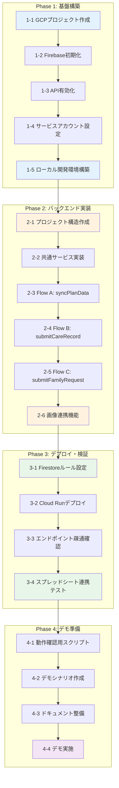

# 開発ロードマップ

## 目標

**デモ版公開**: 介護施設向けコミュニケーションアプリのプロトタイプを動作可能な状態でデプロイし、関係者にデモンストレーションできる状態にする。

---

## 全体フロー図



---

## Phase 1: 基盤構築

GCP/Firebaseの環境をCLIで構築する。

### 1-1. GCPプロジェクト作成

```bash
# 新規プロジェクト作成
gcloud projects create facility-care-demo --name="Facility Care Demo"

# プロジェクトを選択
gcloud config set project facility-care-demo

# 請求先アカウントのリンク（必要に応じて）
gcloud billing accounts list
gcloud billing projects link facility-care-demo --billing-account=BILLING_ACCOUNT_ID
```

**成果物**: GCPプロジェクト `facility-care-demo`

### 1-2. Firebase初期化

```bash
# Firebase CLIでプロジェクトに追加
firebase projects:addfirebase facility-care-demo

# ローカルでFirebase初期化
firebase init
# 選択: Firestore, Functions, Emulators
```

**成果物**: `firebase.json`, `.firebaserc`

### 1-3. API有効化

```bash
# 必要なAPIを有効化
gcloud services enable \
  cloudfunctions.googleapis.com \
  run.googleapis.com \
  firestore.googleapis.com \
  sheets.googleapis.com \
  drive.googleapis.com \
  cloudbuild.googleapis.com
```

**成果物**: 5つのAPIが有効化された状態

### 1-4. サービスアカウント設定

```bash
# サービスアカウント作成
gcloud iam service-accounts create facility-care-sa \
  --display-name="Facility Care Service Account"

# 権限付与
gcloud projects add-iam-policy-binding facility-care-demo \
  --member="serviceAccount:facility-care-sa@facility-care-demo.iam.gserviceaccount.com" \
  --role="roles/datastore.user"

# Sheets/Drive用のキー生成（必要に応じて）
gcloud iam service-accounts keys create ./keys/sa-key.json \
  --iam-account=facility-care-sa@facility-care-demo.iam.gserviceaccount.com
```

**成果物**: サービスアカウント、認証キー

### 1-5. ローカル開発環境構築

```bash
# Functions用ディレクトリで依存関係インストール
cd functions
npm init -y
npm install firebase-functions firebase-admin googleapis

# TypeScript設定
npm install -D typescript @types/node
npx tsc --init
```

**成果物**: `functions/package.json`, `functions/tsconfig.json`

### Phase 1 完了条件

- [ ] `gcloud projects describe facility-care-demo` が成功
- [ ] `firebase projects:list` にプロジェクトが表示
- [ ] `gcloud services list --enabled` で5つのAPIが確認可能
- [ ] `firebase emulators:start` が起動可能

---

## Phase 2: バックエンド実装

Cloud Run functionsのコードを実装する。

### 2-1. プロジェクト構造作成

```
functions/
├── src/
│   ├── index.ts              # エントリポイント
│   ├── config/
│   │   └── sheets.ts         # スプレッドシートID定数
│   ├── functions/
│   │   ├── syncPlanData.ts
│   │   ├── submitCareRecord.ts
│   │   ├── submitFamilyRequest.ts
│   │   └── uploadCareImage.ts
│   ├── services/
│   │   ├── sheetsService.ts
│   │   ├── firestoreService.ts
│   │   └── driveService.ts
│   └── types/
│       └── index.ts
├── package.json
└── tsconfig.json
```

**成果物**: ディレクトリ構造、設定ファイル

### 2-2. 共通サービス実装

| ファイル | 内容 |
|----------|------|
| `sheetsService.ts` | Sheets API読み取り・追記 |
| `firestoreService.ts` | Firestore CRUD操作 |
| `driveService.ts` | Drive アップロード・URL生成 |

**成果物**: 3つのサービスモジュール

### 2-3. Flow A: syncPlanData

- Sheet A（記録の結果）からデータ取得
- Firestoreへ洗い替え同期
- 全シート動的スキャン対応

**成果物**: `syncPlanData.ts`、ローカルテスト完了

### 2-4. Flow B: submitCareRecord

- ケア実績をSheet Bに追記
- **Bot連携ハック実装**（間食→特記事項+重要度）
- 画像URL対応

**成果物**: `submitCareRecord.ts`、Bot連携動作確認

### 2-5. Flow C: submitFamilyRequest

- 家族要望をFirestoreに保存
- カテゴリ・優先度対応

**成果物**: `submitFamilyRequest.ts`

### 2-6. 画像連携機能

- 画像をDriveにアップロード
- 公開URL生成
- Sheet Bへの記録

**成果物**: `uploadCareImage.ts`

### Phase 2 完了条件

- [ ] `npm run build` がエラーなく完了
- [ ] Emulatorで全エンドポイントが応答
- [ ] ローカルでSheet A読み取りテスト成功
- [ ] ローカルでSheet B書き込みテスト成功

---

## Phase 3: デプロイ・検証

本番環境（Cloud Run）へデプロイし、動作確認を行う。

### 3-1. Firestoreルール設定

```bash
# Dev Mode用ルールをデプロイ
firebase deploy --only firestore:rules
```

```javascript
// firestore.rules (Dev Mode)
rules_version = '2';
service cloud.firestore {
  match /databases/{database}/documents {
    match /{document=**} {
      allow read, write: if true;
    }
  }
}
```

**成果物**: Firestoreルールがデプロイ済み

### 3-2. Cloud Runデプロイ

```bash
# 全Functionsをデプロイ
firebase deploy --only functions

# または個別デプロイ
firebase deploy --only functions:syncPlanData
firebase deploy --only functions:submitCareRecord
firebase deploy --only functions:submitFamilyRequest
firebase deploy --only functions:uploadCareImage
```

**成果物**: 4つのCloud Run functionsがデプロイ済み

### 3-3. エンドポイント疎通確認

```bash
# 各エンドポイントの疎通確認
curl -X POST https://[REGION]-[PROJECT].cloudfunctions.net/syncPlanData \
  -H "Content-Type: application/json" \
  -d '{"triggeredBy": "manual"}'

curl -X POST https://[REGION]-[PROJECT].cloudfunctions.net/submitFamilyRequest \
  -H "Content-Type: application/json" \
  -d '{"userId":"F001","residentId":"R001","category":"meal","content":"テスト","priority":"low"}'
```

**成果物**: 全エンドポイントが200レスポンスを返す

### 3-4. スプレッドシート連携テスト

| テスト項目 | 確認内容 |
|------------|----------|
| Sheet A 読み取り | Firestoreにデータが同期される |
| Sheet B 書き込み | 行が追加される |
| Bot連携ハック | 間食入力時に「重要」フラグがセットされる |
| 画像連携 | DriveにファイルがアップロードされURLが記録される |

**成果物**: 全テスト項目がパス

### Phase 3 完了条件

- [ ] `firebase deploy` が成功
- [ ] 本番URLで全APIが応答
- [ ] Sheet A → Firestore同期が動作
- [ ] Sheet B への追記が動作
- [ ] Bot連携（重要フラグ）が動作確認済み

---

## Phase 4: デモ版PWA開発

読み取り専用のPWAアプリケーションを開発し、モバイルでSheet Aデータを閲覧可能にする。

### 4-1. PWA基盤構築

```bash
# フロントエンドプロジェクト作成
npm create vite@latest frontend -- --template react-ts
cd frontend
npm install

# PWA関連パッケージ
npm install vite-plugin-pwa workbox-window

# UI・状態管理
npm install @tanstack/react-query tailwindcss
npx tailwindcss init -p
```

**成果物**: `frontend/` ディレクトリ、PWA設定完了

### 4-2. 画面実装

| 画面 | 機能 |
|------|------|
| HOME | シート一覧（11シート）、同期ステータス、手動同期ボタン |
| SHEET_DETAIL | 選択シートのデータテーブル表示 |

**成果物**: React コンポーネント群

### 4-3. 同期機能実装

| 機能 | 実装 |
|------|------|
| 自動同期 | 15分ごと（setInterval / React Query refetchInterval） |
| 手動同期 | ボタンクリックで即座にAPI呼び出し |
| 同期状態表示 | 最終同期日時、同期中インジケータ |

```typescript
// React Query による同期設定例
const { data, refetch, isFetching } = useQuery({
  queryKey: ['planData'],
  queryFn: fetchPlanData,
  refetchInterval: 15 * 60 * 1000, // 15分
  staleTime: 5 * 60 * 1000, // 5分間はキャッシュ使用
});
```

**成果物**: 同期ロジック、UI表示

### 4-4. Firebase Hosting デプロイ

```bash
# Firebase Hosting 初期化（既存プロジェクト）
firebase init hosting
# public: frontend/dist
# SPA: Yes

# ビルド＆デプロイ
cd frontend
npm run build
cd ..
firebase deploy --only hosting
```

**成果物**: `https://facility-care-input-form.web.app` でPWA公開

### 4-5. モバイル実機テスト

| テスト項目 | 確認内容 |
|------------|----------|
| ホーム画面追加 | PWAとしてインストール可能 |
| シート一覧表示 | 全11シートが表示される |
| データ閲覧 | 各シートのデータが正しく表示 |
| 手動同期 | ボタンタップで同期実行 |
| 自動同期 | 15分後にデータ更新 |
| オフライン | 最終取得データが表示 |

**成果物**: テスト結果レポート

### Phase 4 完了条件

- [ ] PWAがFirebase Hostingにデプロイ済み
- [ ] 全11シートのデータが閲覧可能
- [ ] 15分ごと自動同期が動作
- [ ] 手動同期ボタンが動作
- [ ] モバイルでホーム画面に追加可能
- [ ] 関係者へURL共有・デモ実施完了

### Phase 4 デモシナリオ

| # | シナリオ | 操作 | 期待結果 |
|---|----------|------|----------|
| 1 | アプリ起動 | PWA URLにアクセス | シート一覧が表示 |
| 2 | シート選択 | 「食事」をタップ | 食事データ一覧表示 |
| 3 | 手動同期 | 同期ボタンをタップ | 最新データに更新 |
| 4 | 自動同期確認 | 15分待機 | 自動的にデータ更新 |
| 5 | ホーム画面追加 | ブラウザメニュー | アプリとしてインストール |

---

## Phase 4.1: タブUI・汎用データモデル ✅ 完了

スプレッドシートの列構造を動的に扱うための汎用データモデルを実装。

### 4.1-1. 汎用データモデル対応

| 項目 | 内容 |
|------|------|
| 課題 | 各シートの列構造が異なり、固定スキーマでは対応不可 |
| 解決策 | 列名をキーとしたマップ (`data: Record<string, string>`) で保存 |
| 成果物 | `functions/src/types/index.ts`、`frontend/src/types/index.ts` |

### 4.1-2. タブ形式シート切り替え

- 横スクロール可能なタブバー
- シート名 + レコード数バッジ表示
- タブタップでシート切り替え

**成果物**: `frontend/src/pages/HomePage.tsx`

### 4.1-3. 同期UX改善

- 同期成功時トースト通知（「〇シート △件を同期しました」）
- 同期エラー時エラートースト
- 同期中アニメーション

**成果物**: `frontend/src/components/Header.tsx`

### 4.1-4. Firestoreインデックス

```json
{
  "collectionGroup": "plan_data",
  "fields": [
    { "fieldPath": "sheetName", "order": "ASCENDING" },
    { "fieldPath": "timestamp", "order": "DESCENDING" }
  ]
}
```

**成果物**: `firestore.indexes.json`

### Phase 4.1 完了条件 ✅

- [x] 汎用データモデルがBackend/Frontendで実装
- [x] タブUIでシート切り替え可能
- [x] 同期トースト通知が動作
- [x] Firestoreインデックスが作成済み

---

## Phase 4.2: テーブルビュー・検索・ソート ✅ 完了

カードビューからテーブルビューへ変更し、検索・ソート機能を追加。

### 4.2-1. テーブルビュー実装

| 項目 | 仕様 |
|------|------|
| ヘッダー | シートのカラム名を動的表示 |
| ボディ | 各レコードを行として表示 |
| 横スクロール | カラム数が多い場合対応 |

### 4.2-2. 検索フィルタ

- 入居者名、スタッフ名での部分一致検索
- リアルタイムフィルタ適用

### 4.2-3. ソート機能

- 日時、入居者名、スタッフ名でソート
- 昇順/降順切り替え

### 4.2-4. ページネーション

- 1ページあたり50件表示
- 前へ/次へボタン
- 現在ページ/総ページ数表示

### 4.2-5. 詳細モーダル

行クリック/タップで全カラムの詳細情報をポップアップ表示。

| 項目 | 仕様 |
|------|------|
| トリガー | テーブル行をクリック/タップ |
| 表示内容 | 選択レコードの全カラムをラベル:値形式で表示 |
| レイアウト | **画面中央**に配置（フェードイン） |
| サイズ | 幅: 90%（max 600px）、高さ: 最大80vh |
| 閉じる | 背景タップ or ×ボタン or ESCキー |
| 利点 | 横スクロール不要で全情報を一覧可能、視認性が高い |

**設計の理由**:
- カラム数が多いデータは中央配置の方が視認性が高い
- ボトムシート形式は情報量が少ない場合に適しているが、今回のデータには不向き
- モバイル・デスクトップ両方で適切なサイズに対応

```
+----------------------------------------------------------+
|                                                          |
|    +------------------------------------------------+    |
|    |  [×]                                           |    |
|    |  血糖値インスリン投与 詳細                       |    |
|    |  2025/12/12 19:34:17                           |    |
|    +------------------------------------------------+    |
|    |                                                |    |
|    |  日時              2025/12/12 19:34:17         |    |
|    |  スタッフ名        リー                         |    |
|    |  入居者名          215_蒲地 キヌヱ様(ID7282)   |    |
|    |  特記事項          【ケアに関すること】         |    |
|    |  ...                                           |    |
|    |                                                |    |
|    |  ─────────────────────────────────────────    |    |
|    |  同期日時: 2025/12/13 17:57:08                 |    |
|    +------------------------------------------------+    |
|                                                          |
+----------------------------------------------------------+
```

### Phase 4.2 完了条件 ✅

- [x] テーブルビューがカードビューを置き換え
- [x] 検索フィルタが動作
- [x] ソート機能が動作
- [x] ページネーションが動作
- [x] 詳細モーダルが動作
- [x] Firebase Hostingへ再デプロイ

---

## Phase 4.3: 全シート同期 + 年月フィルタ ✅ 完了

**目的**: Firestoreバッチ制限を解消し、全11シートを同期可能にする。年・月フィルタUIで大量データを効率的に閲覧可能にする。

### 4.3-1. バックエンド修正（バッチ分割）

**問題**: Firestoreのバッチ書き込みは500件/バッチまでの制限があり、大量データ（食事1,482件など）でエラーが発生している。

**解決策**: 400件ずつバッチを分割して書き込み

```typescript
// firestoreService.ts
const BATCH_SIZE = 400;

async function syncSheetData(sheetName: string, records: PlanDataRecord[]): Promise<number> {
  const db = getFirestore();
  const collectionRef = db.collection('plan_data');

  // 1. 既存データ削除（シート単位）
  const existing = await collectionRef.where('sheetName', '==', sheetName).get();
  const deleteChunks = chunkArray(existing.docs, BATCH_SIZE);
  for (const chunk of deleteChunks) {
    const batch = db.batch();
    chunk.forEach(doc => batch.delete(doc.ref));
    await batch.commit();
  }

  // 2. 新規データ追加（バッチ分割）
  const insertChunks = chunkArray(records, BATCH_SIZE);
  for (const chunk of insertChunks) {
    const batch = db.batch();
    chunk.forEach(record => {
      const docRef = collectionRef.doc();
      batch.set(docRef, record);
    });
    await batch.commit();
  }

  return records.length;
}

function chunkArray<T>(array: T[], size: number): T[][] {
  const chunks: T[][] = [];
  for (let i = 0; i < array.length; i += size) {
    chunks.push(array.slice(i, i + size));
  }
  return chunks;
}
```

**影響範囲**:
- `functions/src/services/firestoreService.ts` - `syncPlanData`関数の修正

### 4.3-2. フロントエンド修正（年・月フィルタUI）

**新規コンポーネント**:

| コンポーネント | 役割 |
|----------------|------|
| `YearPaginator.tsx` | 年切り替え（◀ 2025年 ▶） |
| `MonthFilter.tsx` | 月フィルタタブ（全月/1月〜12月） |
| `MonthGroupHeader.tsx` | 月グループセパレーター |

**状態管理**:

```typescript
// HomePage.tsx
const [selectedYear, setSelectedYear] = useState<number>(new Date().getFullYear());
const [selectedMonth, setSelectedMonth] = useState<number | null>(null); // null = 全月

// フィルタ適用
const filteredRecords = useMemo(() => {
  return records.filter(record => {
    const date = new Date(record.timestamp);
    if (date.getFullYear() !== selectedYear) return false;
    if (selectedMonth !== null && date.getMonth() + 1 !== selectedMonth) return false;
    return true;
  });
}, [records, selectedYear, selectedMonth]);
```

**画面レイアウト（DEMO_PWA_SPEC.md参照）**:

```
+--------------------------------------------------+
|  介護記録ビューア                   [🔄 同期]    |
+--------------------------------------------------+
|  [◀] [2025年] [▶]                               |  ← 年ページネーション
+--------------------------------------------------+
|  [全月] [1月] [2月] ... [12月]  →                |  ← 月フィルタ
+--------------------------------------------------+
|  [食事] [水分] [排便] [バイタル] [...]  →        |  ← シートタブ
+--------------------------------------------------+
```

### 4.3-3. データ確認

現在のシート別・年別データ量（実測値）:

| シート | 2024年 | 2025年 | 合計 | バッチ数 |
|--------|--------|--------|------|----------|
| 排便・排尿 | 675 | 1,985 | 2,660 | 7 |
| 水分摂取量 | 441 | 1,626 | 2,067 | 6 |
| 特記事項 | 389 | 1,533 | 1,922 | 5 |
| 口腔ケア | 409 | 1,094 | 1,503 | 4 |
| 内服 | 393 | 1,097 | 1,490 | 4 |
| 食事 | 392 | 1,090 | 1,482 | 4 |
| 血糖値インスリン投与 | 379 | 1,077 | 1,456 | 4 |
| バイタル | 139 | 450 | 589 | 2 |
| 体重 | 58 | 339 | 397 | 1 |
| 往診録 | 14 | 33 | 47 | 1 |
| カンファレンス録 | - | 1 | 1 | 1 |
| **合計** | **3,289** | **10,325** | **13,614** | **39** |

### Phase 4.3 完了条件 ✅

- [x] バッチ分割実装でエラーなく全シート同期
- [x] 全11シートがフロントエンドで閲覧可能
- [x] 年ページネーションが動作
- [x] 月フィルタが動作
- [x] Firebase Hostingへ再デプロイ

---

## Phase 4.4: シート表示順序修正 ✅ 完了

**目的**: APIレスポンスのシート順序をスプレッドシートのタブ順序に一致させる。

### 4.4-1. 問題

- APIレスポンスのシート順序がスプレッドシートの元のタブ順序と異なっていた
- 原因: `getPlanData.ts` で `Map.entries()` から配列作成時、Firestoreクエリの返却順序に依存

### 4.4-2. 解決策

**SHEET_A_ORDER定数追加** (`functions/src/config/sheets.ts`):

```typescript
export const SHEET_A_ORDER: string[] = [
  "食事",
  "水分摂取量",
  "排便・排尿",
  "バイタル",
  "口腔ケア",
  "内服",
  "特記事項",
  "血糖値インスリン投与",
  "往診録",
  "体重",
  "カンファレンス録",
];
```

**ソート処理追加** (`functions/src/functions/getPlanData.ts`):

```typescript
const sheets: SheetSummary[] = Array.from(sheetMap.entries())
  .map(([name, info]) => ({ sheetName: name, ... }))
  .sort((a, b) => {
    const indexA = SHEET_A_ORDER.indexOf(a.sheetName);
    const indexB = SHEET_A_ORDER.indexOf(b.sheetName);
    return (indexA === -1 ? SHEET_A_ORDER.length : indexA) -
           (indexB === -1 ? SHEET_A_ORDER.length : indexB);
  });
```

### Phase 4.4 完了条件 ✅

- [x] SHEET_A_ORDER定数をsheets.tsに追加
- [x] getPlanDataでシート順序ソート処理追加
- [x] ドキュメント更新（SHEET_A_STRUCTURE.md）
- [x] Cloud Functionsデプロイ
- [x] curlで検証（スプレッドシート元順序と一致確認）

---

## Phase 4.5: デザイン改善 + 差分同期実装 (計画中)

**目的**:
1. プロWebデザイナーのアドバイスに基づき、UIの視覚的品質を向上させる
2. 差分同期を実装し、Firestoreコストを最適化する

> **詳細**: [DESIGN_GUIDELINES.md](./DESIGN_GUIDELINES.md) を参照

### 4.5-1. 現状の問題点

| 問題 | 詳細 |
|------|------|
| 視覚的階層の欠如 | 要素間の区別がつきにくい、視線誘導不足 |
| カラーパレット単調 | 青一色で単調、アクセントカラーなし |
| タイポグラフィ | 見出し・本文の区別が曖昧 |
| レイアウト | 余白不足、モバイル最適化不足 |

### 4.5-2. 改善計画

#### 高優先度（即時対応）
- [ ] カラーパレット適用（Tailwind設定更新）
- [ ] ヘッダーデザイン改善（グラデーション、影）
- [ ] 月フィルタ・シートタブのスタイル改善
- [ ] 検索バーのUI改善
- [ ] テーブルのゼブラストライプ・ホバー追加

#### 中優先度（次回対応）
- [ ] シート別アイコン追加
- [ ] モバイル向けボトムナビゲーション
- [ ] アニメーション・トランジション追加

#### 低優先度（将来対応）
- [ ] ダークモード対応

### 4.5-3. カラーシステム

```
Primary: #2563EB (Blue 600)
Secondary: #10B981 (Emerald 500)
Warning: #F59E0B (Amber 500)
Error: #EF4444 (Red 500)
Accent: #14B8A6 (Teal)
```

### 4.5-4. シート別アイコン

| シート名 | アイコン |
|----------|----------|
| 食事 | 🍽️ |
| 水分摂取量 | 💧 |
| 排便・排尿 | 🚻 |
| バイタル | ❤️ |
| 口腔ケア | 🦷 |
| 内服 | 💊 |
| 特記事項 | 📝 |
| 血糖値インスリン投与 | 💉 |
| 往診録 | 🩺 |
| 体重 | ⚖️ |
| カンファレンス録 | 👥 |

### 4.5-5. 差分同期実装（コスト最適化）

**現状の問題**:
- SYNC_STRATEGY.md では15分自動同期は「差分同期」と定義
- しかし現在の実装は自動・手動ともに「完全洗い替え」
- 月間コスト: 現状 ~$144/月 → 差分同期実装後 ~$5-15/月 (90%以上削減)

**実装計画**:

1. **バックエンド修正**
   - `syncPlanData` に `incremental: boolean` パラメータ追加
   - `incremental: true` の場合、最終同期時刻以降の新規レコードのみ取得・追加
   - 既存データは削除せず、新規追加のみ

2. **フロントエンド修正**
   - 自動同期（15分ごと）: `incremental: true` で呼び出し
   - 手動同期（ボタン）: `incremental: false` で完全洗い替え

3. **差分検出ロジック**
   ```typescript
   // Firestoreから最終同期時刻を取得
   const lastSync = await getLastSyncTimestamp(sheetName);

   // Sheets APIで最終同期以降のデータのみ取得
   const newRecords = rows.filter(row => {
     const timestamp = parseTimestamp(row[0]);
     return timestamp > lastSync;
   });
   ```

**影響ファイル**:
- `functions/src/functions/syncPlanData.ts`
- `functions/src/services/firestoreService.ts`
- `frontend/src/hooks/useSync.ts`
- `frontend/src/api/index.ts`

### Phase 4.5 完了条件

- [ ] DESIGN_GUIDELINES.md に基づくUI実装
- [ ] 高優先度項目の実装完了
- [ ] 差分同期実装（15分自動同期がincremental）
- [ ] Firebase Hostingへ再デプロイ
- [ ] モバイル実機での見た目確認

---

## Phase 4.8: 同期競合防止 + コスト最適化 🔄 実装中

**目的**:
1. 複数ユーザー・複数デバイスからの同時同期によるデータ重複を防止
2. Firestoreコストを90%以上削減

> **詳細**: [SYNC_CONCURRENCY.md](./SYNC_CONCURRENCY.md) を参照

### 4.8-1. 問題（インシデント 2025-12-14）

- Firestoreの`plan_data`コレクションで全レコードが2重に保存
- 原因: 複数の`syncPlanData`処理が同時実行（Race Condition）
- フロントエンドでの対策（localStorage）は同一ブラウザ内のみ有効で不十分

### 4.8-2. 採用設計: Cloud Scheduler + 差分同期 + 日次洗い替え

MoE多角的評価の結果、以下の設計を採用:

| 項目 | 変更前 | 変更後 |
|------|--------|--------|
| 15分自動同期 | PWAのsetInterval（洗い替え） | **Cloud Scheduler（差分同期）** |
| 日次同期 | なし | **Cloud Scheduler（完全同期/午前3時）** |
| 手動同期 | syncPlanData API呼び出し | **Firestoreキャッシュ再取得のみ** |
| 競合リスク | 複数トリガーで競合 | **単一トリガーで競合なし** |
| 重複防止 | なし | **決定論的ドキュメントID** |
| 月間コスト | 約$144 | **約$5-15（90%削減）** |

### 4.8-3. 実装タスク

| タスク | 状態 |
|--------|------|
| `syncPlanData.ts` incremental パラメータ追加 | 未実装 |
| `firestoreService.ts` 差分同期ロジック追加 | 未実装 |
| `firestoreService.ts` 決定論的ID生成追加 | 未実装 |
| `sync_metadata` コレクション対応 | 未実装 |
| Cloud Scheduler ジョブ作成（差分/完全） | 未実装 |
| `useSync.ts` 簡素化 | 未実装 |
| `Header.tsx` UI変更（同期→更新） | 未実装 |
| デプロイ・検証 | 未実装 |

### 4.8-4. Cloud Scheduler コマンド

```bash
# 15分ごと差分同期
gcloud scheduler jobs create http sync-plan-data-incremental \
  --location=asia-northeast1 \
  --schedule="*/15 * * * *" \
  --uri="https://asia-northeast1-facility-care-input-form.cloudfunctions.net/syncPlanData" \
  --http-method=POST \
  --headers="Content-Type=application/json" \
  --message-body='{"triggeredBy":"scheduler","incremental":true}' \
  --time-zone="Asia/Tokyo" \
  --description="15分ごとの差分同期"

# 日次完全同期（午前3時）
gcloud scheduler jobs create http sync-plan-data-full \
  --location=asia-northeast1 \
  --schedule="0 3 * * *" \
  --uri="https://asia-northeast1-facility-care-input-form.cloudfunctions.net/syncPlanData" \
  --http-method=POST \
  --headers="Content-Type=application/json" \
  --message-body='{"triggeredBy":"scheduler","incremental":false}' \
  --time-zone="Asia/Tokyo" \
  --description="日次の完全同期（午前3時）"
```

### Phase 4.8 完了条件

- [ ] バックエンド差分同期ロジック実装
- [ ] 決定論的ドキュメントID実装
- [ ] Cloud Scheduler ジョブ作成（差分/完全）
- [ ] フロントエンドから`syncPlanData`呼び出しを削除
- [ ] 「更新」ボタンがFirestoreキャッシュ再取得のみ実行
- [ ] シミュレーション・競合テスト合格
- [ ] デプロイ・動作検証完了
- [ ] ドキュメント更新完了

---

## マイルストーンサマリー

```
Phase 1: 基盤構築            ████████████████████ 100% (完了)
Phase 2: バックエンド実装     ████████████████████ 100% (完了)
Phase 3: デプロイ・検証       ████████████████████ 100% (完了)
Phase 4: デモ版PWA開発       ████████████████████ 100% (完了)
Phase 4.1: タブUI・汎用モデル  ████████████████████ 100% (完了)
Phase 4.2: テーブルビュー     ████████████████████ 100% (完了)
Phase 4.3: 全シート同期       ████████████████████ 100% (完了)
Phase 4.4: シート順序修正     ████████████████████ 100% (完了)
Phase 4.5: デザイン改善       ████████████████████ 100% (完了)
Phase 4.9: 同期競合防止       ████████████████████ 100% (完了)
Phase 5.0: 食事入力フォームUI ████████████████████ 100% (完了)
Phase 5.1: Sheet B SA接続    ████████████████████ 100% (完了)
Phase 5.2: 食事入力フォームAPI ████████████████████ 100% (完了)
                             ─────────────────────
                             合計: 50+ tasks
```

| Phase | タスク数 | 主な成果物 | 状態 |
|-------|----------|------------|------|
| Phase 1 | 5 | GCP/Firebase環境、ローカル開発環境 | ✅ 完了 |
| Phase 2 | 6 | Cloud Functions（7エンドポイント） | ✅ 完了 |
| Phase 3 | 4 | 本番デプロイ、Sheet A読み取り確認 | ✅ 完了 |
| Phase 4 | 5 | デモ版PWA（読み取り専用） | ✅ 完了 |
| Phase 4.1 | 5 | タブUI、汎用データモデル、同期通知 | ✅ 完了 |
| Phase 4.2 | 6 | テーブルビュー、検索、ソート、詳細モーダル | ✅ 完了 |
| Phase 4.3 | 5 | 全シート同期（バッチ分割）、年月フィルタUI | ✅ 完了 |
| Phase 4.4 | 5 | シート表示順序修正（SHEET_A_ORDER） | ✅ 完了 |
| Phase 4.5 | 5 | デザイン改善（カラー、タイポ、アイコン） | ✅ 完了 |
| Phase 4.9 | 5 | 同期競合防止（Cloud Scheduler、決定論的ID） | ✅ 完了 |
| Phase 5.0 | 3 | 食事入力フォームUI | ✅ 完了 |
| Phase 5.1 | 2 | Sheet B サービスアカウント接続 | ✅ 完了 |
| Phase 5.2 | 5 | submitMealRecord API実装・動作確認 | ✅ 完了 |
| Phase 6.0 | 4 | フッターナビゲーション基盤 | ✅ 完了 |
| Phase 6.1 | - | ビュー分離（閲覧/入力） | ✅ 完了（6.0に統合） |

---

## Phase 6.0: フッターナビゲーション基盤 ✅ 完了

**目的**: FABボタン方式からフッターナビゲーション方式に変更し、「読み取り専用ビュー」と「書き込み専用ビュー」を明確に分離する。

> **詳細設計**: [FOOTER_NAVIGATION_SPEC.md](./FOOTER_NAVIGATION_SPEC.md) を参照

### 6.0-1. 背景・課題

| 問題 | 詳細 |
|------|------|
| FABの発見性が低い | 右下のFABボタンは目立たず、初見ユーザーは入力方法がわからない |
| 操作性が悪い | 画面右下は片手操作時に親指が届きにくい |
| コンテキストが曖昧 | 「閲覧中」か「入力中」かが視覚的に不明確 |
| 拡張性が低い | 入力フォームが増えた場合、FABメニューが煩雑になる |

### 6.0-2. 設計概要

```
┌──────────────────────────────────────┐
│              [Header]                │
├──────────────────────────────────────┤
│                                      │
│         [メインコンテンツ]            │
│                                      │
├──────────────────────────────────────┤
│    📋 記録閲覧    │    ✏️ 記録入力    │  ← 2タブ構成
└──────────────────────────────────────┘
```

### 6.0-3. 実装タスク

| タスク | ファイル | 状態 |
|--------|----------|------|
| Layout.tsx 作成 | `frontend/src/components/Layout.tsx` | 📋 |
| FooterNav.tsx 作成 | `frontend/src/components/FooterNav.tsx` | 📋 |
| App.tsx ルーティング変更 | `frontend/src/App.tsx` | 📋 |
| Safe Area 対応 | `frontend/src/index.css` | 📋 |

### 6.0-4. ルーティング変更

| パス | 変更前 | 変更後 |
|------|--------|--------|
| `/` | HomePage | リダイレクト → `/view` |
| `/view` | - | ViewPage（記録閲覧） |
| `/input` | - | InputPage（入力メニュー） |
| `/input/meal` | MealInputPage | MealInputPage（変更なし） |

### Phase 6.0 完了条件

- [x] Layout.tsx 作成（Header + Main + FooterNav）
- [x] FooterNav.tsx 作成（2タブ構成、色反転で視認性向上）
- [x] App.tsx ルーティング変更
- [x] Safe Area 対応（iOS）
- [x] ビルド・Lint 確認
- [x] ローカル動作確認
- [x] 中間画面（InputPage）削除、直接食事入力へ遷移

---

## Phase 6.1: ビュー分離（閲覧/入力）📋 計画中

**目的**: 閲覧ビューと入力ビューを完全に分離し、入力メニュー画面を作成する。

### 6.1-1. 実装タスク

| タスク | ファイル | 状態 |
|--------|----------|------|
| HomePage → ViewPage リネーム | `frontend/src/pages/ViewPage.tsx` | 📋 |
| FABボタン削除 | - | 📋 |
| InputPage 作成（入力メニュー） | `frontend/src/pages/InputPage.tsx` | 📋 |
| InputCard 作成 | `frontend/src/components/InputCard.tsx` | 📋 |

### 6.1-2. 入力メニュー画面

```
┌──────────────────────────────────────┐
│          記録入力                    │
├──────────────────────────────────────┤
│  ┌────────────┐  ┌────────────┐      │
│  │ 🍽️ 食事    │  │ 💧 水分    │      │
│  │ 記録       │  │ 記録       │      │
│  └────────────┘  └────────────┘      │
│                                      │
│  ┌────────────┐  ┌────────────┐      │
│  │ 🚻 排泄    │  │ ❤️ バイタル │      │
│  │ 記録       │  │ 記録       │      │
│  └────────────┘  └────────────┘      │
│                                      │
│  ┌────────────┐                      │
│  │ 📝 特記事項 │                      │
│  └────────────┘                      │
├──────────────────────────────────────┤
│    📋 記録閲覧    │    ✏️ 記録入力    │
└──────────────────────────────────────┘
```

### 6.1-3. 入力種別

| 種別 | アイコン | パス | 状態 |
|------|----------|------|------|
| 食事記録 | 🍽️ | `/input/meal` | ✅ 実装済み |
| 水分記録 | 💧 | `/input/hydration` | 📋 将来実装 |
| 排泄記録 | 🚻 | `/input/excretion` | 📋 将来実装 |
| バイタル記録 | ❤️ | `/input/vital` | 📋 将来実装 |
| 特記事項 | 📝 | `/input/note` | 📋 将来実装 |

### Phase 6.1 完了条件

- [ ] ViewPage 作成（旧HomePage）
- [ ] FABボタン削除
- [ ] InputPage 作成
- [ ] InputCard 作成
- [ ] 食事記録カードから `/input/meal` へ遷移
- [ ] Firebase Hosting デプロイ
- [ ] モバイル実機確認

---

## リスクと対策

| リスク | 影響 | 対策 |
|--------|------|------|
| Sheets API権限不足 | Sheet読み書き失敗 | サービスアカウントをシートに編集者として追加 |
| Bot連携ハックの誤動作 | 通知が飛ばない/誤通知 | 専用テスト行で事前検証 |
| 画像サイズ超過 | アップロード失敗 | Cloud Functions のメモリ/タイムアウト調整 |
| Dev Mode のセキュリティ | データ漏洩リスク | デモ終了後にルール変更、URLは関係者限定共有 |

---

## 次のアクション

**Phase 1-1 から開始**: `docs/SETUP.md` に詳細なCLIコマンドを記載し、順次実行していく。

```bash
# 最初のコマンド
gcloud projects create facility-care-demo --name="Facility Care Demo"
```
