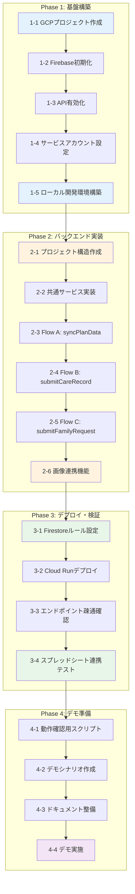

# 開発ロードマップ

## 目標

**デモ版公開**: 介護施設向けコミュニケーションアプリのプロトタイプを動作可能な状態でデプロイし、関係者にデモンストレーションできる状態にする。

---

## 全体フロー図



---

## Phase 1: 基盤構築

GCP/Firebaseの環境をCLIで構築する。

### 1-1. GCPプロジェクト作成

```bash
# 新規プロジェクト作成
gcloud projects create facility-care-demo --name="Facility Care Demo"

# プロジェクトを選択
gcloud config set project facility-care-demo

# 請求先アカウントのリンク（必要に応じて）
gcloud billing accounts list
gcloud billing projects link facility-care-demo --billing-account=BILLING_ACCOUNT_ID
```

**成果物**: GCPプロジェクト `facility-care-demo`

### 1-2. Firebase初期化

```bash
# Firebase CLIでプロジェクトに追加
firebase projects:addfirebase facility-care-demo

# ローカルでFirebase初期化
firebase init
# 選択: Firestore, Functions, Emulators
```

**成果物**: `firebase.json`, `.firebaserc`

### 1-3. API有効化

```bash
# 必要なAPIを有効化
gcloud services enable \
  cloudfunctions.googleapis.com \
  run.googleapis.com \
  firestore.googleapis.com \
  sheets.googleapis.com \
  drive.googleapis.com \
  cloudbuild.googleapis.com
```

**成果物**: 5つのAPIが有効化された状態

### 1-4. サービスアカウント設定

```bash
# サービスアカウント作成
gcloud iam service-accounts create facility-care-sa \
  --display-name="Facility Care Service Account"

# 権限付与
gcloud projects add-iam-policy-binding facility-care-demo \
  --member="serviceAccount:facility-care-sa@facility-care-demo.iam.gserviceaccount.com" \
  --role="roles/datastore.user"

# Sheets/Drive用のキー生成（必要に応じて）
gcloud iam service-accounts keys create ./keys/sa-key.json \
  --iam-account=facility-care-sa@facility-care-demo.iam.gserviceaccount.com
```

**成果物**: サービスアカウント、認証キー

### 1-5. ローカル開発環境構築

```bash
# Functions用ディレクトリで依存関係インストール
cd functions
npm init -y
npm install firebase-functions firebase-admin googleapis

# TypeScript設定
npm install -D typescript @types/node
npx tsc --init
```

**成果物**: `functions/package.json`, `functions/tsconfig.json`

### Phase 1 完了条件

- [ ] `gcloud projects describe facility-care-demo` が成功
- [ ] `firebase projects:list` にプロジェクトが表示
- [ ] `gcloud services list --enabled` で5つのAPIが確認可能
- [ ] `firebase emulators:start` が起動可能

---

## Phase 2: バックエンド実装

Cloud Run functionsのコードを実装する。

### 2-1. プロジェクト構造作成

```
functions/
├── src/
│   ├── index.ts              # エントリポイント
│   ├── config/
│   │   └── sheets.ts         # スプレッドシートID定数
│   ├── functions/
│   │   ├── syncPlanData.ts
│   │   ├── submitCareRecord.ts
│   │   ├── submitFamilyRequest.ts
│   │   └── uploadCareImage.ts
│   ├── services/
│   │   ├── sheetsService.ts
│   │   ├── firestoreService.ts
│   │   └── driveService.ts
│   └── types/
│       └── index.ts
├── package.json
└── tsconfig.json
```

**成果物**: ディレクトリ構造、設定ファイル

### 2-2. 共通サービス実装

| ファイル | 内容 |
|----------|------|
| `sheetsService.ts` | Sheets API読み取り・追記 |
| `firestoreService.ts` | Firestore CRUD操作 |
| `driveService.ts` | Drive アップロード・URL生成 |

**成果物**: 3つのサービスモジュール

### 2-3. Flow A: syncPlanData

- Sheet A（記録の結果）からデータ取得
- Firestoreへ洗い替え同期
- 全シート動的スキャン対応

**成果物**: `syncPlanData.ts`、ローカルテスト完了

### 2-4. Flow B: submitCareRecord

- ケア実績をSheet Bに追記
- **Bot連携ハック実装**（間食→特記事項+重要度）
- 画像URL対応

**成果物**: `submitCareRecord.ts`、Bot連携動作確認

### 2-5. Flow C: submitFamilyRequest

- 家族要望をFirestoreに保存
- カテゴリ・優先度対応

**成果物**: `submitFamilyRequest.ts`

### 2-6. 画像連携機能

- 画像をDriveにアップロード
- 公開URL生成
- Sheet Bへの記録

**成果物**: `uploadCareImage.ts`

### Phase 2 完了条件

- [ ] `npm run build` がエラーなく完了
- [ ] Emulatorで全エンドポイントが応答
- [ ] ローカルでSheet A読み取りテスト成功
- [ ] ローカルでSheet B書き込みテスト成功

---

## Phase 3: デプロイ・検証

本番環境（Cloud Run）へデプロイし、動作確認を行う。

### 3-1. Firestoreルール設定

```bash
# Dev Mode用ルールをデプロイ
firebase deploy --only firestore:rules
```

```javascript
// firestore.rules (Dev Mode)
rules_version = '2';
service cloud.firestore {
  match /databases/{database}/documents {
    match /{document=**} {
      allow read, write: if true;
    }
  }
}
```

**成果物**: Firestoreルールがデプロイ済み

### 3-2. Cloud Runデプロイ

```bash
# 全Functionsをデプロイ
firebase deploy --only functions

# または個別デプロイ
firebase deploy --only functions:syncPlanData
firebase deploy --only functions:submitCareRecord
firebase deploy --only functions:submitFamilyRequest
firebase deploy --only functions:uploadCareImage
```

**成果物**: 4つのCloud Run functionsがデプロイ済み

### 3-3. エンドポイント疎通確認

```bash
# 各エンドポイントの疎通確認
curl -X POST https://[REGION]-[PROJECT].cloudfunctions.net/syncPlanData \
  -H "Content-Type: application/json" \
  -d '{"triggeredBy": "manual"}'

curl -X POST https://[REGION]-[PROJECT].cloudfunctions.net/submitFamilyRequest \
  -H "Content-Type: application/json" \
  -d '{"userId":"F001","residentId":"R001","category":"meal","content":"テスト","priority":"low"}'
```

**成果物**: 全エンドポイントが200レスポンスを返す

### 3-4. スプレッドシート連携テスト

| テスト項目 | 確認内容 |
|------------|----------|
| Sheet A 読み取り | Firestoreにデータが同期される |
| Sheet B 書き込み | 行が追加される |
| Bot連携ハック | 間食入力時に「重要」フラグがセットされる |
| 画像連携 | DriveにファイルがアップロードされURLが記録される |

**成果物**: 全テスト項目がパス

### Phase 3 完了条件

- [ ] `firebase deploy` が成功
- [ ] 本番URLで全APIが応答
- [ ] Sheet A → Firestore同期が動作
- [ ] Sheet B への追記が動作
- [ ] Bot連携（重要フラグ）が動作確認済み

---

## Phase 4: デモ版PWA開発

読み取り専用のPWAアプリケーションを開発し、モバイルでSheet Aデータを閲覧可能にする。

### 4-1. PWA基盤構築

```bash
# フロントエンドプロジェクト作成
npm create vite@latest frontend -- --template react-ts
cd frontend
npm install

# PWA関連パッケージ
npm install vite-plugin-pwa workbox-window

# UI・状態管理
npm install @tanstack/react-query tailwindcss
npx tailwindcss init -p
```

**成果物**: `frontend/` ディレクトリ、PWA設定完了

### 4-2. 画面実装

| 画面 | 機能 |
|------|------|
| HOME | シート一覧（11シート）、同期ステータス、手動同期ボタン |
| SHEET_DETAIL | 選択シートのデータテーブル表示 |

**成果物**: React コンポーネント群

### 4-3. 同期機能実装

| 機能 | 実装 |
|------|------|
| 自動同期 | 15分ごと（setInterval / React Query refetchInterval） |
| 手動同期 | ボタンクリックで即座にAPI呼び出し |
| 同期状態表示 | 最終同期日時、同期中インジケータ |

```typescript
// React Query による同期設定例
const { data, refetch, isFetching } = useQuery({
  queryKey: ['planData'],
  queryFn: fetchPlanData,
  refetchInterval: 15 * 60 * 1000, // 15分
  staleTime: 5 * 60 * 1000, // 5分間はキャッシュ使用
});
```

**成果物**: 同期ロジック、UI表示

### 4-4. Firebase Hosting デプロイ

```bash
# Firebase Hosting 初期化（既存プロジェクト）
firebase init hosting
# public: frontend/dist
# SPA: Yes

# ビルド＆デプロイ
cd frontend
npm run build
cd ..
firebase deploy --only hosting
```

**成果物**: `https://facility-care-input-form.web.app` でPWA公開

### 4-5. モバイル実機テスト

| テスト項目 | 確認内容 |
|------------|----------|
| ホーム画面追加 | PWAとしてインストール可能 |
| シート一覧表示 | 全11シートが表示される |
| データ閲覧 | 各シートのデータが正しく表示 |
| 手動同期 | ボタンタップで同期実行 |
| 自動同期 | 15分後にデータ更新 |
| オフライン | 最終取得データが表示 |

**成果物**: テスト結果レポート

### Phase 4 完了条件

- [ ] PWAがFirebase Hostingにデプロイ済み
- [ ] 全11シートのデータが閲覧可能
- [ ] 15分ごと自動同期が動作
- [ ] 手動同期ボタンが動作
- [ ] モバイルでホーム画面に追加可能
- [ ] 関係者へURL共有・デモ実施完了

### Phase 4 デモシナリオ

| # | シナリオ | 操作 | 期待結果 |
|---|----------|------|----------|
| 1 | アプリ起動 | PWA URLにアクセス | シート一覧が表示 |
| 2 | シート選択 | 「食事」をタップ | 食事データ一覧表示 |
| 3 | 手動同期 | 同期ボタンをタップ | 最新データに更新 |
| 4 | 自動同期確認 | 15分待機 | 自動的にデータ更新 |
| 5 | ホーム画面追加 | ブラウザメニュー | アプリとしてインストール |

---

## マイルストーンサマリー

```
Phase 1: 基盤構築        ████████████████████ 100% (完了)
Phase 2: バックエンド実装  ████████████████████ 100% (完了)
Phase 3: デプロイ・検証    ████████████████░░░░  80% (Sheet B共有待ち)
Phase 4: デモ版PWA開発    ░░░░░░░░░░░░░░░░░░░░   0% (次フェーズ)
                         ─────────────────────
                         合計: 20 tasks → デモ公開
```

| Phase | タスク数 | 主な成果物 | 状態 |
|-------|----------|------------|------|
| Phase 1 | 5 | GCP/Firebase環境、ローカル開発環境 | ✅ 完了 |
| Phase 2 | 6 | Cloud Functions（7エンドポイント） | ✅ 完了 |
| Phase 3 | 4 | 本番デプロイ、Sheet A読み取り確認 | 🔄 80% |
| Phase 4 | 5 | デモ版PWA（読み取り専用） | ⬜ 未着手 |

---

## リスクと対策

| リスク | 影響 | 対策 |
|--------|------|------|
| Sheets API権限不足 | Sheet読み書き失敗 | サービスアカウントをシートに編集者として追加 |
| Bot連携ハックの誤動作 | 通知が飛ばない/誤通知 | 専用テスト行で事前検証 |
| 画像サイズ超過 | アップロード失敗 | Cloud Functions のメモリ/タイムアウト調整 |
| Dev Mode のセキュリティ | データ漏洩リスク | デモ終了後にルール変更、URLは関係者限定共有 |

---

## 次のアクション

**Phase 1-1 から開始**: `docs/SETUP.md` に詳細なCLIコマンドを記載し、順次実行していく。

```bash
# 最初のコマンド
gcloud projects create facility-care-demo --name="Facility Care Demo"
```
