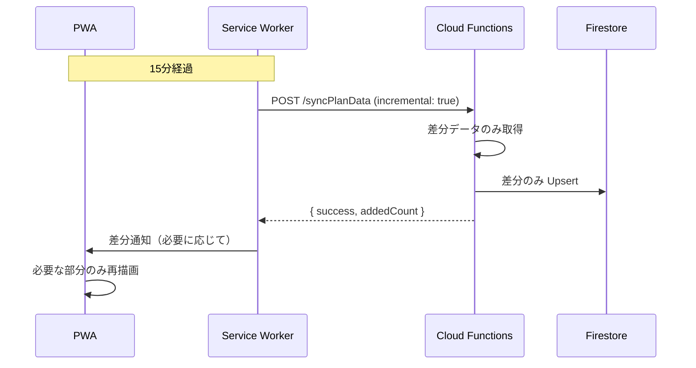
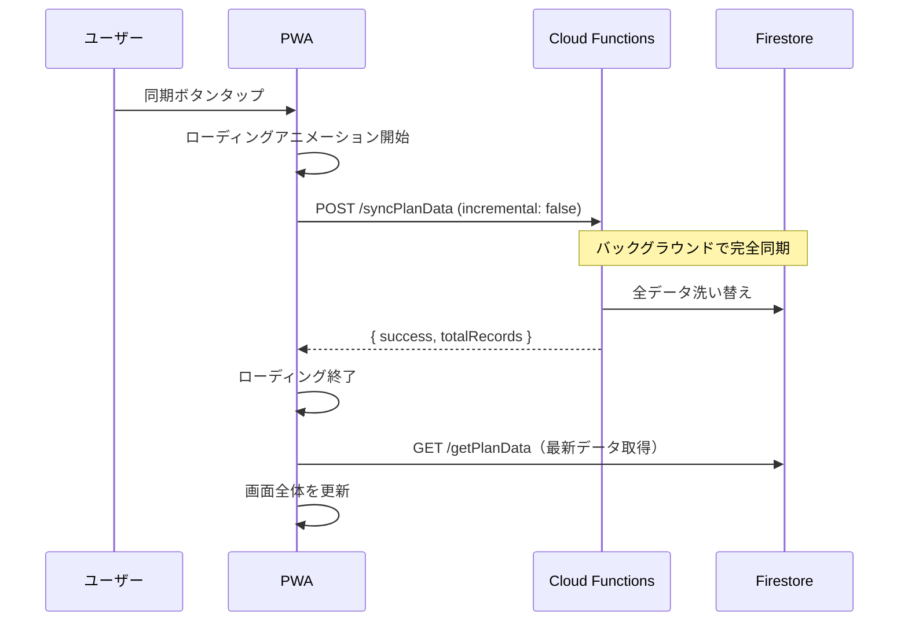

# 同期戦略設計書

> **最終更新**: 2025年12月13日
>
> このドキュメントは、Sheet A（記録の結果）からFirestoreへのデータ同期戦略を定義します。

---

## 1. 現状分析

### 1.1 データ規模

| 項目 | 値 |
|------|-----|
| シート数 | 11 |
| 総レコード数 | 約13,600件 |
| 1回の完全同期時間 | 約65秒 |
| 同期データサイズ | 推定 5-10MB |

### 1.2 シート別レコード数（推定）

| シート名 | 用途 | 更新頻度 |
|----------|------|----------|
| 食事 | 食事記録 | 高（毎日3回×人数） |
| 水分摂取量 | 水分記録 | 高 |
| 排便・排尿 | 排泄記録 | 高 |
| バイタル | バイタルサイン | 高 |
| 口腔ケア | 口腔ケア記録 | 中 |
| 内服 | 服薬記録 | 中 |
| 特記事項 | 特記事項 | 中 |
| 血糖値インスリン投与 | 血糖・インスリン | 低（対象者のみ） |
| 往診録 | 往診記録 | 低（週1-2回程度） |
| 体重 | 体重測定 | 低（週1回程度） |
| カンファレンス録 | カンファレンス | 低（月1回程度） |

---

## 2. 同期戦略

### 2.1 概要

| 同期種別 | トリガー | 方式 | 目的 |
|----------|----------|------|------|
| **自動同期** | 15分ごと | 差分同期 | 通常運用時のリアルタイム性確保 |
| **手動同期** | ユーザー操作 | 完全洗い替え | データ整合性の保証 |

### 2.2 差分同期（自動同期用）

**方式**: タイムスタンプベースの増分取得

```
前回同期時刻 < レコードのタイムスタンプ → 新規/更新として取得
```

**メリット**:
- API呼び出しのデータ量削減
- Firestoreの書き込み回数削減
- バッテリー・通信量の節約

**実装方針**:
1. Firestoreに `sync_metadata` コレクションを追加
2. 各シートの最終同期時刻を記録
3. Sheets APIで条件付き取得（タイムスタンプフィルタ）

### 2.3 完全洗い替え（手動同期用）

**方式**: 全データ削除 → 全データ再取得

**メリット**:
- データ整合性を完全に保証
- 削除されたレコードも反映

**UX考慮**:
- バックグラウンドで処理実行
- 同期中はアニメーション表示
- 完了後に画面を自動更新

---

## 3. フロントエンド同期フロー

### 3.1 自動同期（15分ごと）



### 3.2 手動同期（完全洗い替え）



---

## 4. データモデル改善

### 4.1 現状の問題

現在の `PlanData` 型は固定構造で、実際のシート構造と一致していない：

```typescript
// 現在の型（不適切）
interface PlanData {
  residentId: string;      // 実際は A列: タイムスタンプ
  residentName: string;    // 実際は B列: 入力者名
  mealRestrictions: string[];  // 実際は C列: 利用者名
  // ...
}
```

### 4.2 改善案: 汎用データモデル

**方針**: 列名をキーとした柔軟な構造に変更

```typescript
// 改善後の型
interface SheetRecord {
  id: string;                    // ドキュメントID
  sheetName: string;             // シート名（例: "食事"）
  timestamp: string;             // A列: タイムスタンプ
  staffName: string;             // B列: 入力者名
  residentName: string;          // C列: 利用者名（一部シートはD列）
  data: Record<string, string>;  // D列以降: 列名→値のマップ
  rawRow: string[];              // 元データ（デバッグ用）
  syncedAt: Timestamp;           // Firestore同期日時
}
```

### 4.3 シート別列マッピング

各シートの列構造は `SHEET_A_STRUCTURE.md` を参照。

共通パターン:
- **A列**: タイムスタンプ
- **B列**: 入力者名（スタッフ）
- **C列**: 利用者名（※血糖値シートはD列）
- **D列以降**: シート固有データ

---

## 5. PWA画面設計

### 5.1 画面構成

```
+------------------------------------------+
|  介護記録ビューア            [手動同期]   |
+------------------------------------------+
| [食事] [水分] [排泄] [バイタル] [...]     |  ← タブ切り替え
+------------------------------------------+
|  最終同期: 16:45 | 13件                  |
+------------------------------------------+
|                                          |
|  +------------------------------------+  |
|  | 2024/09/01 09:37                   |  |
|  | 入力者: 藤田                       |  |
|  | 利用者: 215_蒲地 キヌヱ様          |  |
|  | 食事: 朝 | 主食: 9割 | 副食: 9割  |  |
|  +------------------------------------+  |
|                                          |
|  +------------------------------------+  |
|  | 2024/09/01 13:06                   |  |
|  | ...                                |  |
|  +------------------------------------+  |
|                                          |
+------------------------------------------+
```

### 5.2 タブナビゲーション

| タブ | シート名 | アイコン（例） |
|------|----------|---------------|
| 食事 | 食事 | 🍽️ |
| 水分 | 水分摂取量 | 💧 |
| 排泄 | 排便・排尿 | 🚻 |
| バイタル | バイタル | ❤️ |
| 口腔 | 口腔ケア | 🦷 |
| 内服 | 内服 | 💊 |
| 特記 | 特記事項 | 📝 |
| 血糖 | 血糖値インスリン投与 | 🩸 |
| 往診 | 往診録 | 🏥 |
| 体重 | 体重 | ⚖️ |
| 会議 | カンファレンス録 | 👥 |

---

## 6. 同期中のUX

### 6.1 手動同期時の表示

```
+------------------------------------------+
|  介護記録ビューア            [同期中...]  |
+------------------------------------------+
|                                          |
|        ┌────────────────────┐            |
|        │   ○ ○ ○            │            |
|        │   同期中...        │            |
|        │   11シートを更新中  │            |
|        │   [キャンセル]     │            |
|        └────────────────────┘            |
|                                          |
+------------------------------------------+
```

### 6.2 完了時の通知

- トースト通知: 「13,603件のデータを同期しました」
- 画面の自動更新（現在表示中のシート）

---

## 7. 実装優先度

### Phase 4.5: 同期改善（推奨実装順）

| 優先度 | タスク | 理由 |
|--------|--------|------|
| 1 | データモデル修正（汎用型） | フロントエンド表示の前提 |
| 2 | フロントエンドタブUI | シート別閲覧の実現 |
| 3 | 手動同期UX改善 | ユーザー体験向上 |
| 4 | 差分同期実装 | パフォーマンス最適化 |

---

## 8. 技術的考慮事項

### 8.1 Sheets API の制限

| 項目 | 制限値 |
|------|--------|
| 1日あたりのリクエスト数 | 500リクエスト/日/プロジェクト（無料枠） |
| 1リクエストあたりのセル数 | 制限なし（実用上は数万セル） |

15分ごとの自動同期 = 96回/日 → 十分余裕あり

### 8.2 Firestore の制限

| 項目 | 制限値 |
|------|--------|
| 1ドキュメントのサイズ | 1MB |
| バッチ書き込み | 500操作/バッチ |

13,600件 / 500 = 28バッチ → 実装時に分割必要

### 8.3 差分同期の実装方法

**オプション1: タイムスタンプフィルタ（推奨）**
- A列（タイムスタンプ）を使用
- 前回同期時刻以降のレコードのみ取得

**オプション2: 行番号ベース**
- 前回の最終行番号を記録
- 新規追加分のみ取得
- 問題: 既存行の更新を検知できない

---

## 9. 次のアクション

1. [ ] この設計書のレビュー・承認
2. [ ] バックエンド `syncPlanData` の汎用型対応
3. [ ] フロントエンド タブUI実装
4. [ ] 手動同期UX改善（ローディング）
5. [ ] 差分同期の実装（Phase 2）

---

## 10. 関連ドキュメント

| ドキュメント | 内容 |
|--------------|------|
| [SHEET_A_STRUCTURE.md](./SHEET_A_STRUCTURE.md) | シート別の列構造詳細 |
| [DEMO_PWA_SPEC.md](./DEMO_PWA_SPEC.md) | PWA仕様 |
| [ARCHITECTURE.md](./ARCHITECTURE.md) | システム全体設計 |
