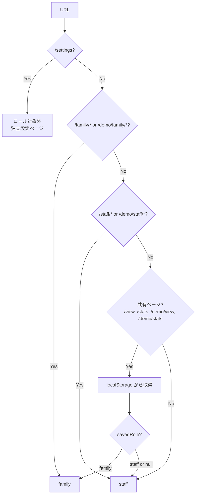
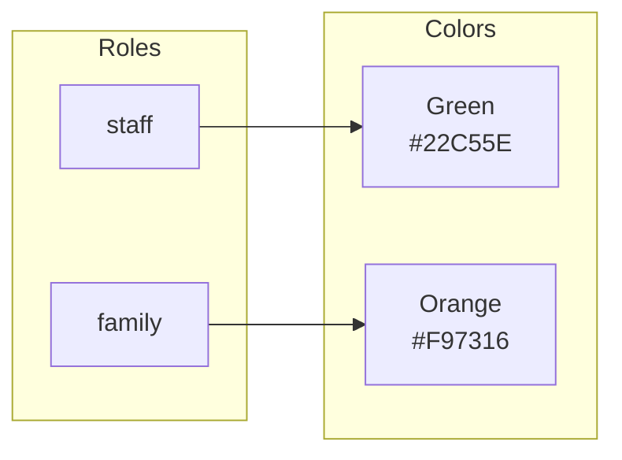
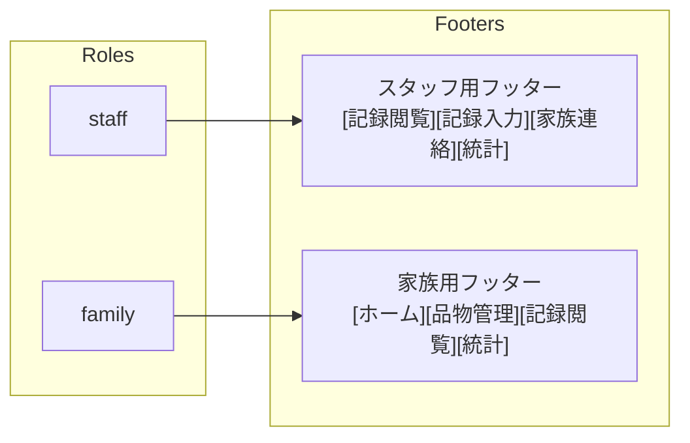
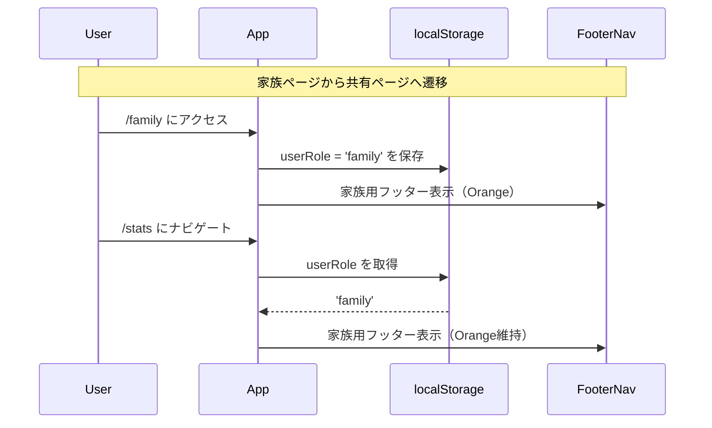

# ロール別テーマ設計書

## 概要

本ドキュメントでは、4つのユーザーパターン（スタッフ/家族/家族デモ/スタッフデモ）における
フッターナビゲーションとベースカラーの設計を整理する。

**設定ページ（`/settings`）は独立したページとして、ロールシステムの対象外。**

## 1. 4パターンの定義

| パターン | URL例 | ロール | ベースカラー | フッタータイプ |
|----------|-------|--------|--------------|----------------|
| スタッフ（本番） | `/staff/*` | staff | Green (#22C55E) | スタッフ用 |
| 家族（本番） | `/family/*` | family | Orange (#F97316) | 家族用 |
| 家族デモ | `/demo/family/*` | family | Orange (#F97316) | 家族用 |
| スタッフデモ | `/demo/staff/*` | staff | Green (#22C55E) | スタッフ用 |

## 2. 設定ページ（独立）

| パス | ロール | カラー | フッター |
|------|--------|--------|----------|
| `/settings` | なし | デフォルト（Yellow基調） | なし |

**特徴**:
- 単独リンクからのアクセス
- 戻るボタンなし
- フッターなし
- ロールシステムから独立

## 3. URL→ロール判定フロー

## 4. ロール→カラー対応

## 5. ロール→フッター対応

## 6. フッターのリンク先（本番モード）

### スタッフ用フッター

| タブ | リンク先 | リダイレクト先 | アクティブ判定 |
|------|----------|----------------|----------------|
| 記録閲覧 | `/view` | - | pathname === '/view' |
| 記録入力 | `/staff/input/meal` | - | pathname.includes('/input/meal') |
| 家族連絡 | `/staff/family-messages` | - | pathname.includes('/family-messages') |
| 統計 | `/staff/stats` | `/stats` | pathname === '/stats' or '/staff/stats' |

### 家族用フッター

| タブ | リンク先 | リダイレクト先 | アクティブ判定 |
|------|----------|----------------|----------------|
| ホーム | `/family` | - | pathname === '/family' |
| 品物管理 | `/family/items` | - | pathname.includes('/family/items') |
| 記録閲覧 | `/view` | - | pathname === '/view' |
| 統計 | `/stats` | - | pathname === '/stats' |

## 7. フッターのリンク先（デモモード）

### スタッフ用フッター（デモ）

| タブ | リンク先 | リダイレクト先 | アクティブ判定 |
|------|----------|----------------|----------------|
| 記録閲覧 | `/demo/view` | - | pathname === '/demo/view' |
| 記録入力 | `/demo/staff/input/meal` | - | pathname.includes('/demo/staff/input/meal') |
| 家族連絡 | `/demo/staff/family-messages` | - | pathname.includes('/demo/staff/family-messages') |
| 統計 | `/demo/staff/stats` | `/demo/stats` | pathname === '/demo/stats' or '/demo/staff/stats' |

### 家族用フッター（デモ）

| タブ | リンク先 | リダイレクト先 | アクティブ判定 |
|------|----------|----------------|----------------|
| ホーム | `/demo/family` | - | pathname === '/demo/family' |
| 品物管理 | `/demo/family/items` | - | pathname.includes('/demo/family/items') |
| 記録閲覧 | `/demo/view` | - | pathname === '/demo/view' |
| 統計 | `/demo/stats` | - | pathname === '/demo/stats' |

## 8. 共有ページの振る舞い

共有ページ（`/view`, `/stats`, `/demo/view`, `/demo/stats`）では：

1. **ロール判定**: localStorageの `userRole` を参照
2. **カラー**: 保存されたロールのカラーを適用
3. **フッター**: 保存されたロールに対応するフッターを表示

## 9. 実装状況と整合性チェック

### チェック完了項目

| 項目 | roleTheme.ts | FooterNav.tsx | App.tsx | 状態 |
|------|--------------|---------------|---------|------|
| `/staff/*` → staff | ✅ | ✅ | ✅ | OK |
| `/family/*` → family | ✅ | ✅ | ✅ | OK |
| `/demo/staff/*` → staff | ✅ | ✅ | ✅ | OK |
| `/demo/family/*` → family | ✅ | ✅ | ✅ | OK |
| `/settings` → 独立ページ | ✅ | ✅ | ✅ | OK |
| 共有ページ localStorage | ✅ | ✅ | - | OK |
| `/staff/stats` → `/stats` リダイレクト | - | - | ✅ | OK |
| `/demo/staff/stats` → `/demo/stats` リダイレクト | - | - | ✅ | OK |

### 修正済み項目

#### 修正1: 記録入力タブのリンク先
- **修正前**: `/input/meal`
- **修正後**: `/staff/input/meal`

#### 修正2: CSS変数の適用方法
- **問題**: TailwindCSS V4で `:root[data-role]` セレクタがビルドに含まれない
- **修正**: `applyRoleTheme()` で `root.style.setProperty()` を使用

#### 修正3: admin ロール削除
- **修正前**: 5パターン（スタッフ/家族/管理者/家族デモ/スタッフデモ）
- **修正後**: 4パターン + 独立設定ページ
- **理由**: 管理者は設定画面のみ必要、ロールとして持つ必要なし

### レガシーパス対応

| パス | 動作 | 備考 |
|------|------|------|
| `/input/meal` | `/staff/input/meal` へリダイレクト | 後方互換 |

## 10. テストマトリクス

| パターン | URL | 期待されるロール | 期待されるカラー | 期待されるフッター | アクティブタブ |
|----------|-----|------------------|------------------|-------------------|---------------|
| スタッフ本番 | /staff/input/meal | staff | Green | スタッフ用 | 記録入力 |
| スタッフ本番 | /stats (from staff) | staff | Green | スタッフ用 | 統計 |
| 家族本番 | /family | family | Orange | 家族用 | ホーム |
| 家族本番 | /family/items | family | Orange | 家族用 | 品物管理 |
| 家族本番 | /stats (from family) | family | Orange | 家族用 | 統計 |
| 家族デモ | /demo/family | family | Orange | 家族用 | ホーム |
| 家族デモ | /demo/stats (from family) | family | Orange | 家族用 | 統計 |
| スタッフデモ | /demo/staff | staff | Green | スタッフ用 | - |
| スタッフデモ | /demo/staff/input/meal | staff | Green | スタッフ用 | 記録入力 |
| スタッフデモ | /demo/stats (from staff) | staff | Green | スタッフ用 | 統計 |
| 設定ページ | /settings | なし | Yellow基調 | なし | - |

## 11. 実装ファイル

| ファイル | 役割 |
|----------|------|
| `src/utils/roleTheme.ts` | ロール判定・カラー適用 |
| `src/hooks/useRoleTheme.ts` | ルート変更時のテーマ適用 |
| `src/components/FooterNav.tsx` | フッターナビゲーション |
| `src/pages/SettingsPage.tsx` | 独立設定ページ（NEW） |
| `src/App.tsx` | ルーティング定義・リダイレクト |
| `src/index.css` | CSS変数定義 |
