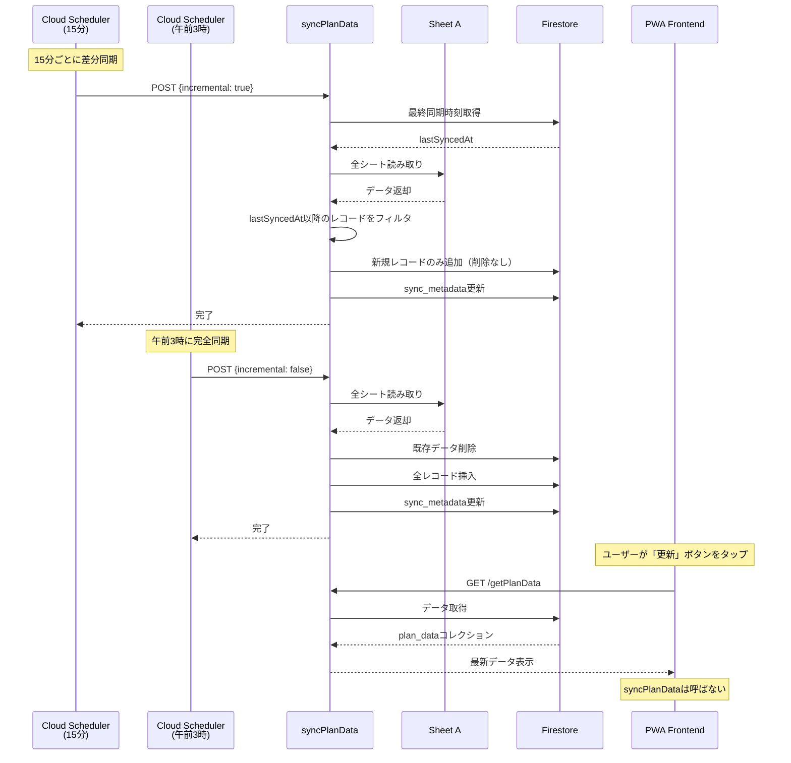

# 同期処理の競合防止設計書

> **⚠️ アーカイブ済み**: 本ドキュメントの要点は [SYNC_STRATEGY.md](../SYNC_STRATEGY.md) に統合されました。
> 詳細な経緯・実装の参照用としてアーカイブに保存しています。

> **作成日**: 2025-12-14
> **更新日**: 2025-12-14
> **関連インシデント**: Firestoreデータ重複問題（2025-12-14発生）

---

## 1. インシデント概要

### 1.1 発生した問題

Firestoreの`plan_data`コレクションにおいて、全レコードが2重に保存されている状態が発生。

**症状**:
- 食事シート: 1000件中ユニークタイムスタンプ500件（2倍の重複）
- 同じタイムスタンプ・スタッフ名で異なるドキュメントIDのレコードが存在
- UIのテーブルビューで全行が2回表示される

### 1.2 原因分析

**直接原因**: 複数の`syncPlanData`処理が同時に実行され、Race Condition（競合状態）が発生

**発生メカニズム**:
```
時刻T1: 同期プロセスA開始 → 既存データ削除開始
時刻T2: 同期プロセスB開始 → 既存データ削除開始（Aの削除前のデータを参照）
時刻T3: プロセスA削除完了 → 新規データ挿入
時刻T4: プロセスB削除完了 → 新規データ挿入（Aが挿入したデータを削除できていない）
結果: プロセスAとBの両方がデータを挿入 → 2倍の重複
```

### 1.3 根本原因

複数のトリガーポイントから`syncPlanData`が呼び出される設計:

| トリガー | 発生条件 | リスク |
|----------|----------|--------|
| 手動同期ボタン | ユーザー操作 | **複数ユーザーが同時押下** |
| 15分自動同期 | PWAのsetInterval | **複数タブ・デバイスで同時発火** |

**重要**: フロントエンド（localStorage）での制御は**同一ブラウザ内のみ有効**。異なるデバイス・ユーザー間では共有されない。

---

## 2. MoE多角的評価

### 2.1 評価軸と重み

| 評価軸 | 重み | 説明 |
|--------|------|------|
| **安定性・安全性** | 高 | 競合によるデータ破損を防止 |
| **コストパフォーマンス** | 高 | 実装コスト・ランニングコスト |
| **実装複雑度** | 中 | 保守・デバッグの容易さ |
| **保守性** | 中 | 将来の変更対応のしやすさ |
| **ユーザー体験** | 中 | ユーザーの利便性 |

### 2.2 候補案比較

| 案 | 概要 | 安定性 | コスト | 複雑度 | 保守性 | UX | 総合 |
|----|------|--------|--------|--------|--------|-----|------|
| A: Cloud Scheduler単一（洗い替え） | Schedulerのみ、全件洗い替え | ◎ | × | ◎ | ◎ | △ | △ |
| B: Firestore分散ロック | バックエンドでロック | ○ | △ | △ | △ | ○ | △ |
| C: 差分同期のみ | 常に差分追加 | △ | ◎ | △ | △ | ○ | △ |
| **D: Scheduler + 差分同期 + 日次洗い替え** | 差分15分、洗い替え日次 | **◎** | **◎** | **○** | **◎** | **○** | **◎** |

### 2.3 最終採用：案D

**「Cloud Scheduler + 差分同期（15分） + 日次洗い替え」を採用**

**評価結果**:
| 評価軸 | 評価 | 根拠 |
|--------|------|------|
| **安定性** | ◎ | Cloud Scheduler単一トリガーで競合を原理的に排除 |
| **コストパフォーマンス** | ◎ | 差分同期で月$144→$5-15（90%以上削減） |
| **実装複雑度** | ○ | 差分ロジック追加だが、フロントエンド簡素化で相殺 |
| **保守性** | ◎ | 単純なアーキテクチャ、障害点が少ない |
| **UX** | ○ | 「更新」ボタンで最新データ即時表示 |

---

## 3. 最終設計：Cloud Scheduler + 差分同期

### 3.1 同期方式一覧

| 処理 | トリガー | 方式 | 頻度 | 目的 |
|------|----------|------|------|------|
| **差分同期** | Cloud Scheduler | 新規レコードのみ追加 | 15分ごと | 最新データ反映 |
| **完全同期** | Cloud Scheduler | 洗い替え | 日次（午前3時） | データ整合性担保 |
| **手動更新** | ユーザー操作 | Firestoreキャッシュ再取得 | 任意 | 最新表示 |

### 3.2 アーキテクチャ図



### 3.3 差分同期ロジック

#### 3.3.1 差分検出の仕組み

```typescript
// syncPlanData.ts
interface SyncRequest {
  triggeredBy: 'scheduler' | 'recovery';
  incremental?: boolean; // true: 差分, false: 完全
}

async function syncPlanDataHandler(req: Request, res: Response) {
  const { triggeredBy, incremental = true } = req.body as SyncRequest;

  for (const sheetName of sheetNames) {
    if (incremental) {
      // 差分同期
      await syncIncremental(sheetName, records);
    } else {
      // 完全同期（洗い替え）
      await syncFull(sheetName, records);
    }
  }

  // sync_metadata更新
  await updateSyncMetadata(triggeredBy, incremental);
}
```

#### 3.3.2 差分同期の実装

```typescript
// firestoreService.ts
async function syncIncremental(sheetName: string, records: PlanDataRecord[]): Promise<number> {
  const db = getFirestore();

  // 1. 最終同期時刻を取得
  const metadataRef = db.collection('sync_metadata').doc('latest');
  const metadata = await metadataRef.get();
  const lastSyncedAt = metadata.exists
    ? metadata.data()?.lastSyncedAt?.toDate()
    : new Date(0); // 初回は全件

  // 2. 最終同期以降の新規レコードをフィルタ
  const newRecords = records.filter(record => {
    const recordTime = parseTimestamp(record.timestamp);
    return recordTime > lastSyncedAt;
  });

  if (newRecords.length === 0) {
    logger.info(`No new records for ${sheetName}`);
    return 0;
  }

  // 3. 新規レコードのみ追加（削除なし）
  const collectionRef = db.collection('plan_data');
  const chunks = chunkArray(newRecords, BATCH_SIZE);

  for (const chunk of chunks) {
    const batch = db.batch();
    chunk.forEach(record => {
      // 決定論的なドキュメントIDを生成（重複防止）
      const docId = generateDeterministicId(sheetName, record.timestamp, record.staffName);
      const docRef = collectionRef.doc(docId);
      batch.set(docRef, record, { merge: true }); // 既存があればマージ
    });
    await batch.commit();
  }

  logger.info(`Inserted ${newRecords.length} new records for ${sheetName}`);
  return newRecords.length;
}

// 決定論的なドキュメントID生成
function generateDeterministicId(sheetName: string, timestamp: string, staffName: string): string {
  const hash = crypto.createHash('md5')
    .update(`${sheetName}_${timestamp}_${staffName}`)
    .digest('hex')
    .substring(0, 20);
  return hash;
}
```

#### 3.3.3 完全同期（洗い替え）の実装

```typescript
// firestoreService.ts
async function syncFull(sheetName: string, records: PlanDataRecord[]): Promise<number> {
  const db = getFirestore();
  const collectionRef = db.collection('plan_data');

  // 1. 既存データ削除
  const existing = await collectionRef.where('sheetName', '==', sheetName).get();
  const deleteChunks = chunkArray(existing.docs, BATCH_SIZE);
  for (const chunk of deleteChunks) {
    const batch = db.batch();
    chunk.forEach(doc => batch.delete(doc.ref));
    await batch.commit();
  }

  // 2. 全レコード挿入（決定論的ID使用）
  const insertChunks = chunkArray(records, BATCH_SIZE);
  for (const chunk of insertChunks) {
    const batch = db.batch();
    chunk.forEach(record => {
      const docId = generateDeterministicId(sheetName, record.timestamp, record.staffName);
      const docRef = collectionRef.doc(docId);
      batch.set(docRef, record);
    });
    await batch.commit();
  }

  logger.info(`Full sync: ${records.length} records for ${sheetName}`);
  return records.length;
}
```

### 3.4 sync_metadata コレクション

```typescript
// Firestore: sync_metadata/latest
interface SyncMetadata {
  lastSyncedAt: Timestamp;      // 最終同期時刻
  syncType: 'incremental' | 'full';
  triggeredBy: 'scheduler' | 'recovery';
  totalRecords: number;         // 処理レコード数
  syncDuration: number;         // 処理時間（ms）
  sheets: {
    [sheetName: string]: {
      recordCount: number;
      newRecords: number;       // 差分同期時の新規追加数
    }
  }
}
```

### 3.5 Cloud Scheduler 設定

#### 3.5.1 差分同期ジョブ（15分ごと）

```bash
gcloud scheduler jobs create http sync-plan-data-incremental \
  --location=asia-northeast1 \
  --schedule="*/15 * * * *" \
  --uri="https://asia-northeast1-facility-care-input-form.cloudfunctions.net/syncPlanData" \
  --http-method=POST \
  --headers="Content-Type=application/json" \
  --message-body='{"triggeredBy":"scheduler","incremental":true}' \
  --time-zone="Asia/Tokyo" \
  --description="15分ごとの差分同期"
```

#### 3.5.2 完全同期ジョブ（日次午前3時）

```bash
gcloud scheduler jobs create http sync-plan-data-full \
  --location=asia-northeast1 \
  --schedule="0 3 * * *" \
  --uri="https://asia-northeast1-facility-care-input-form.cloudfunctions.net/syncPlanData" \
  --http-method=POST \
  --headers="Content-Type=application/json" \
  --message-body='{"triggeredBy":"scheduler","incremental":false}' \
  --time-zone="Asia/Tokyo" \
  --description="日次の完全同期（午前3時）"
```

### 3.6 フロントエンド変更

#### 3.6.1 useSync.ts（簡素化）

```typescript
// useSync.ts - 簡素化版
import { useCallback } from 'react';
import { useQuery, useQueryClient } from '@tanstack/react-query';
import { getSyncMetadata } from '../api';

export function useSync() {
  const queryClient = useQueryClient();

  // sync_metadataから最終同期情報を取得
  const { data: syncMetadata } = useQuery({
    queryKey: ['syncMetadata'],
    queryFn: getSyncMetadata,
    refetchInterval: 60 * 1000, // 1分ごとに更新
  });

  // 「更新」ボタン = Firestoreキャッシュ再取得のみ
  const refresh = useCallback(() => {
    queryClient.invalidateQueries({ queryKey: ['planData'] });
    queryClient.invalidateQueries({ queryKey: ['syncMetadata'] });
  }, [queryClient]);

  return {
    refresh,
    isRefreshing: queryClient.isFetching({ queryKey: ['planData'] }) > 0,
    lastSyncedAt: syncMetadata?.lastSyncedAt ?? null,
    syncType: syncMetadata?.syncType ?? null,
  };
}
```

#### 3.6.2 Header.tsx（UI変更）

```typescript
// Header.tsx - UI変更
// 「同期」→「更新」
// 「同期中...」→「読み込み中...」
// 「最終同期: HH:MM」→「データ更新: HH:MM（自動同期: 15分ごと）」

<button onClick={refresh} disabled={isRefreshing}>
  {isRefreshing ? '読み込み中...' : '更新'}
</button>

<span>
  データ更新: {formatTime(lastSyncedAt)}
  <small>（自動同期: 15分ごと）</small>
</span>
```

### 3.7 重複防止の保証

**決定論的ドキュメントIDにより重複を原理的に防止**:

| シナリオ | 結果 |
|----------|------|
| 同じレコードを2回挿入 | 同じIDなのでマージ（重複なし） |
| 差分同期後に完全同期 | 同じIDなので上書き（重複なし） |
| 完全同期が2回実行 | 削除→挿入だが、IDが同じなので整合性維持 |

---

## 4. コスト比較

| 方式 | 15分ごとの書き込み | 月間書き込み数 | 月間コスト概算 |
|------|-------------------|----------------|----------------|
| **洗い替えのみ** | 27,200件（削除+挿入） | 約260万件 | 約$144 |
| **差分同期+日次洗い替え** | 平均50件 + 日次27,200件 | 約12万件 | 約$5-15 |

**削減率: 90%以上**

---

## 5. 実装チェックリスト

### 5.1 バックエンド ✅ 完了

- [x] `syncPlanData.ts` に `incremental` パラメータ追加
- [x] `firestoreService.ts` に `syncPlanDataIncremental` 関数追加
- [x] `firestoreService.ts` に `generateDeterministicId` 関数追加
- [x] `sync_metadata` コレクションへの書き込み追加
- [x] `types/index.ts` に `SyncPlanDataRequest.incremental` 追加

### 5.2 インフラ ✅ 完了

- [x] Cloud Scheduler `sync-plan-data-incremental` ジョブ作成（15分ごと）
- [x] Cloud Scheduler `sync-plan-data-full` ジョブ作成（午前3時）

### 5.3 フロントエンド ✅ 完了

- [x] `useSync.ts` 簡素化（syncPlanData呼び出し削除、キャッシュ更新のみ）
- [x] `Header.tsx` UI変更（「同期」→「更新」）
- [x] 15分自動同期のsetInterval削除

### 5.4 検証 ✅ 完了

- [x] 完全同期のシミュレーション（13,615レコード、全てユニーク）
- [x] 差分同期のシミュレーション（重複なし確認）
- [x] 重複データなしの確認
- [x] Firebase Functions デプロイ完了

---

## 6. シミュレーション手順

### 6.1 重複データ修正（初回完全同期）

```bash
# 現在の重複状態を確認
curl -s "https://asia-northeast1-facility-care-input-form.cloudfunctions.net/getPlanData?sheetName=%E9%A3%9F%E4%BA%8B" | \
  jq '{totalCount: .data.totalCount, uniqueTimestamps: ([.data.records[].timestamp] | unique | length)}'

# 完全同期を実行
curl -X POST "https://asia-northeast1-facility-care-input-form.cloudfunctions.net/syncPlanData" \
  -H "Content-Type: application/json" \
  -d '{"triggeredBy":"recovery","incremental":false}'

# 重複解消を確認（totalCount = uniqueTimestamps であること）
curl -s "https://asia-northeast1-facility-care-input-form.cloudfunctions.net/getPlanData?sheetName=%E9%A3%9F%E4%BA%8B" | \
  jq '{totalCount: .data.totalCount, uniqueTimestamps: ([.data.records[].timestamp] | unique | length)}'
```

### 6.2 差分同期のテスト

```bash
# 差分同期を実行
curl -X POST "https://asia-northeast1-facility-care-input-form.cloudfunctions.net/syncPlanData" \
  -H "Content-Type: application/json" \
  -d '{"triggeredBy":"scheduler","incremental":true}'

# 重複がないことを確認
curl -s "https://asia-northeast1-facility-care-input-form.cloudfunctions.net/getPlanData?sheetName=%E9%A3%9F%E4%BA%8B" | \
  jq '{totalCount: .data.totalCount, uniqueTimestamps: ([.data.records[].timestamp] | unique | length)}'
```

### 6.3 競合テスト

```bash
# 同時に2回実行しても重複しないことを確認
curl -X POST "https://...cloudfunctions.net/syncPlanData" -d '{"incremental":true}' &
curl -X POST "https://...cloudfunctions.net/syncPlanData" -d '{"incremental":true}' &
wait

# 重複なしを確認
curl -s "https://...cloudfunctions.net/getPlanData?sheetName=%E9%A3%9F%E4%BA%8B" | \
  jq '{totalCount: .data.totalCount, uniqueTimestamps: ([.data.records[].timestamp] | unique | length)}'
```

---

## 7. 復旧手順

重複が発生した場合の復旧手順:

```bash
# 1. 重複状態を確認
curl -s "https://asia-northeast1-facility-care-input-form.cloudfunctions.net/getPlanData?sheetName=%E9%A3%9F%E4%BA%8B" | \
  jq '{totalCount: .data.totalCount, uniqueTimestamps: ([.data.records[].timestamp] | unique | length)}'

# 2. 完全同期を実行（洗い替え）
curl -X POST "https://asia-northeast1-facility-care-input-form.cloudfunctions.net/syncPlanData" \
  -H "Content-Type: application/json" \
  -d '{"triggeredBy":"recovery","incremental":false}'

# 3. 重複解消を確認
curl -s "https://asia-northeast1-facility-care-input-form.cloudfunctions.net/getPlanData?sheetName=%E9%A3%9F%E4%BA%8B" | \
  jq '{totalCount: .data.totalCount, uniqueTimestamps: ([.data.records[].timestamp] | unique | length)}'
```

---

## 8. 関連ドキュメント

| ドキュメント | 内容 |
|--------------|------|
| [ARCHITECTURE.md](../ARCHITECTURE.md) | システム全体設計 |
| [API_SPEC.md](../API_SPEC.md) | syncPlanData API仕様 |
